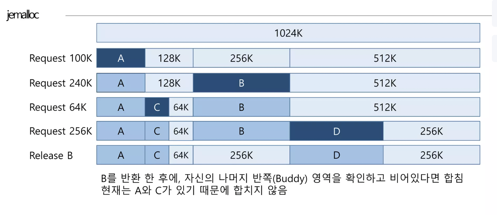
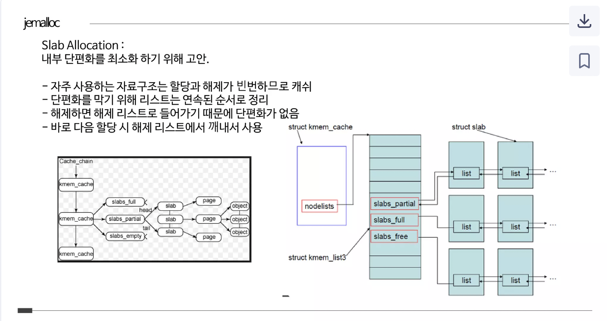

# jemalloc

https://jasone.github.io/2025/06/12/jemalloc-postmortem/

jemalloc 은 2004년 처음 고안된 오픈 소스 메모리 할당기임  
20년간 주요 오픈 소스 프로젝트 및 빅테크 인프라에서 활발히 활용됨  
위에 아티클은 jemalloc 을 20년에 걸쳐 개발한 여정을 담은 내용임.

## jemalloc 에 대해서

Jason Evans 가 FreeBSD 를 위해서 개발한 malloc(동적메모리 할당기) 임.  
> FreeBSD는 고성능, 안정성, 보안성에 중점을 둔 오픈 소스 유닉스 계열 운영체제

주요 특징은 메모리 단편화를 최소화하고, 멀티프로세서/멀티스레드 환경에서 동시성을 제공하는것임.

## 메모리 단편화

https://www.slideshare.net/JangHoon1/jemalloc-92835449#5

메모리 단편화란 사용 가능한 전체 메모리 공간은 충분하지만, allocation 할 연속적인 공간이 부족하여 할당에 어려움을 겪는것임 (이는 CPU cache 효율에 영향을 미칠 수 있음)

* External Fragmentation
  * 외부 단편화, 다양한 크기의 메모리를 할당하고 해제 할때 발생.
  * ex) 100MB 가 비어 있어도, 1MB 공간이 여기저기 흩어져 있어서 10MB 연속 공간은 없는 경우
* Internal Fragmentation
  * 내부 단편화, 할당된 메모리 크기보다 적게 사용될 때 발생.
  * ex) 24byte 를 요청했는데 32byte의 메모리 블록을 할당해준다면 8byte 의 메모리 낭비가 발생 함

외부 단편화를 해결하는 알고리즘으로 `Buddy Allocation` 이 있음.
* 메모리를 2의 제곱 단위로 나누고, 필요한 만큼 쪼개서 가장 잘 맞는 크기의 메로리를 찾아가는 방식임

내부 단편화를 해결하는 알고리증으로 `Slab Allocation` 이 있음.
* 미리 준비된 공간을 사용하여 낭비가 없고 & 할당 해제를 빠르게 할 수 있음.
* 자주 쓰거나 같은 크기의 객체들을 묶어둠.

