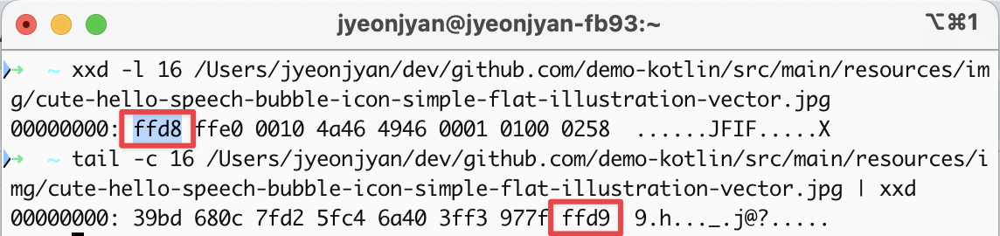

# application 에서 이미지 파일인지 확인하기

## 특정 파일의 확장자를 알고 싶을때 파일의 magic number 를 보자.

여기서 magic number 는 정확히는 file signiture 이다.  
https://en.wikipedia.org/wiki/List_of_file_signatures



JPG(JPEG) 파일의 경우 HEX 코드로 ffd8 로 시작하고 ffd9로 끝난다.
간단히 command line 으로 확인하고 싶다면, MacOS 기준 아래 command 를 실행하면 된다.

```
# megic number 앞부분
➜  ~ xxd -l 16 /Users/jyeonjyan/dev/github.com/demo-kotlin/src/main/resources/img/cute-hello-speech-bubble-icon-simple-flat-illustration-vector.jpg
00000000: ffd8 ffe0 0010 4a46 4946 0001 0100 0258  ......JFIF.....X

# magic number 뒷부분
➜  ~ tail -c 16 /Users/jyeonjyan/dev/github.com/demo-kotlin/src/main/resources/img/cute-hello-speech-bubble-icon-simple-flat-illustration-vector.jpg | xxd
00000000: 39bd 680c 7fd2 5fc4 6a40 3ff3 977f ffd9  9.h..._.j@?.....
```


## application 의 개선이 필요한 예제

```kotlin
fun main() {
    val realJPG = File("/Users/jyeonjyan/dev/github.com/demo-kotlin/src/main/resources/img/cute-hello.jpg")

    val readImg = ImageIO.read(realJPG)
    println("this file is maybe img file: ${readImg != null}")
}
```

기존에 위처럼 ImageIO 를 사용해서 이미지 인지/아닌지를 판별했다면 image 전체를 memory에 올려버리기 때문에 성능상 문제가 있다.  

intelliJ 에서 profiler 를 돌려서 확인해보자.


ImageIO.read() 하는 부분에서 18MB 가 잡히는걸 볼 수 있다.  
이걸 metadata 를 추출해주는 라이브러리를 사용해서 개선하면 어떨까? 


## metadata extractor 라이브러리 활용

깃허브에 메타데이터(매직넘버 포함)를 활용하는 오픈소스 라이브러리 metadata-extractor 가 있길래 써봤다.  
[` _root.addPath(FileType.Jpeg, new byte[]{(byte)0xff, (byte)0xd8})`](https://github.com/drewnoakes/metadata-extractor/blob/a6e88771b8248bd7f91914a414a9d7e153432866/Source/com/drew/imaging/FileTypeDetector.java#L55C9-L55C74)  
라이브러리에 `detectFileType()` 구현을 보면 보면 대충 매직넘버 기반으로 판단하는거 같다.

> https://github.com/drewnoakes/metadata-extractor


```kotlin
fun main() {
    val realJPG = File("/Users/jyeonjyan/dev/github.com/demo-kotlin/src/main/resources/img/cute-hello.jpg")

    val readImg = ImageIO.read(realJPG)
    println("this file is maybe img file: ${readImg != null}")

    val fileType = BufferedInputStream(FileInputStream(realJPG)).use { input ->
        FileTypeDetector.detectFileType(input)
    }
    println("this file is maybe jpg file: ${fileType == FileType.Jpeg}")
}
```


ImageIO 를 사용해서 모든 이미지를 memory에 올렸을때와 다르게, `FileTypeDetector` 를 이용했을적에는 profiler 에 메모리 과적재로 인식되지 않는것을 볼 수 있다.


## POC 해보면서 추가적으로 알게된 점

1. FileTypeDetector 의 경우 inputStream의 mark(), reset() 기능을 요구하는데 FileInputStream 의 경우 이 기능이 없어서 수행하지 못한다.

mark(), reset() 기능은 스트림 앞부분을 읽고 포맷 판단 후 앞으로 다시 돌아가서 전체를 파싱하는 흐름이 있기 때문에 필요하다.  
따라서 BufferedInputStream 을 사용했고, BufferedInputStream 의 경우 스트림을 buffer 로 올려두기 때문에 mark, reset 기능 지원이 가능하다.

```java
if (!inputStream.markSupported())
    throw new IOException("Stream must support mark/reset");
```


2. JPG 파일의 크기와 application 으로 memory 에 올렸을때의 파일 크기는 다르다


여기서는 17KB 로 보이나, 메모리는 18MB 정도로 잡힌것을 볼 수 있다.  
이유는 이미지 디코딩과 래스터화(rasterization)" 과정에서의 구조적 오버헤드 때문이다.  
JPEG은 손실 압축 형식이라 디스크 상에서는 작지만, 메모리에 올리면 18MB 정도가 나온다.  

`3000 (width) × 2000 (height) × 3 (RGB) bytes ≒ 18,000,000 bytes ≒ 18MB`
