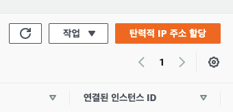

# 간단하게 EC2 서버에 프로젝트 배포하기
## Amazon Web Service EC2

### 인스턴스 생성
```
https://aws.amazon.com/ko/education/awseducate/
```
**EC2 서버 만들기**
```
Amazon Linux 2 AMI (HVM), SSD Volume Type 사용하기
```
### 인스턴스 연결


프라이빗 키 파일을 찾습니다. 이 인스턴스를 시작하는 데 사용되는 키는 ***.pem입니다.  
필요한 경우 이 명령을 실행하여 키를 공개적으로 볼 수 없도록 합니다.
```bash
$ chmod 400 ***.pem
```
ssh connect
```bash
$ ssh -i "***.pem" ec2-user@ec2-34-202-149-32.compute-1.amazonaws.com
```

## AWS EC2 서버 환경 설정
**git install**
```bash
$ sudo yum install git
```

**java8 install**
```bash
$ sudo yum install -y java-1.8.0-openjdk-devel.x86_64
```

**In order to install java 11**
```bash
$ sudo amazon-linux-extras install java-openjdk11
```

**Finally, if you want to switch between java versions run**
```bash
$ sudo alternatives --config java
```

**git clone**
```bash
$ git clone {"repository address"}
```

**install mvn**
```bash
$ sudo wget http://repos.fedorapeople.org/repos/dchen/apache-maven/epel-apache-maven.repo -O /etc/yum.repos.d/epel-apache-maven.repo

$ sudo sed -i s/\$releasever/6/g /etc/yum.repos.d/epel-apache-maven.repo

$ sudo yum install -y apache-maven

$ mvn --version

```

**make a shell**
```bash
#!/bin/bash
echo "move to project"
cd {"project name"}/

echo "git pull"
git pull

echo "compile"
mvn compile

echo "package"
mvn package
```

**Modify Permissions**
```bash
$ chmod 644 {"project name"} 
$ chmod 744 {"project name"}

ex) $ chmod 744 ./shell
```

**Run File**
```bash
$ ./{bash file name}
```

**jar file Run**
```bash
$ cd {"project name"}/target/.jar
$ java -jar {jar file name}
```

**Run when Background**
```bash
$ nohup java -jar {jar file name}
```

**curl localhost:8080**
```bash
$ curl localhost:8080
```

**Finally AWS EC2 instance ip connect**
```
**.****.****:8080
```

**Replace with resilient ip**

