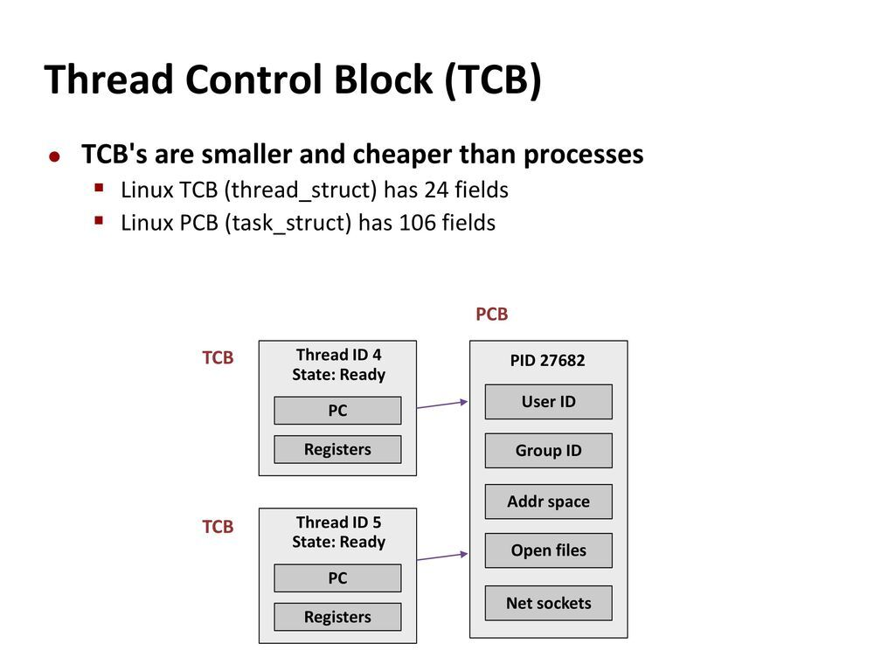

# PCB & IPC & Context Switching

## Context Switching 역할에 질문 던지기

### 컴퓨터에서 하나의 Task만 처리할 수 있다면?

* 해당 Task가 끝날때까지 다음 Task는 기다릴 수 밖에 없다. (Blocking)
* 또한 반응속도가 매우 느리고 사용하기 불편하다.

### 그렇다면 사람들이 동시에 사용하는 것처럼 하기 위해서는?

* Computer multitasking을 통해 빠른 속도로 응답할 수 있다. 
* 빠른 속도로 Task를 바꿔가며 실행하기 때문에 실시간 처럼 보이게 되는 장점이 있다.
* CPU가 task 를 바꿔가며 실행하기 위해 Context Switching이 필요하게 되었다. 

## Context Switching
> 현재 진행하고 있는 Task의 상태를 저장하고 다음 진행할 Task의 상태값을 읽어 적용하는 과정을 말한다.

### Context Switching은 어떻게 진행될까?

* Task의 대부분 정보는 Register에 저장되고 PCB로 관리되고 있다. 
* 현재 실행하고 있는 Task의 PCB 정보를 저장하게 된다. (Process Stack, Ready Queue)
* 다음 실행할 Task의 PCB 정보를 읽어 Register에 적재하고 CPU가 이전에 진행했던 과정을 연속적으로 수행을 할 수 있다.

### PCB, TCB

* PCB
  * 프로세스 상태와 정보를 저장하는 Block
* TCB
  * 쓰레드별로 존재하는 자료구조. `Program Counter`, `Register Set`, `PCB`를 가르키는 포인터를 갖는다.
* 데이터의 양: PCB > TCB  
  *  

### Context Switching Cost

* Context Switching이 발생하면 많은 Cost가 소요됩니다.
  * cache 초기화
  * memory mapping 초기화
  * kernel은 항상 실행

### Process vs Thread

* Context Switching의 비용은 Process(PCB) > Thread(TCB)
  * Thread는 Stack영역을 제외한 모든 메모리를 공유한다.
  * Context Switching 발생시 Stack 영역만 변경하면 된다.
    * 장애 발생시 프로세스 하위의 쓰레드를 모두 종료해야 하는 단점을 보인다 (InternetExplorer)