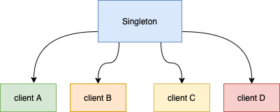

# Sigleton

### index
1. Singleton의 개념을 알 수 있다: 무엇이며 언제 어떻게 사용되는가?
2. Singleton의 단점을 알 수 있다: 왜 안티패턴이라 불리는가?
3. Spring에서 Singleton의 의미를 알 수 있다: Spring bean, Object, Singleton의 관계

## Singleton Pattern
`싱글톤패턴` 은 GoF가 소개한 디자인 패턴 중 하나이다. 어떤 클래스를 애플리케이션 내에서 하나의 인스턴스가 존재하도록 강제하는 패턴이다. `이렇게 하나만 만들어지는 클래스의 오브젝트는 애플리케이션 내에서 전역에서 접근 가능`하다.

싱글톤 패턴 사용 시 주의해야 할 점은 상태를 가진 객체를 Singleton으로 만들면 안된다는 것이다.  
멀티 스레드 환경을 생각해보면.. 어플리케이션 내에 단 한개의 인스턴스가 존재하고, 이를 전역에서 접근할 수 있다면 각기 다른 스레드에서 객체의 상태를 마구자비로 변경시킬 여지가 있다.

**상태가 공유된다는 점에서 아주 위험한 상황이다** Dao와 같은 Singleton들은 DB에 저장할 데이터에 대해 어떻게 갖고 있을까?

메서드 안에서 생성되는 로컬변수는 새로운 값을 저장할 독립적인 공간이 따로 만들어지기 때문에 안전하다.

즉 **무상태 객체나 설계상 유일해야하는 시스템 컴퍼넌트**를 Singleton으로 만들어야 한다.

## 언제 필요한가?
**단일 오브젝트만 존재해야하고, 이를 어플리케이션이 여러곳에서 공유하는** 경우에 주로 사용한다.  
예를 들어 서버의 각 로직을 담당하는 오브젝트들이 클라이언트에서 요청이 들어올 때마다 새로 생성된다고 생각해보자.  
클라이언트의 요청이 증가할수록, 로직을 담당하는 오브젝트들의 개수도 기하급수적으로 늘어날 것이다. 이는 시스템에 큰 부하를 일으키고, 서비스 장애로 이어질 수 있다.  
그래서 spring 서버 환경에서 Object bean 들을 Singleton으로 생성하는 것이다.

### 사용법은 아래와 같다
1. 클래스 밖에서는 오브젝트를 생성하지 못하도록 기본 생성자를 private으로 받는다.
2. 생성된 Singleton Object를 지정할 수 있는 자신과 같은 타입의 static 필드를 정의한다.
3. static 팩토리 메서드인 `getInstance()`를 만들고 이 메서드가 최초로 호출되는 시점에서 한 번만 오브젝트가 만들어지게 한다.
4. 생성된 오브젝트는 static 필드에 저장된다. 또는 static 필드의 초기값으로 오브젝트를 미리 만들어 줄 수도 있다.
5. 한 번 오브젝트가 만들어지고 난 후에는 `getInstance()` 메서드를 통해 이미 만들어져 스태틱 필드에 저장해둔 오브젝트를 넘겨준다.

### Singleton 을 안티패턴이라 부르는 이유
SOLID 원칙의 대부분은 인터페이스 설계와 관련이 있다.  
의존성을 concrete class (구현 클래스)가 아닌 Interface에 두면, 실제 구현 클래스의 구현이 변경되어도 이를 사용한 코드는 큰 영향을 받지 않는다.  
그렇기 때문에 SOLID 원칙을 지키기 위해서는 인터페이스로 설계를 해야한다.

하지만 싱글톤을 사용하는 경우 대부분 인터페이스가 아닌 구현 클래스의 객체를 미리 생성해놓고 정적 메서드를 이용하여 사용하게 된다.  
이는 여러 SOLID 원칙을 위반할 수 있는 가능성을 열어둠과 동시에, 싱글톤을 사용하는 곳과 싱글톤 클래스 사이에 의존성이 생기게 된다. 클래스 사이에 강한 의존성, 즉 높은 결합이 생기게 되면 수정, 단위테스트의 어려움 등 다양한 문제가 발생한다. 

1. 객체지향과 맞지 않다
   1. 싱글톤의 사용은 `전역상태`를 만들 수 있기 때문에 바람직하지 못하다.
      1. 아무객체나 자유롭게 접근하고 수정하고 공유할 수 있는 전역 상태를 갖는 것은 객체지향 프로그래밍에서는 지양되어야 할 모델이다.
   2. `private` 생성자를 갖고 있기 때문에 상속할 수 없다. static 필드와 메서드를 사용하기 때문에 다형성 같은 객체지향의 특징이 적용되지 않는다.

2. 테스트 하기 어렵다
   1. 단위테스트
   2. Mock 테스트 어려움

3. 서버 환경에서는 싱글톤이 하나만 만들어지는 것을 보장하지 못한다.
   1. `private`하게 두었어도 `reflection`을 통해 하나 이상의 오브젝트가 만들어질 수 있다.
   2. 여러개의 JVM에 분산되어 설치가 되는 경우에도 각각 독립적으로 오브젝트가 생기기 때문에 싱글톤으로서의 가치가 떨어진다.

###  Spring bean, Single Object, Sigleton의 관계

Single Object
> 말 그대로 `단 하나의 객체`를 뜻한다.  
> 주로 우리는 Singleton Pattern을 통해 Single Object 가 생성되기를 기대한다. 하지만 위에서 살펴봤듯, Singleton Pattern은 단일 인스턴스 생성을 보장하지 않는다.  
> Singleton Pattern은 Single Object 가 되도록, 즉 말 그대로 메모리 상에 객체가 단 하나만 존재하도록 코드를 구현하였지만 분산된 JVM 혹은 Reflection을 통해 복수 개의 Object 가 될 여지가 있다.

Bean?
> bean 은 스프링이 IoC 방식으로 관리하는 오브젝트라는 뜻이다.  
> 관리되는 오브젝트라고 불리기도 한다.  
> 주의할 점은 스프링을 사용하는 애플리케이션에서 만들어지는 모든 오브젝트가 다 bean이 아니라는 사실이다. 그 중에서 스프링이 직접 그 생성과 제어를 담당하는 오브젝트만을 bean이라고 부른다.

스프링은 기본적으로 별다른 설정을 하지 않으면 내부에서 생성하는 빈 오브젝트를 모두 싱글톤으로 만든다. 다른 말로 bean의 scope 가 singleton 이라고도 한다.  

