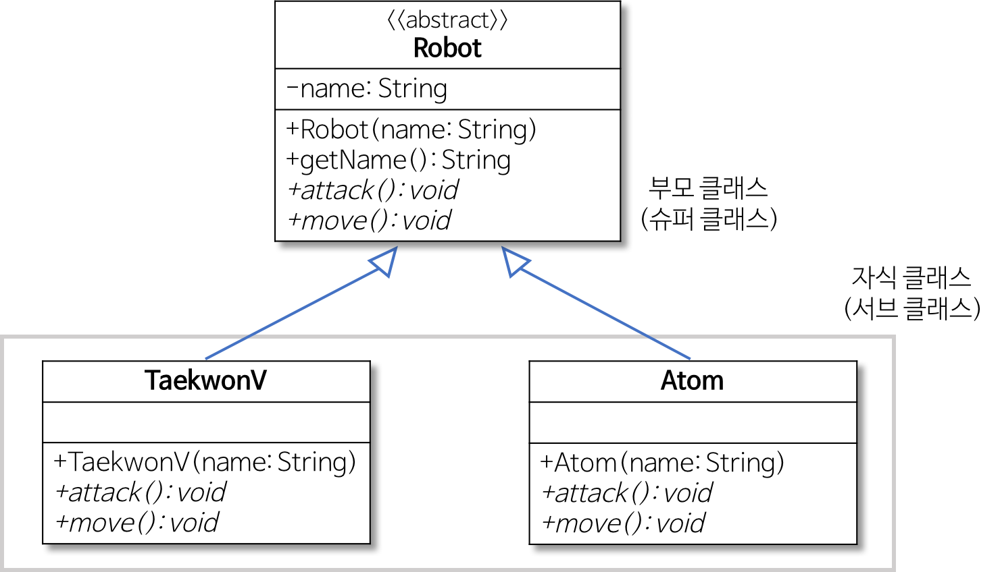
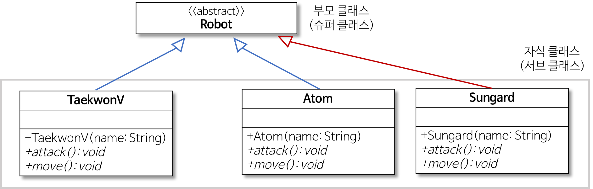

# 스트래티지 패턴
> 여러가지 알고리즘을 하나의 접근점(Interface)를 만들어 접근점에서 서로 교환(Delegate) 가능하도록 한 패턴

## 스트래티지 패턴이란
1. 행위를 클래스로 캡슐화해 동적으로 행위를 자유롭게 바꿀 수 있게 해주는 패턴
   1. 같은 문제를 해결하는 여러 알고리즘이 클래스별로 캡슐화되어 있고 이들이 필요할 때 교체할 수 있도록 함으로써 동일한 문제를 다른 알고리즘으로 해결할 수 있게 하는 패턴
   2. 행위 패턴의 하나
2. 전략을 쉽게 바꿀 수 있도록 해주는 디자인 패턴
   1. 전략이란.
      1. 어떤 목적을 달성하기 위해 일을 수행하는 방식, 비즈니스 규칙, 문제를 해결하는 알고리즘 등
3. 특히 게임 프로그래밍에서 게임 캐릭터가 자신이 처한 상황에 따라 공격이나 행동 방식을 바꾸고 싶을 때 사용


### 구조설명
* Strategy
  * 인터페이스나 추상 클래스로 외부에서 동일한 방식으로 알고리즘을 호출하는 방법을 명시
* ConcreteStrategy
  * 스트래티지 패턴에서 명시한 알고리즘을 실제로 구현한 클래스
* Context
  * 스트래티지 패턴을 이용하는 역할을 수행한다.
  * 필요에 따라 동적으로 구체적인 전략을 바꿀 수 있도록 setter 메서드를 제공한다.


## 예시


1. AbstRobot.class [Strategy]
```java
public abstract class Robot {
  private String name;
  public Robot(String name) { this.name = name; }
  public String getName() { return name; }
  // 추상 메서드
  public abstract void attack();
  public abstract void move();
}
```

2. TeakwonV.class [ConcreteStrategy]
```java
public class TaekwonV extends Robot {
  public TaekwonV(String name) { super(name); }
  public void attack() { System.out.println("I have Missile."); }
  public void move() { System.out.println("I can only walk."); }
}
```

3. Atom.class [ConcreteStrategy]
```java
public class Atom extends Robot {
  public Atom(String name) { super(name); }
  public void attack() { System.out.println("I have strong punch."); }
  public void move() { System.out.println("I can fly."); }
}
```
3. ClientMain.class [Context]
```java
public class Client {
  public static void main(String[] args) {
    Robot taekwonV = new TaekwonV("TaekwonV");
    Robot atom = new Atom("Atom");

    System.out.println("My name is " + taekwonV.getName());
    taekwonV.move();
    taekwonV.attack();

    System.out.println()
    System.out.println("My name is " + atom.getName());
    atom.move();
    atom.attack();
  }
}
```

## 스트래티지 패턴의 문제
1. 기존 로봇의 공격과 이동 방법을 수정하는 경우
   1. Atom은 날 수 없고, 오직 걷게만 하고 싶으면?
   2. TeakwonV를 날게 하려면?
    
    ```java
    public class Atom extends Robot {
        public Atom(String name) { super(name); }
        public void attack() { System.out.println("I have strong punch."); }
        public void move() { System.out.println("I can only walk."); } // 수정
    }
    ```
    * 새로운 기능으로 변경하려고 기존 코드의 내용을 수정해야 함으로 OCP(Open Closed Principle) 원칙에 위배된다.
    * 또한 TeakwonV와 Atom의 Move() 메서드의 내용이 중복된다.
    * 만약 걷는 방식에 문제가 있거나 새로운 방식으로 수정하려면 모든 중복 코드를 일관성있게 변경해야한다.


2. 새로운 로봇을 만들어 기존의 공격 또는 이동 방법을 추가/수정 하는 경우
* 새로운 로봇으로 `Sungard` 만들어 `TeakwonV`의 미사일 공격 기능을 추가하려면?
  ```java
    public class Sungard extends Robot {
        public Sungard(String name) { super(name); }
        public void attack() { System.out.println("I have Missile."); } // 중복
        public void move() { System.out.println("I can only walk."); }
    }   
  ```
  
  

* 현재 시스템의 캡슐화 단위가 'Robot' 자체이므로 로봇을 추가하기는 매우 쉽다.
* 그러나 새로운 로봇인 'Sungard'에 기존의 공격 또는 이동방법을 추가하거나 변경하려고 하면 문제가 발생한다.


### 해결책
문제를 해결하기 위해서는 `무엇이 변화되었는지 찾은 후에 이를 클래스로 캡슐화해야 한다.`
