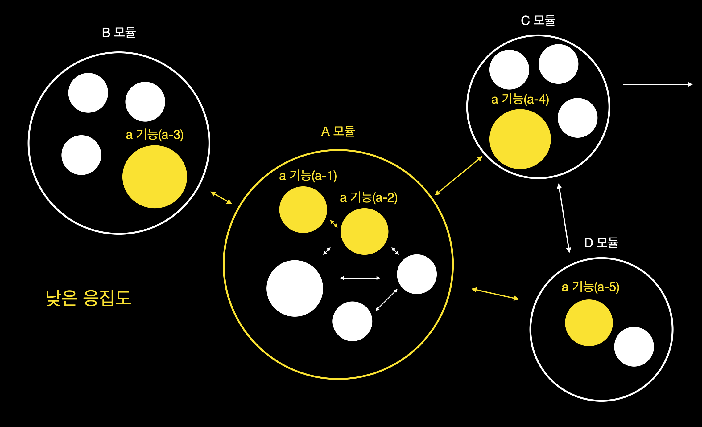

# 응집도와 결합도

High Cohesion, Low Coupling `응집도`와 `결합도`라는 설계관련 용어는 프로그래밍을 하면서 자주 등장한다.  
난 처음에 둘 다 같은 의미의 단어 인것 같았다. 사전을 참고해보자.

응집도에 대한 내용은 아래와 같다.

    

> "응집도" 자체에 대한 정의는 공식 어학사전에서 찾아보기 힘들지만 프로그래밍 기법에 빗대어 설명한 내용은 위와 같다.

결합도에 대한 내용은 아래와 같다.

    

## 응집도

    
    

응집도는 모듈에 포함된 내부 요소들이 하나의 책임/목적을 위해 연결 되어있는 연관된 정도이다.

* 모듈이 하나의 목적을 수행하는 요소들간의 연관성 척도
* 모듈 내부의 기능적인 응집 정도를 나타낸다
* 높을수록 좋다

> A라는 기능을 만족하기 위해 a 모듈에 A 기능들을 위한 책임과 목적이 **잘 모여 있는(응집도가 강함)** 것과 아닌 경우 수정하기가 어느쪽이 어려울까요?

A 라는 기능을 수정하기 위해 a 모듈만 손대면 되니깐 수정하기 용이하겠죠 !  
반대로 A 라는 기능의 책임과 목적이 a,b 모듈에 흩어져 있다면 낮은 응집도를 가진다고 할 수 있습니다.

## 결합도

    

결합도는 `다른 모듈과`의 의존성의 정도 입니다. 모듈을 수정하기 위해 다른 모듈의 변경을 요구하는 정도로도 생각해 볼 수 있습니다.

* 모듈이 `다른 모듈`에 의존하는 정도의 척도
* `모듈과 모듈간`의 상호 결합 정도를 나타냄
* 낮을수록 좋다

유지보수를 위해 B라는 기능을 수정하기 위해 B기능이 모여있는 b모듈을 수정하는데 다른 모듈들과 기능들과 연관되어 수정하려면 다른 모듈의 소스도 확인하면서 해야합니다.

결합도가 높아 다른 모듈들까지 수정해야한다면 유지보수가 더욱 어려워진다. 수정에 있어서 테스트코드까지 의존하고 있다면 더 힘들어진다 🥲

## 높은 응집도와 낮은 결합도를 유지해야한다.

응집도는 강함-약함  
결합도는 약함-강함

이렇게 기준점을 두고 개발을 해야겠다.