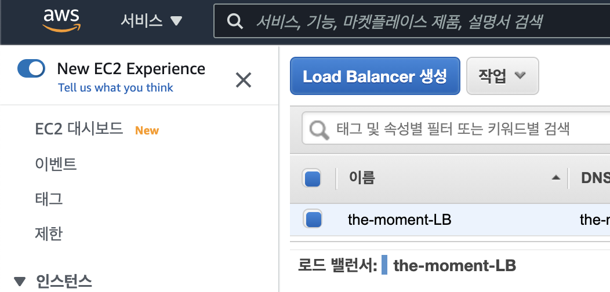
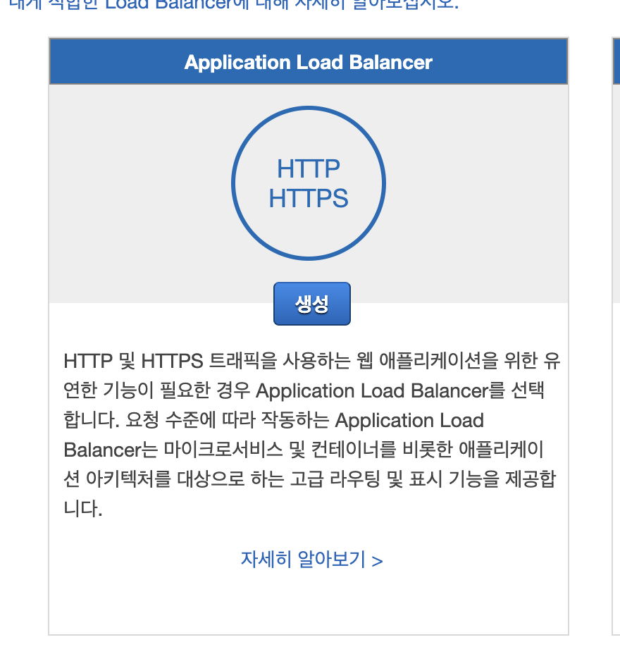
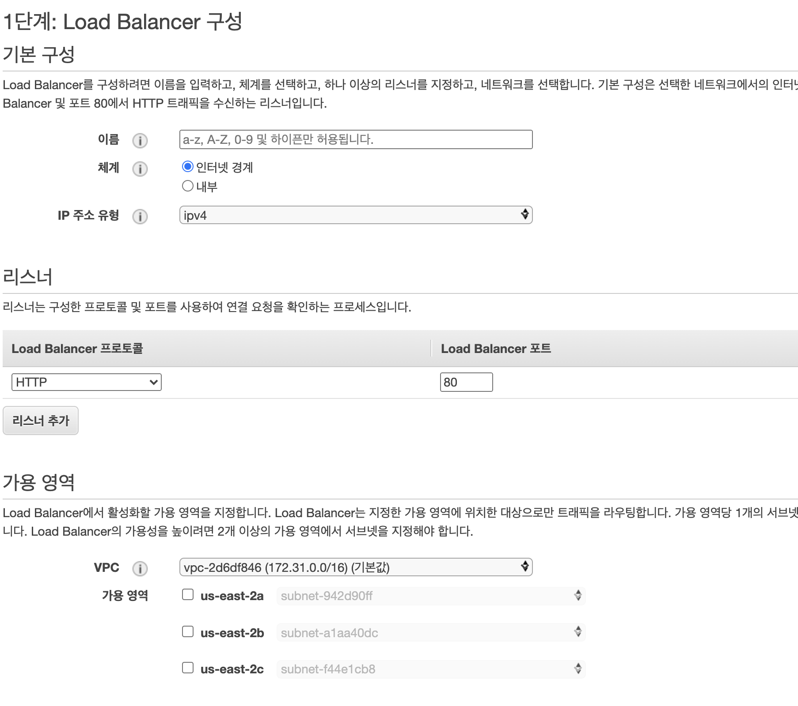
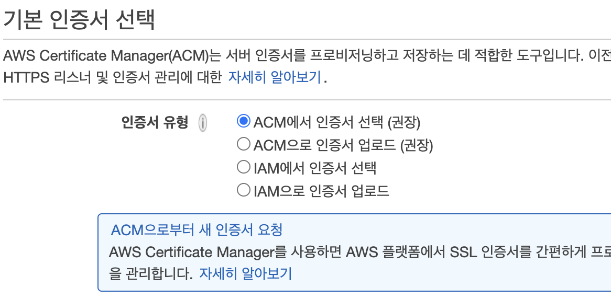
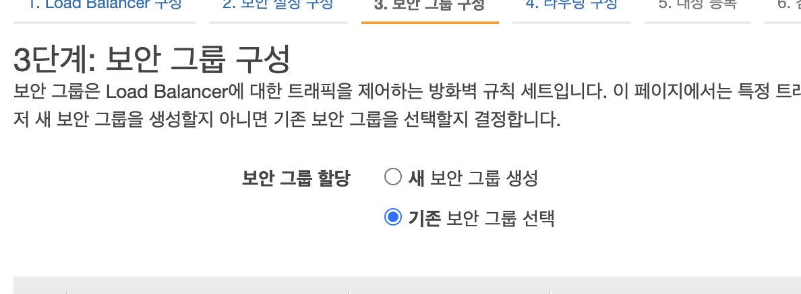
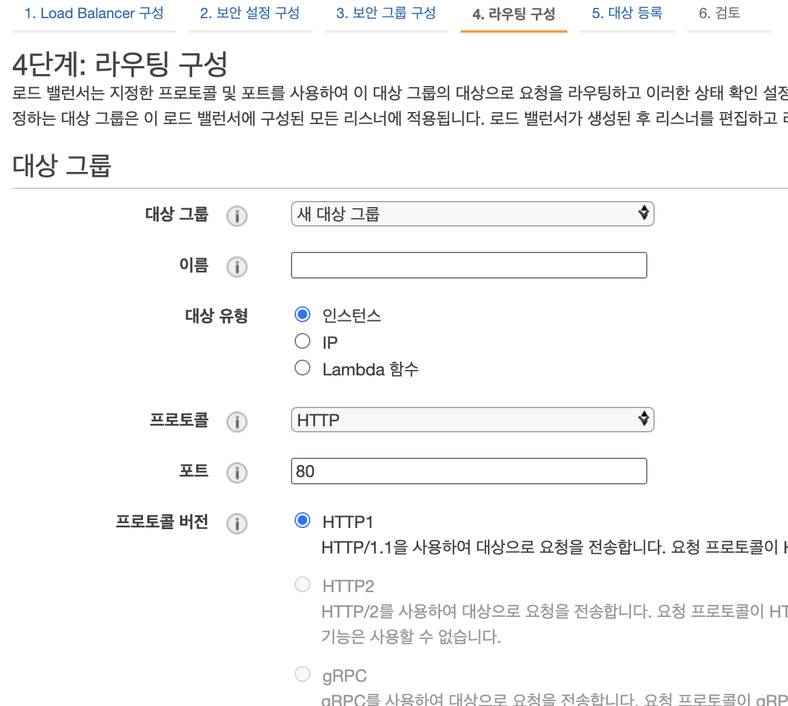
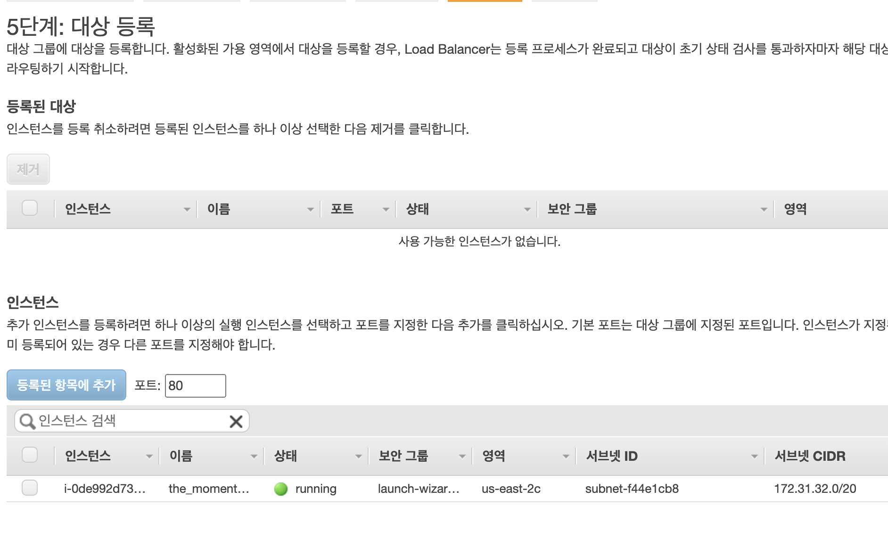

## AWS SSL(Https) 적용방법

문제상황
* mixed contents 이슈 발생
* 프론트에서 https를 사용하고 있고 http에서 https로는 브라우저가 똑똑하게 s를 붙여줘서 연결이 되지만
https(클라이언트)가 http(서버)로 XHR(요청)을 보내게 되면 연결 이슈가 발생

 

해결방안w
* ``the-moment.org`` 도메인을 Route 53 과 연결
* ELB에 SSL Listener 생성
* ELB Security group 설정
* 최종 SSL 적용

## 도메인 Route 53과 연결하고 접속하기

> Route 53에 자신의 도메인을 등록한다.

> ns@@~~ 로 시작하는 부분 4개의 값을 가비아의 네임서버에 등록한다. (마지막 . 제외)

> 레코드를 생성한다.  
> 여기서 ec2 를 사용한다면 ec2의 주소를 ip 값으로 넣어주면 된다.

## ELB 생성하기
* 먼저 ELB를 생성합니다.

* 해당 메뉴를 선택합니다.

* ``기본구성/이름`` 자신이 원하는 이름을 입력합니다.
* ``리스너`` 에 Https 를 추가합니다.
* ``가용영역`` 에 해당하는 체크박스를 다 체크합니다.

* 인증서를 선택합니다. 없다면 ACM으로부터 새 인증서를 발급합니다.

* 인증서를 선택하고 보안그룹을 선택합니다.

* 라우팅을 세팅합니다 저는 docker-compose 포트를 5000 포트로 사용하기 때문에 5000을 넣어줍니다.

* 다음으로 대상 등록을 해주고 

