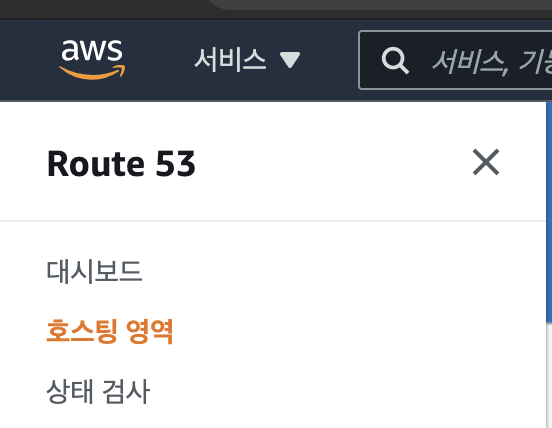
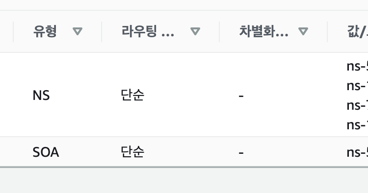
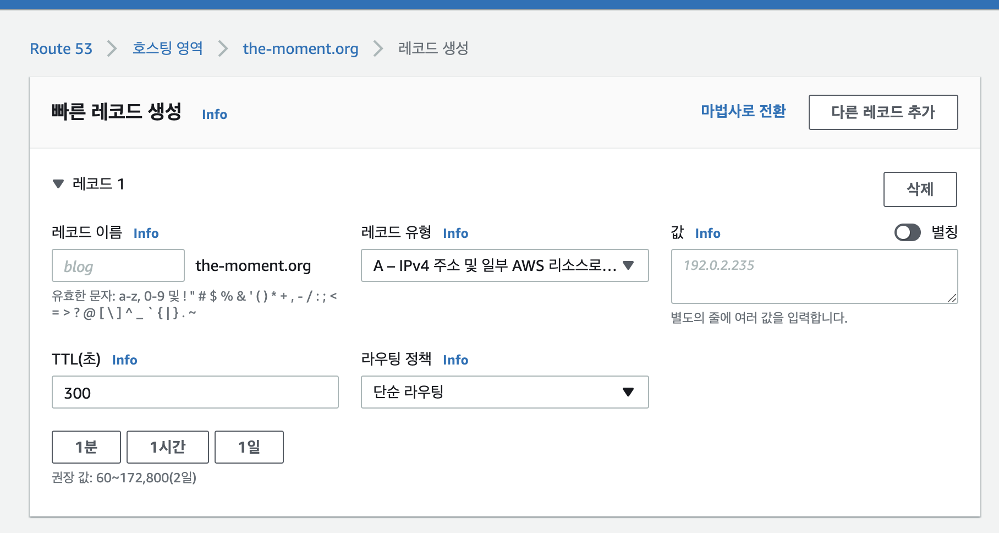

## AWS SSL(Https) 적용방법

문제상황
* mixed contents 이슈 발생
* 프론트에서 https를 사용하고 있고 http에서 https로는 브라우저가 똑똑하게 s를 붙여줘서 연결이 되지만
https(클라이언트)가 http(서버)로 XHR(요청)을 보내게 되면 연결 이슈가 발생

 

해결방안
* ``the-moment.org`` 도메인을 Route 53 과 연결
* ELB에 SSL Listener 생성
* ELB Security group 설정
* 최종 SSL 적용

## 도메인 Route 53과 연결하고 접속하기

> Route 53에 자신의 도메인을 등록한다.

> ns@@~~ 로 시작하는 부분 4개의 값을 가비아의 네임서버에 등록한다. (마지막 . 제외)

> 레코드를 생성한다.  
> 여기서 ec2 를 사용한다면 ec2의 주소를 ip 값으로 넣어주면 된다.