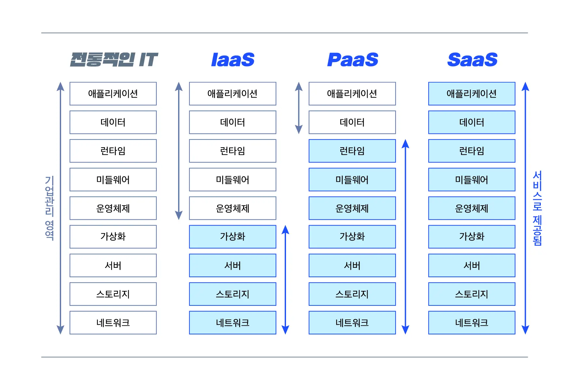

# 클라우드 서비스 이해하기 IaaS, PaaS, SaaS
> 도움을 주셔서 감사합니다 🙇🏻‍♂️  
> https://www.whatap.io/ko/blog/9/

### 🥑 용어정리 
1. IaaS_아이아스(Infastructure as a Service): 서비스로 제공되는 인프라 스트럭쳐, 개발사에 제공되는 물리적 자원을 가상화.
2. PaaS_파스(Platform as a Service): 서비스로 제공되는 플랫폼, 개발사에 제공되는 플랫폼을 가상화
3. SaaS_사스(Software as a Service): 서비스로 제공되는 소프트웨어, 고객에게 소프트웨어를 가상화

### 🥕 어떤 것을 제공하나요?

**IaaS** 는 기존의 데이터센터에서 제공받던 물리적인 자산을 완벽하게 가상화하여 제공하기 때문에 서버 사양의 변경 등 물리적 수정이 필요한 경우 기존에 비해 훨씬 빠른 대응이 가능합니다.

**PaaS**를 사용하면 기업에서는 특수 소프트웨어 구성 요소를 사용하여 PaaS에 내장된 응용프로그램을 설계하고 만들 수 있습니다.

**SaaS**를 공급하는 업체는 데이터, 미들웨어, 서버 및 스토리지와 같은 모든 잠재적인 기술적 문제를 관리하기 떄문에 고객은 유지 보수 및 자원을 간소화 하면서 비즈니스에 집중 할 수 있습니다.

## 🐷 각 클라우드 서비스의 장단점

### IaaS (aws, azure, GCE)
* 비용: 물리적 자원을 서버 형태로 사용하기 때문에 고정비가 없음
* 속도: 물리적 자원을 즉시 소비할 수 있다
* 관리: 자동화된 배포, 운영을 벤더에 맡기고, 확장 축소가 자유롭다

### PaaS (aws Elastic Beanstalk...etc)
* 장점: 필요한 플랫폼만 소비 형태로 사용하기에 비용 부담이 덜하다
* 속도: 개발 및 배포 프로세스를 빠르게 확보할 수 있다.
* 관리: 소프트웨어 유지 관리가 손쉽다, 가상화 기술을 기반으로 구축되어 비즈니스가 변함에 따라 리소스를 쉽게 확장, 축소 가능
* 단점: 특정 플랫폼에 종속될 수 있음

### SaaS (Google apps, Dropbox)
* 비용: 소프트웨어를 소비 형태로 사용하기 때문에 비용 부담을 덜 수 있다.
* 속도: 즉시 사용이 가능하다. 
* 관리: 소프트웨어를 설치하는 물리적 자원이 필요가 없다, 언제든 접근 가능
* 단점: 커스터마이징이 어렵다.