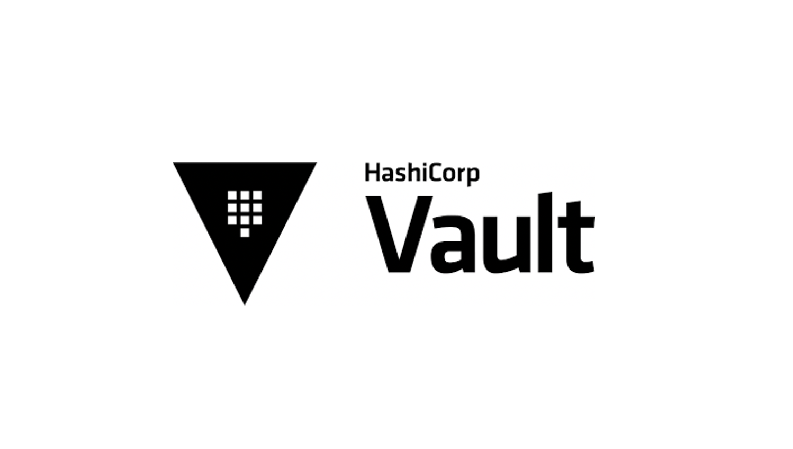
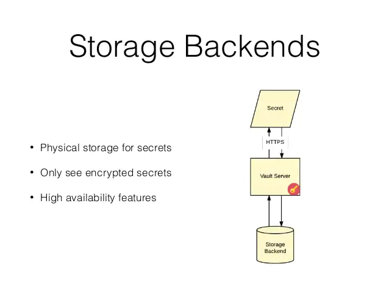
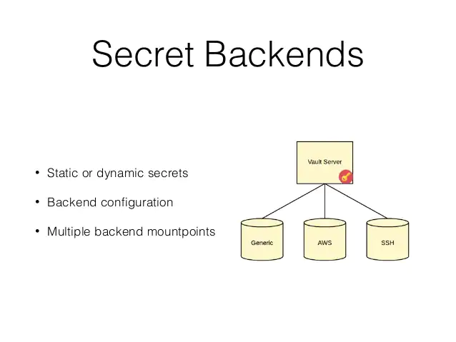

# 20명 정도의 규모의 팀에서 Vault 적용하기
> 도움을 주셔서 감사합니다 🙇🏻‍♂️  
> [하시코프 볼트](), 데브시스터즈

## Vault 란?

Vault는 HashiCorp에 의해서 개발된 크로스플랫폼 패스워드 및 인증 관리 시스템이다.  
공개되면 안되는 비밀번호, API 키, 토큰 등을 저장하고 관리한다.

## Vault 에서 사용하는 용어
> Vault 를 자세히 살펴보기 전에 이해를 돕기 위해서 용어 설명을 해야 할 것 같다.

### 스토리지 백엔드(Storage Backend)

Vault의 정보를 저장하면 Vault가 이를 어딘가에는 저장해야 하는데 이를 스토리지 백엔드라고 부른다.  
스토리지 백엔드를 Mysql 로 설정하면 정보를 Mysql 에 저장하고 S3로 설정하면 파일에 저장한다.

### 시크릿 백엔드(Secret Backend)

시크릿 백엔드는, 문서를 보면 꽤 많은 시크릿 백엔드가 있다.  
대표적으로 Generic과 Cubbyhole이 있는데 Generic 시크릿 백엔드를 사용할 때 정보를 저장하면 위의 스토리지 백엔드로 설정한 물리 스토리지에 정보를 저장하게 된다.  

Cubbyhole은 Generic과 똑같이 동작하지만, `연습용 플레이그라운드`라고 생각하면 된다.  
일반적으로 비밀번호를 저장할 때 생각하게 되는 `username/password` 등을 저장한다고 하면 이 Generic을 사용하면 된다.

예를 들어 AWS 시크릿 백엔드를 사용한다고 하면 AWS에서 API키와 시크릿을 만들어서 Vault에 이 정보로 `AWS 시크릿 백엔드`를 설정한다.  
그러면 AWS 키가 필요할 때 이 백엔드에 요청을 하면 `AWS에 접속해서 새로운 Role을 만들고` 그 엑세스 키와 시크릿 정보를 관리해 주게 된다.  

즉 비밀정보를 관리할 수 있는 권한을 Vault 에 주고 Vault 가 필요에 따라 새로 만들어 줌으로써 계정이나 비밀번호를 관리할 수 있게 하겠다는 것이다.

## 우리 팀에서 도입하려고 하는 이유

극단적인 예를 들어 보겠다..  
A라는 사람이 우리 팀에서 나가게 되면 그 사람이 가진 우리팀의 SSH key를 무력화 시켜야 한다.  
Vault를 사용하면 SSH 생명주기를 Vault가 관리하여 새로운 SSH key 발급이 필요할 때 매번 수작업으로 발급하고 공유해야하는 리소스를 줄일 수 있다.
-> Key Rotation 기능

또한 개별적인 SSH 를 개별적인 생명주기와 함께 발급함으로써 보안성을 강화할 수 있다는 장점도 있다.  
다양한 플랫폼과 응용하여 사용하면 더 많은데 버겁다 ㅎㅎ 

## Vault 도입 전, 우선 기반이 다져져야 한다.
우리 팀 인프라 챕터에게 Vault 도입에 대해 말했지만 우선 빠꾸 먹었다.  
이유는 내가 초반에 DevOps 기본 지식이 부족해서 구성을 *같이 해놓은 덕분에 레거시 청산을 하고 나서 도입할 생각이다.
만약 지금 억지로 도입한다고 하면 세팅이 야매가 돼서 지금의 설정은 무용지물이 될 것이고, 아무튼 지금은 때가 아니다.  

<u>빠르면 2주, 길면 한달 후에 점진적으로 도입해볼 생각이다.</u>