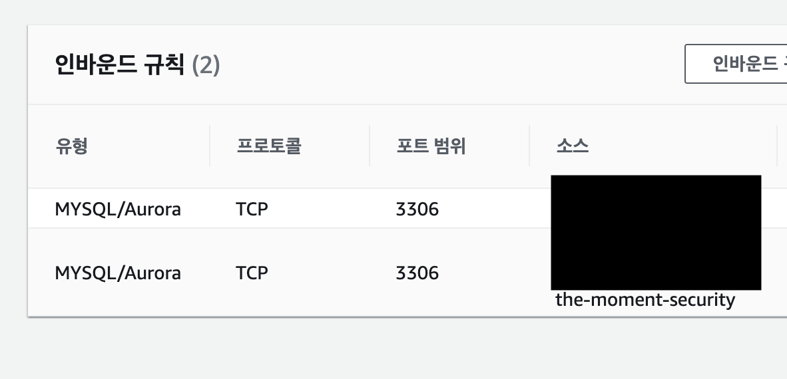
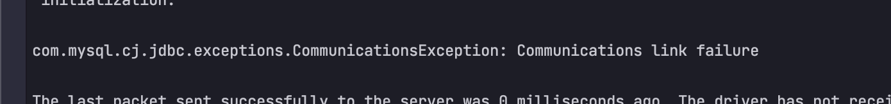
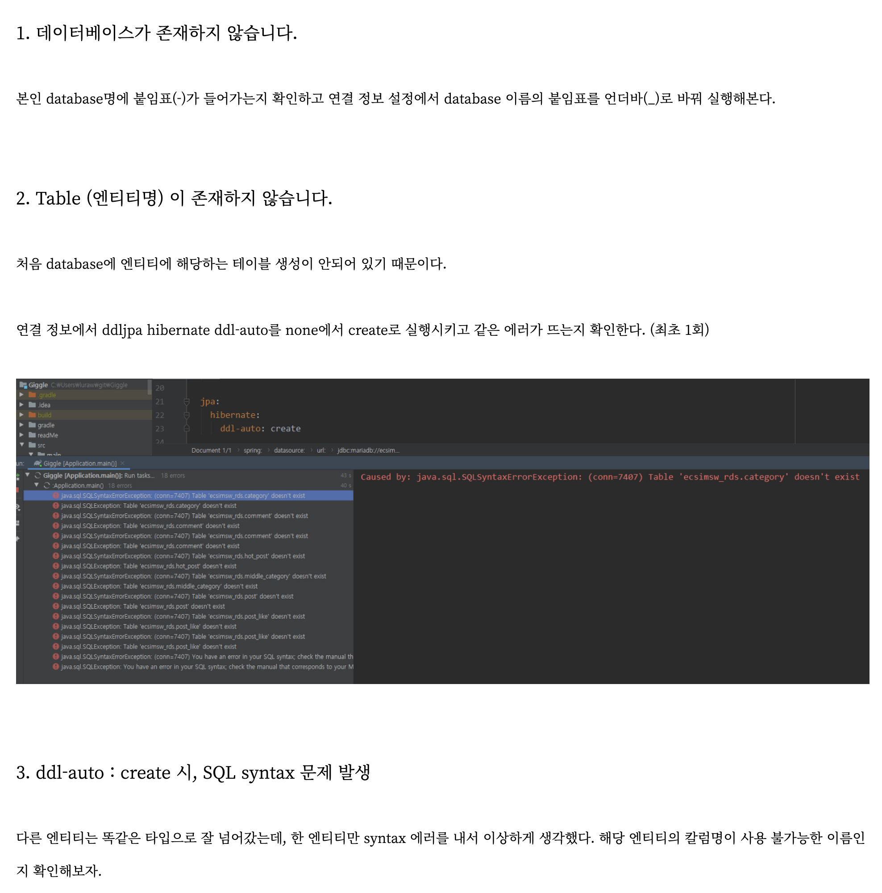

## RDS를 Springboot project에 연동하며...

### 우선 간단히 RDS 를 연동하는 과정에 대해서 설명하겠다.



> 우선 유형으로 자기가 선택한 종류의 DB를 선택하고  
> TCP 및 DB 포트를 적고 내 IP, EC2 보안그룹에 대해서 허용해준다.

<br>

RDS 에서는 개인적으로 세팅해줘야 할 부분이 많지 않다.

### 마주할 수 있는 치명적 에러



계속 IntelliJ에서 위와 같은 오류가 발생한다.  
> 나도 로컬에서는 해결하지 않아 정확한 해답을 찾지는 못했는데 발생할 수 있는 경우는 아래와 같다.



결국에는 EC2 로 접속해서 EC2에 있는 SpringBoot application을 실행하고 Hibernate ``create table`` 시켜주면 저 Exception이 해결되고, table이 생성되는 것을 확인 할 수 있다.

### application.yml 더 나아가 설정하기
```yml
datasource:
  url : jdbc:mariadb://rds엔드포인트:포트명/database이름
  username : db계정
  password : db계정 비밀번호
  driver-class-name: org.mariadb.jdbc.Driver

jpa:
  hibernate:
    ddl-auto: none
    // 최초 DB 연동에는 ddl-auto: ture 해줘야 한다.
```