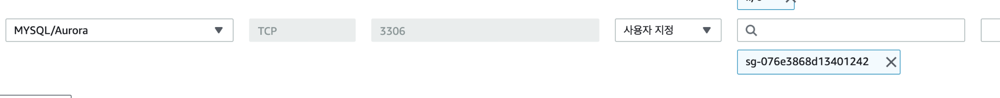

## Ubuntu AWS 서버에 프로젝트 올리기

1st. Ubuntu Server 구축하기
```
다음, 다음, 다음 누르다가
--------------------
보안 그룹 설정에서 아래와 같이 추가하기
SSH, HTTP [위치무관] + SpringBoot Port:8080 [위치무관]
```

2nd. EC2 서버에 접속하기
```
pem 파일이 있는 경로에 들어가서
-------------------------
$  ssh -i "***.pem" ec2-user@ec2-34-202-149-32.compute-1.amazonaws.com
```

3. Mysql 설치
```
$ sudo apt update
$ sudo apt install mysql
```

> <ins> SpringBoot proj 파일 추가 및 실행 방법은 다른 TIL 참고 </ins>

4. 보안 그룹 수정




