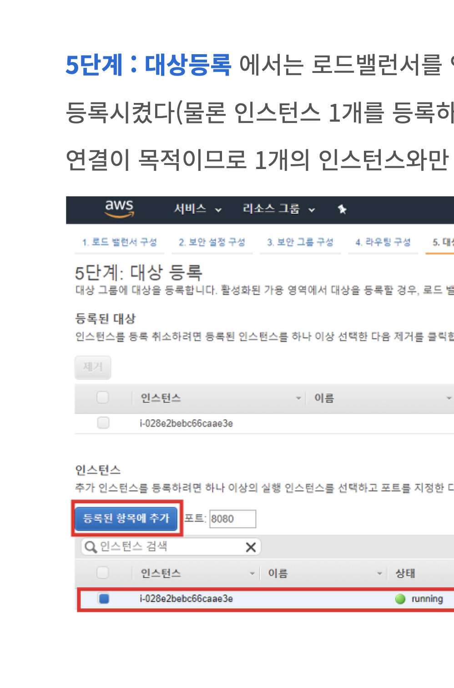

## ELB 에서 발생하는 50x 문제 해결

### 문제 해결 방법에 앞서서........
1. ELB 생성을 꼼꼼하게 하자.
2. 코드, 환경은 거짓말 하지 않는다.

### 해결을 위해 참고 해야하는 문제 유형

HTTP 502(잘못된 게이트웨이)  
> EC2 인스턴스에서 실행 중인 웹 서버 또는 연결된 백엔드 애플리케이션 서버가 CLB(Classic Load Balancer)에서 구문 분석 할 수 없는 메시지를 반환하면 HTTP 502 오류가 발생할 수 있습니다.  

HTTP 504(게이트웨이 제한 시간)
> 웹 서버 인스턴스 또는 백엔드 애플리케이션 서버 인스턴스가 사용 중이며 구성된 ELB(Elastic Load Balancing) 유휴 시간 제한 내에서 요청에 응답할 수 없습니다.  

> 로드 밸런서가 연결을 종료하기 전에 웹 서버 인스턴스 또는 백엔드 애플리케이션 서버 인스턴스가 연결을 종료하므로 연결이 조기에 종료됩니다.  

> 요청이 진행 중일 때 웹 서버 인스턴스 또는 백엔드 애플리케이션 서버 인스턴스가 서버 프로세스를 중단시키거나 재시작하여 결과적으로 서버가 모든 연결을 끊게 됩니다.

나는 우선 502 error에 하루동안 빠져있었는데..  
그냥 다시 ELB를 차근차근 만들어보자. 

나는 대상 등록에서의 문제였다.  
``http:80`` , ``https:443`` 을 넣는게 아니라 자신이 포워딩 하고자 하는 ``5000`` docker-compose app port 를 넣어 추가해야한다.