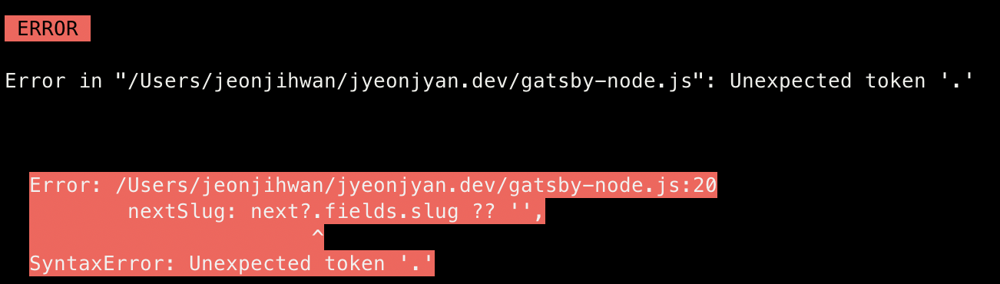
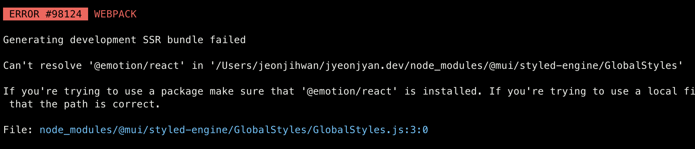

# Node 진영 개발자가 아닌 사람이 Gatsby를 써야할 때 겪을 수 있는 에러 해결책
> Gatsby로 기술블로그 쓰려고 node을 조금 만졌는데.. 중간에 다양한 에러가 발생해서 나중을 위해 기록한다.

## 노드 버전을 업데이트 하자!



> 나도 [이 이슈](https://github.com/zoomkoding/zoomkoding-gatsby-blog/issues/16)와 같은 문제를 겪었다. 🥲

`$ node -v`를 통해 노드 버전을 확인하고 latest 버전이랑 너무 멀면 아래 명령어로 업데이트 하자. [참고](https://stackoverflow.com/a/47909570)

#### Ubuntu Linux / Mac

```sh
sudo npm install n -g
sudo n stable
```

## Gatsby template 모듈을 모두 설치하자.



처음에는 이렇게 `emotions/react` 관련 not found 에러만 뜨길레 해당 부분만 설치했는데. 나중에는 다른 것(react, styled)도 뜸.  
[stackoverflow](https://stackoverflow.com/a/70479813)에서 어느 분이 all stop solution을 공유해주셨는데 그냥 이거 쓰면 될 것 같다.

#### all stop solution
```sh
npm install @mui/material @emotion/react @emotion/styled
```