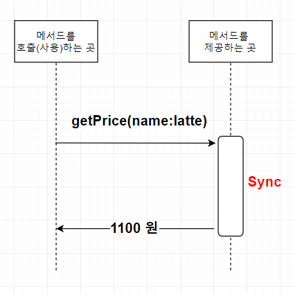
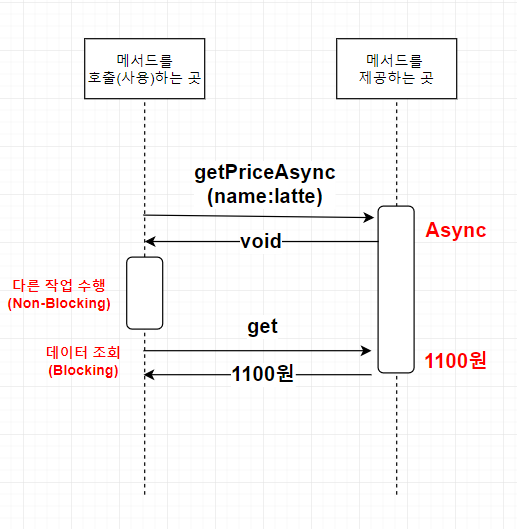

## 자바 비동기 프로그래밍을 위한 CompletableFuture
> 메모리 구조를 공부하다 쓰레드의 개념이 나와서 연관된 동기 비동기 블록킹 논블록킹에 대해 적어보려 한다.

### Sync, Async vs Blocking, Non-Blocking
동기, 비동기 | 블록킹, 논블록킹에 대해서 먼저 생각해야한다.  
비슷한 개념이라고 생각하는 개발자도 많지만.. 사실 조금 다르게 해석된다.

#### Sync(동기) Async(비동기)
아래의 클래스에서는 가격을 조회하는 메서드를 제공해준다. 그리고 클라이언트에서는 메서드를 호출할 때 커피의 이름을 파라미터로 넘겨주면 1100 원이라는 데이터를 리턴받게 된다. 이 방식은 Sync 방식이다.

클라이언트에서 "latte" 라는 커피의 가격을 조회하기 위해 클래스의 getPrice() 라는 메서드를 실행하고 동기 방식으로 1100원 이라는 결과를 리턴하였다. 메서드는 결과가 완성될때까지 반환을 하지 않는다.

반면에, 비동기 방식은 어떻게 동작할까?  
비동기 방식은 결과값이 결정되기 전에 일단 반환을 한다. "latte"라는 커피의 가격이 1100원이라는 정보를 찾기 전에 일단 빈값을 넘기게 된다.  
필자의 샘플 그림에서는 void 라고 표현하는데 아닐 수도 있다.  
참고로 비동기 프로그래밍 방식은 개발하는 방식에 따라 다양하다.

메서드를 호출하는 곳 즉 클라이언트에서는 최종 결과를 받기 전에 메서드로 부터 임시로 반환을 받는다. 그렇다면 클라이언트는 최종 결과인 "latte" 라는 커피의 가격이 1100 원이라는 사실을 어떻게 알까?

여기에는 두 가지 방법이 존재하는데 , Blocking 과 Non-Blocking 이다.  

#### Blocking | Non-Blocking
동기 비동기는 메서드를 제공하는 곳에서의 입장이라면, 블록킹과 논블록킹은 메서드를 사용하는 곳, 즉 클라이언트에서의 입장이다.

클라이언트에서 데이터를 조회하는 두 가지 방법에 대해서 생각해보자. 일단, 위에서 설명했듯이 Async 메서드는 결과를 완성하기 전에 일단 반환을 한다. 그래서 클라이언트에서는 결과가 완성되었을때쯤 메서드를 조회해야 한다. 이 방법이 첫번째 방법이다. 메서드를 호출한 이후 어느정도 시간이 지난후 다시 결과를 조회하는 방법이다.

getPriceAsync 메서드를 호출한 이후에 클라이언트는 다른 작업을 수행할 수 있다.  
즉, 최종 결과를 조회할 때까지 차단 되지 않고 다른 작업을 할 수 있는 것이다.  

"latte" 라는 가격이 필요한 시점에서 getPriceAsync() 의 결과를 알고 싶을 때는 데이터를 조회해야 한다. get 이라는 메서드를 사용했다고 가정하면, get 메서드를 통해 최종 결과를 전달 받기 전까지는 기다려야 한다. 서비스 제공 메서드는 비동기로 구현을 했지만, 클라이언트 입장에서는 항상 논블록킹은 아닌 상황이다. 데이터를 조회하는 순간에는 다시 블록킹으로 동작한다.

#### 상황 개선
완벽한 논-블록킹 환경으로 개선하려면 콜백 함수를 구현해야 한다.  
메서드를 제공하는 곳에서 결과가 완성되면 클라이언트로 결과가 나왔다고 알려주는 방법이다.

#### Async, Non-Blocking
비동기, 논블록킹에 대한 개발자의 의견이 조금씩 다르다.