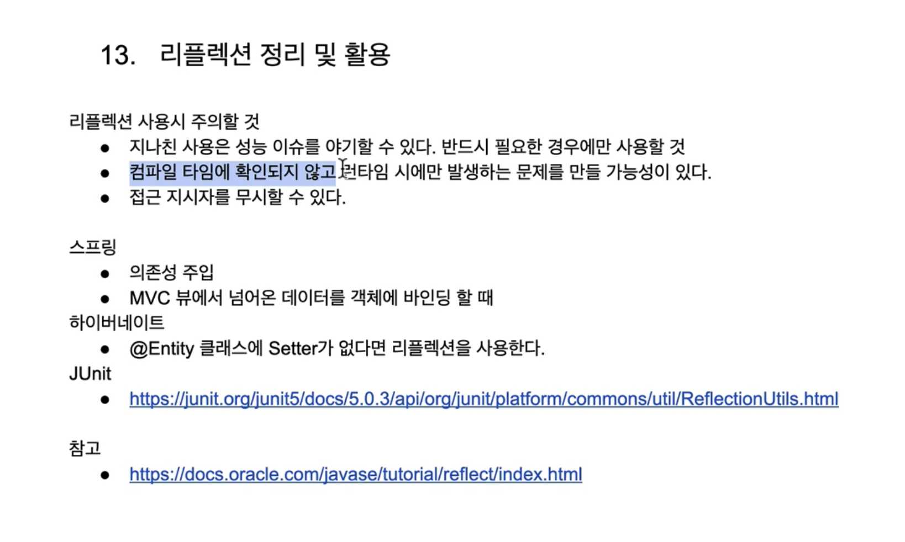

## java 리플랙션을 응용해서 DI 구현하기.
> 따라서 구현해보니 너무 신기하고 바로 이런 방법까지 생각할 수 있다니.. 백기선님이 너무 대단하신 것 같다..  

### 로직 설계
1. 근본적인 DI 는 아래와 같이 적으면 springboot 가 알아서 해준다.(필드주입)
```java
@Autowired
private NoteRepository noteRepository;
```

그러면 바로 그 클래스 어디서든지 noteRepository의 모든 것을 활용할 수 있게 된다. (범위는 옵셔널이다).

#### 그러면 DI 를 구현하는데 필요한 절차를 간추리자면
1. BoxService 내부에서 `public BoxRepository boxRepository` 하면...
2. `boxRepository`의 인스턴스를 활용해서 자유자재로 사용, 확장 가능하게 해야한다.

테스트로 `BoxService.class.boxRepository`가 isNotNull 인지 확인해보면.. false 일것이다.  
> 그럼 여기서 해야하는건 `@Autowired` 와 같은 역할을 하는 customAnnotation에 알맞은 instance를 잡아 넘겨줘야한다.  

나는 `@Autowired` 와 같은 역할을 해주는 customAnnotation을 `@Inject` 로 잡았다.
그렇다면.. 시나리오는 @Inject 가 붙어있는 필드를 찾아 그 필드의 타입의 인스턴스를 생성에 넘겨주면 되는거다!

ContainerService.class
```java
public class ContainerService {
    public static <T> T getObject(Class<T> classType) throws InvocationTargetException, InstantiationException, IllegalAccessException, NoSuchMethodException {
        T instance = createInstance(classType);
        // private 인 feild 일 가능성도 있으니깐 getDeclaredFields 로 찾고
        Arrays.stream(classType.getDeclaredFields()).forEach(f -> {
            if (f.getAnnotation(Inject.class) != null){
                try {
                    /**
                    어노테이션이 달린 필드의 타입을 가져온 뒤 인스턴스를 생성한다.
                    f.set(구, 현)
                    */
                    Object fieldInstance = createInstance(f.getType());
                    f.setAccessible(true);
                    f.set(instance, fieldInstance);
                } catch (InstantiationException | IllegalAccessException | InvocationTargetException | NoSuchMethodException e) {
                    //getType 에서 Exception 을 handling 해줘야 함.
                    throw new RuntimeException(e);
                }
            }
        });
        return instance;
    }

    인스턴스를 생성하는 부분
    private static <T> T createInstance(Class<T> classType) throws InstantiationException, IllegalAccessException, InvocationTargetException, NoSuchMethodException {
        // 기본생성자(null)을 가져와서 인스턴스를 생성한다.
        return classType.getConstructor(null).newInstance();
    }
}
```

이제 이 프로젝트를 export 시켜서 pom.xml에 dependency로 등록해서 사용하면 된다.

