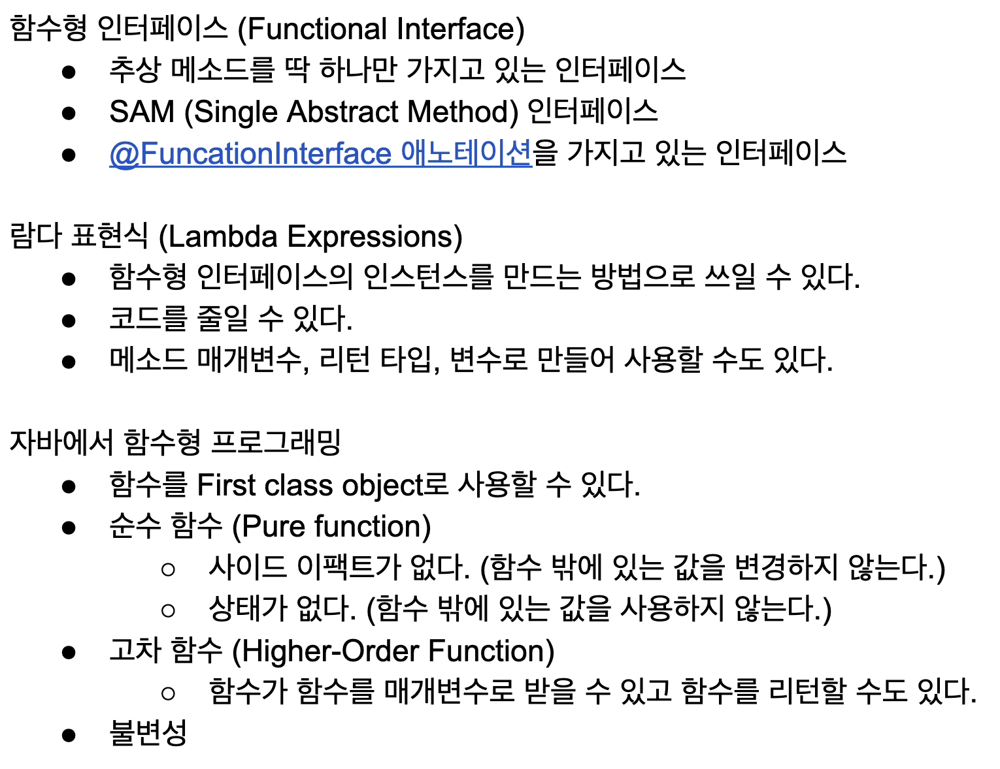

## 함수형 인터페이스 (Functional Interface)
> 함수형 인터페이스는 일급객체로 사용할 수 없는 Java 언어의 단점을 보완하기 위해 도입되었다.  
> [JDK 1.8의 function package](https://docs.oracle.com/javase/8/docs/api/java/util/function/package-summary.html) 에는 수 많은 Functional Interface 들이 정의되어 있다.

* 일급객체(first-class Object)
  * 다른 객체들에 일반적으로 적용 가능한 연산을 모두 지원하는 객체를 가르킨다. 
  * 보통 함수에 매개변수로 넘기기, 수정하기, 변수에 대입하기와 같은 연산을 지원할 때 일급 객체라고 한다.

### Index
1. Fuctional Interface란?
2. java.util.function 패키지의 대표적인 인터페이스
3. 위 인터페이스를 사용하는 Stream 인터페이스에 람다식 적용 방법
   

### 1. Functional Interface
> 메서드를 하나만 가지는 인터페이스를 말한다.

**Function Interface라는걸 명시하여 메서드를 추가로 선언하거나 인터페이스를 상속받는 등의 부적절한 행동을 미연에 방지하기 위해 @FunctionalInterface 어노테이션을 사용한다.**

ArithmeticOperator.interface
```java
@FunctionalInterface
public interface ArithmeticOperator {
    public int operate(int a, int b);
}
```

ArithmeticCalculator.interface
```java
@FunctionalInterface
public class ArithmeticCalculator {
    public static int calculate(int a, int b, ArithmeticOperator operator) {
        return operator.operate(a, b);
    }
}
```

ArithmeticCalculatorMain.class
```java
public class ArithmeticCalculatorTest {
 
    @Test
    public void test() {
        int first = 5;
        int second = 10;
        
        int result = ArithmeticCalculator.calculate(first, second, (a, b) -> a + b);
        Assert.assertEquals(first + second, result);
    }
}
```

위의 `ArithmeticCalculatorMain` 을 보면 `ArithmeticOperator`의 구현체가 예상되는 곳에 람다식을 넣었다.  
Functional Interface는 추상 메서드가 하나뿐이기 때문에 파라미터와 리턴 타입을 쉽게 추론할 수 있고, 이를 근거로 인스턴스를 생성한다.


### 부가적인 설명
> 아까 말했듯 Functional Interface의 조건은 추상 메소드를 딱 하나만 가지고 있는 인스턴스라고 했는데

예를 들어 아래 interface 를 참고해서 보면..
```java
@FunctionalInterface
public interface FooInterface {
    Integer calculatePlus(int a, int b);
}
```

`public abstract` 라고 하지 않았는데도 compile error 가 나지 않는 것을 볼 수 있다. (jdk 1.8 부터는 생략 가능)


또한 이 함수는 이렇게 사용이 가능하다.
```java
public class FooMain {
    public static void main(String[] args) {
        FooInterface fooInterface = (a, b) -> return a+b; // Integer::sum 메소드 레퍼런스 이용 가능
        System.out.println(fooInterface.calculatePlus(2,3));
    }
}
```

### 이렇게도 정리 가능할 것 같다.
