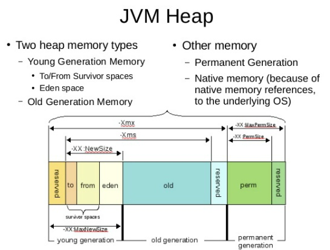
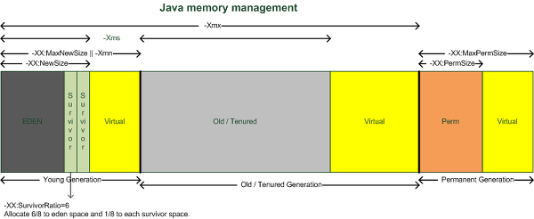
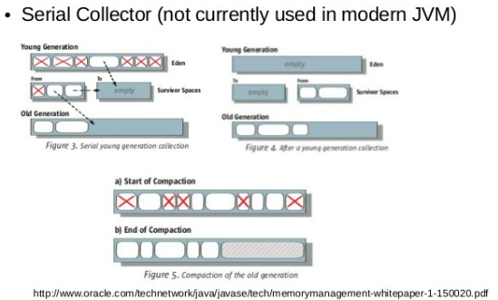

# [성능튜닝] GC, 가비지 컬렉터의 이해
어떤 서버든 풀(Full) GC를 수행하는 시점에는 해당 WAS의 컨테이너에서 서비스가 처리되지 않는다는 단점이 있습니다 다시한번 이야기 하면, GC를 많이 할 수록 응답시간에 많은 영향을 끼친다는 것입니다.

그러므로 자신이 만든 자바 프로그램의 성능을 생각하는 자바 엔지니어라면 GC가 어떻게 처리 되는지 알아야 합니다.

## 가비지 컬렉터의 원리
> GC 작업을 하는 가비지 컬렉터는 다음의 역할을 합니다.

1. 메모리 할당
2. 사용 중인 메모리 인식
3. 사용하지 않는 메모리 인식

GC를 해도 더이상 사용 가능한 메모리영역이 없는데 계속 메모리를 할당하려고 하면 OutOfMemoryError가 발생하며 WAS가 다운될 수 있습니다. 행(Hang) 즉, 서버가 요청을 처리 하지 못하고 있는 상태가 됩니다.

JVM의 메모리는 크게 `클래스 영역, 자바 스택, 힙, 네이티브 메소드` 스택의 4개 영역으로 나뉩니다.  
가비지 컬렉터에서는 힙 메모리를 다루게 됩니다. 즉 자바 컬렉터가 인식하고 할당하는 자바 메모리 영역은 힙 영역인 것입니다.

Heap은 `Young`, `Old`, `Perm` 세 영역으로 나뉩니다.  
이 중 Perm 영역은 거의 사용되지 않는 영역으로서 클래스와 메서드 정보와 같이 자바 언어 레벨에서 사용되지 않습니다. `Yong`, `Old` 영역 그리고 `Young` 영역은 Eden 영역과 두개의 Survivor 영역으로 나뉩니다. 우리가 고려해야 할 자바의 메모리 영역은 총 4개의 영역으로 나뉜다고 볼 수 있습니다. **( Young (1. Eden, 2. Survivor 1, 3. Survivor 2), Old (4. 메모리))**

일단 메모리에 객체가 생성되면, Eden 영역에 객체가 저장됩니다. Eden 영역에 데이터가 어느정도 쌓이면, 이 영역에 있던 객체가 욞겨지거나 삭제됩니다. 이 때 옮겨가는 위치가 survivor 영역입니다.

두개의 Survivor 사이에 우선 순위가 있는 것은 아니지만, 이 두개의 영역 중 한 영역은 반드시 비어 있어야 합니다. 그 비어있는 영역에 Eden 영역에 있던 객체가 할당됩니다.

Eden에서 survivor 둘 중 하나의 영역으로 할당 되고, 할당된 Survivor 영역이 차면 GC가 되면서 Eden 영역에 있는 객체와 꽉 찬 Survivor 영역에 있는 객체가 비어 있는 Survivor 영역으로 이동합니다. 그러다가 더 큰 객체가 생성되거나, 더 이상 Young 영역에 공간이 남지 않으면 객체들은 Old 영역으로 이동하게 됩니다.

### GC 가비지 컬렉터의 종류
> GC는 크게 두 가지 타입으로 나뉩니다. 마이너 GC와 메이저 GC의 두가지 GC가 발생할 수 있습니다.  

1. 마이너 GC: Young 영역에서 발생하는 GC
2. Old 영역이나 Perm 영역에서 발생하는 GC

두가지 GC가 어떻게 상호 작용하느냐에 따라서 GC 방식에 차이가 나며, 성능에도 영향을 줍니다.  
GC가 발생하거나 객체가 각 영역에서 다른 영역으로 이동할 때 애플리케이션의 병목이 발생하면서 성능에 영향을 주게 됩니다.  
그래서 핫 스팟 JVM 에서는 스레드 로컬 할당 버퍼 라는 것을 사용하는데. 이를 통해 메모리 버퍼를 사용하면 다른 스레드에 영향을 주지 않는 메모리 할당 작업이 가능합니다.

### 4가지 GC 방식

> Serial Collector (이하 시리얼 콜렉터)  
> Parallel Collector (이하 병렬 콜렉터)  
> Parallel Compacting Collector (이하 병렬 컴팩팅 콜렉터)  
> Concurrent Mark-Sweep (CMS) Collector (이하 CMS 콜렉터)

1. 시리얼 콜렉터
> Young 영역과 Old 영역이 시리얼하게 처리되며 하나의 CPU를 사용합니다. Sun 에서는 이 처리를 할 때 Stop-the-world 라고 표현합니다. 다시 말하면, 콜렉션이 수행될 때 애플리케이션 수행이 정지됩니다.

1) 일단 살아있는 객체들은 Eden 영역에 있습니다.
2) Eden 영역에 꽉차게 되면 To Survivor영역(비어있는)으로 객체가 이동됩니다. 이때 Survivor 영역에 들어가기에 너무 큰 객체는 바로 Old 영역으로 이동합니다. 그리고 From Survivor 영역에 남아 있는 객체들은 Old 영역으로 이동합니다.
3) To Survivor 영역이 꽉 찼을 경우, Even 영역이나 From Survivor 영역에 남아 있는 Old 영역으로 이동합니다. 

이 이후에 Old 영역이나 Perm 영역에 있는 객체들은 Mark-sweep-compact 콜렉션 알고리즘을 따릅니다. 이 알고리즘에 대해서 간단하게 말하면 **안쓰는거 표시해서 삭제하고 한 곳으로 모으는 알고리즘** 입니다.