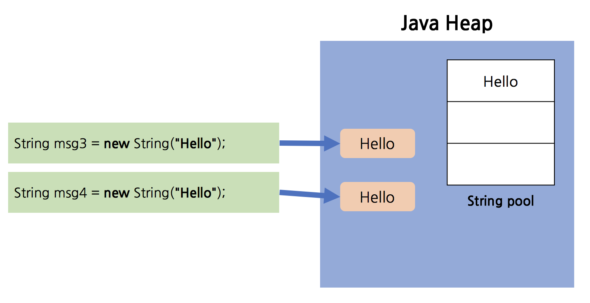

# Java StringBuilder를 쓰는 이유

```java
String literal1 = "hello world";
String literal2 = "hello world";
String notLiteral = new String("hello world");

assertFalse(literal1 == notLiteral);
```

String literal은 같은 문자열인 경우 Heap Memory/String pool 전체에서 하나만 존재한다.  
`literal1` `literal2` 모두 같은 내용의 literal 문자열인 경우에는 `assertTrue()`를 정상적으로 통과 해야한다.

```java
assertTrue(literal1.hashCode() == literal2.hashCode());
```

<p align="center">
    
</p>

하지만 `notLiteral`은 `new String`을 통해 같은 내용의 문자열임에도, 메모리에 새롭게 생성했다.  
