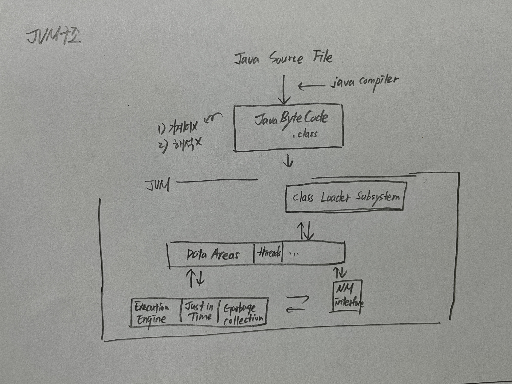

## JVM 이란?

### JVM 이란
`Java Virtual Machine` 의 줄임말 이며, Java Byte Code 를 OS에 맞게 해석 해주는 역할을 한다.  
Java Compiler는 `.java` 파일을 `.class` 라는 java byte code로 변환시켜 줍니다.  
Byte Code는 기계어가 아니기 때문에 OS 에서 바로 해석되지 않습니다.  
하지막 JVM의 해석은 OS가 ByteCode를 이해할 수 있도록 해줍니다.  

하지만.. JVM의 해석을 거치기 때문에 c언어 같은 네이티브 언어에 배해 속도가 느렸지만 JIT(Just In Time)컴파일러를 구현해 이점을 극복했습니다.  

**ByteCode 는 JVM 위에서 OS상관없이 실행된다.** 이런점이 java의 큰 장점이라고 할 수 있습니다. OS에 종속적이지 않고 Java 파일 하나만 만들면 어느 디바이스든 JVM 위에서 실행 할 수 있습니다.  

JVM은 `Class Loder`, `Runtime Data Areas`, `Excution Engine` 이렇게 3가지로 구성 돼 있습니다.  

