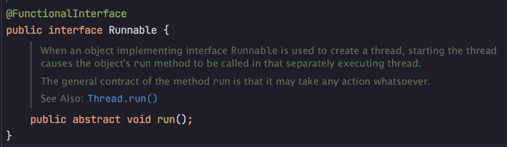

## 람다식
> 람다식은 다른말로 익명 메서드라고 한다.

* 인터페이스 중에서 메서드 하나만 가지고 있는 인터페이스를 함수형 인터페이스라고 하는데
  * 쓰레드를 만들 때 사용하는 Runnable 인터페이스의 경우 run() 메서드 하나만 가지고 있다.
    

#### Runnable 을 사용하여 "hello"를 10번 찍기
```java
package Lambda;

public class Runnable {
    public static void main(String[] args) {
        new Thread(new java.lang.Runnable(){
            public void run(){
                for (int i=0; i<10; i++){
                    System.out.println("hello");
                }
            }
        }).start();
    }
}
```
* 쓰레드가 실행되면 생성자 안에 넣은 Runable.run 메서드가 실행이된다.
* 자바는 **메서드만 매개변수(parameter)로 전달할 방법이 없다**. 인스턴스만 전달 할 수 있다.
* 그렇기 때문에 run() 메서드를 갖고 있는 func interface. Runnable 객체를 만들어 전달.

*메서드만 전달 가능해도, 편히라게 프로그래밍 할 수 있었지만.. 자바는 메서드를 전달할 방법이 없기 때문에 매번 객체를 생성해서 전달 했어야 했습니다. 이 부분을 해결한 것이 람다 표현식 입니다.*

#### 람다식을 이용해서 수정한 코드

```java
package Lambda;

public class LambdaEx {
    public static void main(String[] args) {
        new Thread(() -> {
            for(int i=0; i<10; i++){
                System.out.println("hello");
            }
        }).start();
    }
}
```

* `() -> {}` 부분이 람다식, 다른말로 익명 메서드(interface 안에 1개의 method만 선언)입니다.
* JVM은 Thread를 보고 `() -> {}` 이 무엇인지 **대상을 추론**합니다.
* Thread 생성자는 api를 보면 **Runnable 인터페이스를 받아드리는 것**을 알 수 있습니다.
* J**VM Thread 생성자가 Runnable 인터페이스를 구현한 것이 와야 하는 것**을 알게되고, `() -> {}`을 **Runbable 을 구현하는 객체로 자동으로 만들어** 매개변수로 넣습니다.