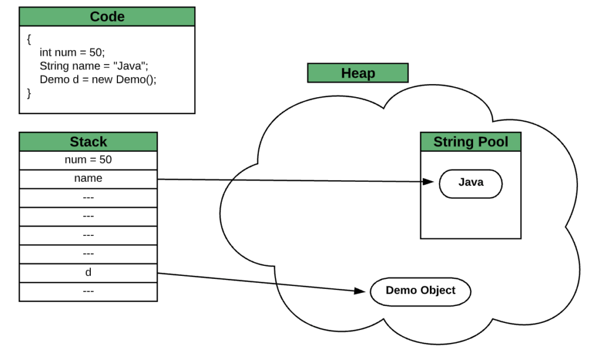
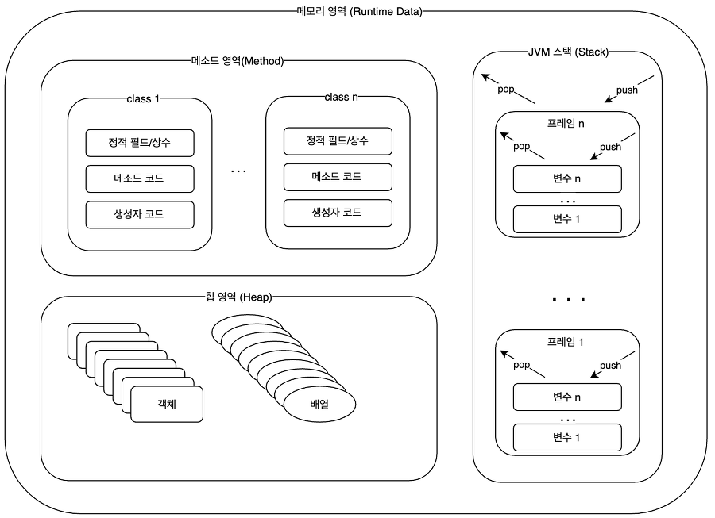

# 참조형 변수
> 자바는 크게 Primitive Type 과 Reference Type으로 분류됩니다.

## primitive type, Reference Type
```java
class ManyType {
    // Primitive type
    int a = 10;
    char myChar = 'm'; 

    // Reference type
    String s = "Hello, world!";
}
```

메모리에서 이 변수들이 갖는 값을 그림을 그리면 아래와 같습니다.


## 메모리 사용 영역


### 메소드 영역
메소드 영역은 JVM이 시작할 때 생성되고 모든 스레드가 공유되는 영역입니다.  
메소드 영역에서는 코드에 사용되는 class 들을 클래스 로더로 읽어 클래스 별로 static feild 와 constant, method code, constructor code 등을 분류해서 저장합니다.

### 힙 영역
힙 영역은 객체와 배열이 생성되는 영역입니다. 여기에 생성된 객체와 배열은 JVM 스택 영역의 변수나 다른 객체의 필드에서 참조합니다.  
만일 참조하는 변수나 필드가 없다면 의미없는 객체가 되기 때문에 JVM에서는 GC로 처리합니다.

### 스택 영역
JVM 스택은 메소드를 호출할 때마다 frame 을 추가하고 메소드가 종료되면 해당 프레임을 제거하는 동작을 수행합니다 (재귀함수)

프레임 내부에서는 로컬 변수 스택이 있는데 기본 타입 변수와 참조 타입 변수가 추가되거나 제거됩니다. 스택 영역에 변수가 생성되는 시점은 최초로 변수의 값이 저장될 때입니다. 변수는 선언된 블록 안에서만 스택에 존재하고 블록을 벗어나면 스택에서 제거됩니다.

## 결론
참조형 변수는 기본형 변수와는 다르게 실제 값을 그대로 저장하는 공간이 아니라 Heap 영역에 값이 저장된 공간의 주소값을 저장하는 공간이라는 것이다.

**즉, 기본형 변수는 실제 값을 저장하고, 참조형 변수는 주소 값을 저장하고 있는 것이다.**