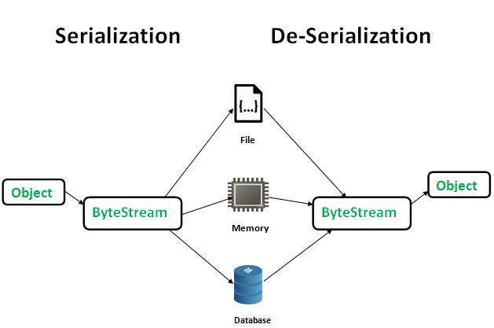
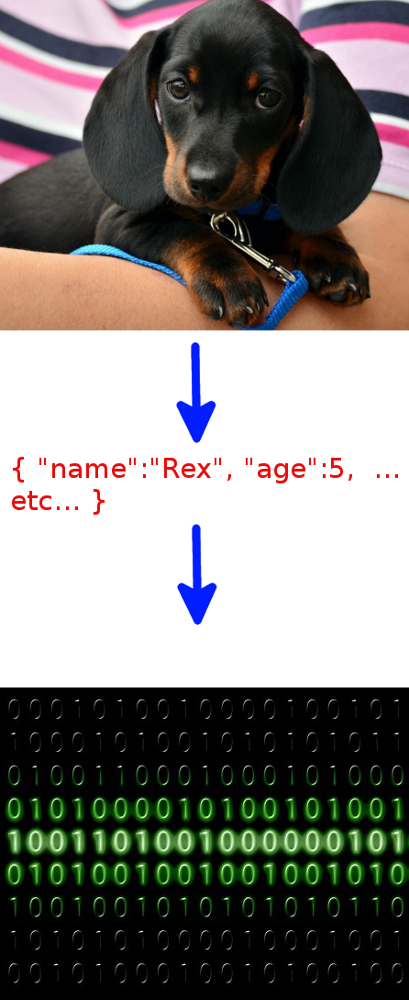

# 직렬화(Serialization)란?

> 도움을 주셔서 감사합니다 🙇🏻‍♂️  
> https://medium.com/@lunay0ung/basics-%EC%A7%81%EB%A0%AC%ED%99%94-serialization-%EB%9E%80-feat-java-2f3eb11e9a8

객체를 저장하거나 메모리, 데이터베이스 혹은 파일로 옮기려면 어떻게 해야할까?  
이럴 때 필요한 것이 직렬화다.

직렬화란 객체를 바이트 스트림으로 바꾸는 것, 즉 객체에 저장된 데이터를 스트림에 쓰기 위해 연속적인 serial 데이터로 변환하는 것이다.

직렬화의 주된 목적은 객체를 상태 그대로 저장하고 필요할 때 다시 생성하여 사용하는 것이다.



역직렬화는 Deserialization은 직렬화의 반대말로, 네트워크나 영구저장소에서 바이트 스트림을 가져와서 객체가 저장되었던 바로 그 상태로 변환하는 것이다.

직렬화하면서 생긴 바이트 스트림은 플랫폼에 독립적이다.  
**직렬화된 객체는 다른 플랫폼에서 역직렬화가 가능하다는 뜻이다.**

## Serializable
모든 클래스에서 직렬화 할 수는 없다. `java.io.Serializable` 인터페이스를 구현한 클래스의 객체만 직렬화될 수 있다.

serializable 인터페이스는 어떤 멤버변수나 메서드도 가지고 있지 않은 마커 인터페이스이다. 해당 인터페이스를 구현한 클래스가 특정 능력을 가진다고 표시 해두기 위해 쓰인다는 뜻이다.

단, 클래스에 비밀번호와 같이 보안상 직렬화되면 안 되는 값이나 직렬화가 될 수 없는 객체에 대한 참조가 포함된 경우 transient 라는 제어자를 이용할 수 있다. transient 가 붙은 인스턴스 변수의 값은 그 타입의 기본값으로 직렬화된다.

## SerialVersionUID
직렬화된 객체를 역직렬화 할 때엔 직렬화 당시 클래스와 같은 클래스를 사용해야 하는데, 클래스명이 같더라도 내용이 변경된 경우 역직렬화는 실패한다.

클래스 일치여부를 구별하는 기준은 SerialVersionUID로, 직렬화되는 클래스가 명시적으로 serialVersionUid를 선언하지 않으면 직렬화시 자동 생성 되어 직렬환 내용에 포함된다.

serialVersionUID는 컴파일러 실행에 따라 변경될 수 있는 클래스의 세부 사항에 매우 민감한 반면, 클래스 내에 serialVersionUID를 정의할 경우 클래스 내용이 변경되어도 클래스 버전은 업데이트되지 않으므로 직렬화시에는 serialVersionUID를 정의할 것이 권장된다.

## 직렬화가 뭔지 와닿지 않는다면.. 



상대방에게 새로 입양한 Rex를 있는 그대로 설명하고 싶지만..
어떤 사진이나 바디 랭귀지 없이 전화상으로 말로만 하기엔 어려운 일이다.

하지만..  
```
{
    "name": "Rex"
    "age": 5
    "fav_food": "apple"
    ...
}
```

이렇게 강아지가 가진 특성을 객체로 생성해서 직렬화한 후 통화 상대방에게 보내면 일이 보다 간단해진다.  