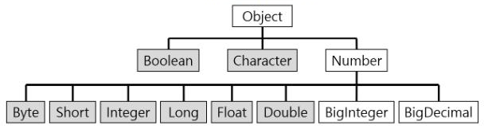
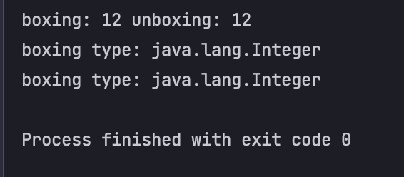

## 래퍼 클래스란?
> 자바의 자료형은 크게 기본타입과 참조 타입으로 나뉜다.  
> 대표적으로 기본 타입은 `char, int, float, double, boolean` 등이 있고, 참조 타입은 `class, interface` 가 있다.  
> 프로그래밍을 하다 보면 기본 타입의 데이터를 객체로 표현해야 하는 경우가 종종 있습니다.  

**"이럴 때 기본 자료타입을 객체로 다루기 위해 사용하는 클래스를 wrapper class 라고 합니다."**

자바는 모든 기본타입은 값을 갖는 객체를 생성할 수 있습니다.  
이런 객체를 포장 객체라고도 하는데 그 이유는 기본 타입의 값을 내부에 두고 포장하기 때문입니다.  
래퍼 클래스로 감싸고 있는 기본 타입 값은 외부에서 변경할 수 없습니다.  

### 래퍼 클래스 구조도


래퍼클래스의 부모는 Object 이고, 내부적으로 숫자를 다루는 래퍼클래스의 부모 클래스는 Number 클래스입니다.  
결론적으로 모든 래퍼클래스는 최종 클래스로 정의된다.


### 박싱과 언박싱


기본 타입의 값을 포장 객체(wrapper-object)로 만드는 과정을 boxing  
반대로 포장객체에서 기본타입의 값을 얻어내는 과정을 unBoxing 이라고 합니다.

```java
public class WrapperMain {
    public static void main(String[] args) {
        Integer boxing = 12;
        int unboxing = boxing.intValue();

        System.out.println("boxing: " + boxing + " unboxing: " + unboxing);
        System.out.println("boxing type: " + boxing.getClass().getName());
        System.out.println("unboxing type: " + ((Object) unboxing).getClass().getName());
    }
}
```



### 자동 박싱과 저동 언박싱

기본타입 값을 직접 박싱, 언박싱 하지 않아도 자동적으로 일어나는 경우가 있습니다.  
자동 박싱의 포장 클래스 타입에 기본값이 대입될 경우에 발생합니다.  

예를 들어 int 타입의 값을 Integer 클래스 변수에 대입하면 자동 박싱이 일어나 힙 영역에 Integer 객체가 생성됩니다.

```java
public class Wrapper_Ex {
    public static void main(String[] args)  {
        Integer num = 17; // 자동 박싱
        int n = num; //자동 언박싱
        System.out.println(n);
    }
}
```

### 문자열을 기본 타입 값으로 변환

```java
public class WrapperMain {
    public static void main(String[] args) {
        String str = "12.1";
        String str2 = "123.1";

        double strTrans = Double.parseDouble(str);
        double str2Trans = Double.parseDouble(str2);

        System.out.println("===str1 의 trans: " + strTrans + " ===str2 의 trans: " + str2Trans);
    }
}
```

래퍼클래스의 주요 용도는 값을 박싱해서 포장 객체로 만드는 것이지만, 문자열을 기본 타입 값으로 변환할 때에도 사용됩니다.  
대부분의 래퍼 클래스에는 parse + 기본 타입명으로 돼 있는 정적 메서드가 있습니다.  


### 값 비교

```java
public class Wrapper_Ex {
    public static void main(String[] args)  {
        Integer num = new Integer(10); //래퍼 클래스1
        Integer num2 = new Integer(10); //래퍼 클래스2
        int i = 10; //기본타입
		 
        System.out.println("래퍼클래스 == 기본타입 : "+(num == i)); //true
        System.out.println("래퍼클래스.equals(기본타입) : "+num.equals(i)); //true
        System.out.println("래퍼클래스 == 래퍼클래스 : "+(num == num2)); //false
        System.out.println("래퍼클래스.equals(래퍼클래스) : "+num.equals(num2)); //true
    }
}
```

래퍼 객체는 내부의 값을 비교하기 위해 `==` 연산자를 사용할 수 없습니다.  
이 연산자는 내부의 값을 비교하는 것이 아니라 래퍼 객체의 참조 주소를 비교하기 때문입니다.  
비교 대상인 래퍼는 객체이므로 서로의 참조 주소가 다릅니다.  

**객체끼리의 비교를 하려면 `.equals()` 를 사용해야 합니다.**  
**하지만 래퍼 클래스와 기본자료형은 `==`, `.equals()` 둘 다 가능합니다.**  

이유는 컴파일러가 자동으로 오토박싱과 언박싱을 해주기 떄문입니다.