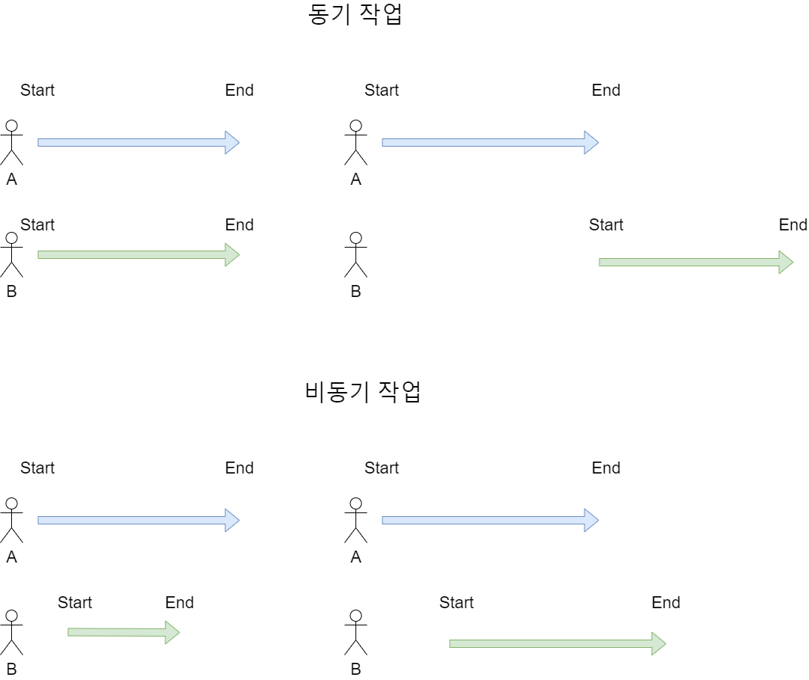
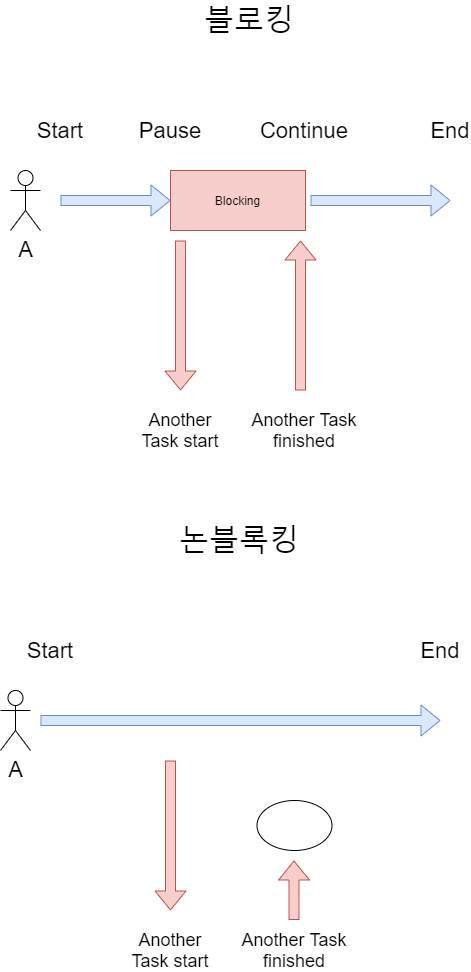

## 동기, 비동기 | 블록킹, 논블록킹
> fcm 서버를 구성하다가 내가 위와 같은 개념들을 혼용해서 쓴다는 생각이 들어 글로 정리한다. 

#### 동기 비동기 그리고 블록킹 논블록킹
우선 이 개념은 프로그램을 개발할 때 중요한 개념이다. 개발자들 사이에서도 로직을 개발하거나 기획할 때 위 개념을 이해한 정도에 따라 오해석이 발생할 수 있다.

우선 `동기 비동기 == 블록킹 논블로킹` 이라고 혼용하여 사용하는 경우가 있지만 둘은 서로 다른 개념이다. 연관관계가 없는 별개의 개념이라는 것이다.

동기/비동기는 작업을 수행하는 주체가 두 개(A, B) 이상이여야 한다. 이 때 작업은 시간(시작, 종료 등)을 서로 맞춘 다면 "동기"가 되는 것이고, 서로 작업의 시간이 관계가 없다면 "비동기"가 된다는 것이다.

반면에 블록킹/논블록킹은 작업의 대상이 2개 이상이여야 한다. 

두 개념이 서로 바라보는 관점이 다르기 때문에 다양한 조합이 가능합니다.  
ex) 동기/블록킹, 동기/논블록킹, 비동기/블록킹, 비동기/논블록킹

### 동기/비동기
동기 작업이란 작업을 수행하는 두 개 이상의 주체가 동시에 수행하거나 동시에 끝나거나 끝나는 동시에 시작할 때를 의미한다. 시작과 종료를 동시에 하거나, 하나의 작업이 끝나는 동시에 다른 주체가 작업을 시작하면 이를 동기 작업이라고 볼 수 있다. 

비동기 작업은 두 주체가 서로의 시작, 종료시간과는 관계 없이 별도의 수행 시작/종료시간을 가지고 있을 때를 뜻한다. 서로 다른 주체가 하는 작업이 자신의 작업 시작, 종료시간과는 관계가 없을 때 비동기라고 부를 수 있다.

### 블록킹/논블록킹
블로킹과 논블로킹은 다른 작업을 수행하는 주체를 어떻게 상대하는지가 중요하다.  
자신의 작업을 하다가 다른 작업 주체가 하는 작업의 시작부터 끝까지 기다렸다가 자신의 작업을 수행한다면 **블록킹**.  
다른 주체의 작업과 관계없이 자신의 작업을 계속한다면 이를 **논블로킹**이라고 할 수 있다.  

A쓰레드가 어떤 작업을 하는 다른 대상을 호출하고 그 대상이 가져온 결과를 받아 작업을 제개한다. 이러한 작업을 **블록킹**.  
반대로 다른 주체에게 작업을 요청하고 그 결과를 받을 때까지 기다리지 않으며 자신의 작업을 한다면 이를 **논블록킹**이라고 한다.

[-> stack overflow 에서도 이와 같은 정리를 확인할 수 있습니다](https://deveric.tistory.com/99)
