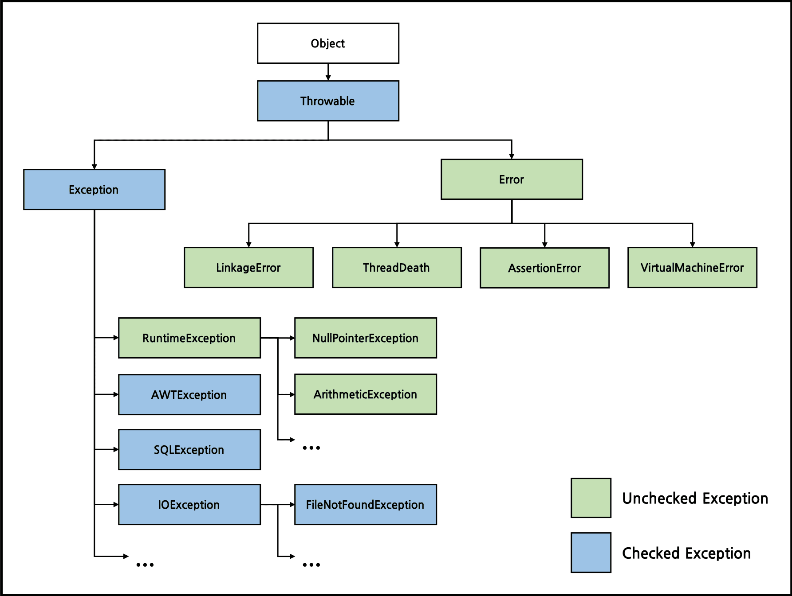

# 자바에서의 예외 구분 (checked, unchecked)
## 예외 구분
java에서의 Exception은 두 가지로 구분할 수 있다 CheckedException과 UnCheckedException으로 구분할 수 있는데, 간단하게 **RuntimeException**을 상속받는지 안받는지로 분류할 수 있다. 상속한 클래스는 UnCheckedException, 상속하지 않은 클래스는 CheckedException이다.



여기서 RuntimeException은 Exception 클래스의 서브 클래스이기 때문에 Exception의 일종이기도 하지만 **자바에서는 RuntimeException과 이를 상속한 클래스를 조금 특별하게 취급한다.** 명시적으로 예외를 처리하지 않아도 되기 때문이다.

## 예외 처리
예외를 처리하는 방법에는 예외 복구, 예외 처리 회피, 예외 전환 방법이 있다.

### 예외 복구
* 예외의 상황을 파악하고 문제를 해결해서 다시 정상 상태로 돌려 놓는 방법.
* 예외를 잡아서 일정 시간, 조건 만큼 대기하고 다시 재시도를 반복한다.
* 최대 재시도 횟수를 넘기게 되는 경우 예외를 발생시킨다.

```java
final int MAX_RETRY = 100;
public Object someMethod() {
    int maxRetry = MAX_RETRY;
    while(maxRetry > 0) {
        try {
            ...
        } catch(SomeException e) {
            // 로그 출력. 정해진 시간만큼 대기한다.
        } finally {
            // 리소스 반납 및 정리 작업
        }
    }
    // 최대 재시도 횟수를 넘기면 직접 예외를 발생시킨다.
    throw new RetryFailedException();
}
```

### 예외처리 회피
* 예외 처리를 직접 담당하지 않고 호출한 쪽으로 던져 회피하는 방법
* 그래도 예외 처리의 필요성이 있다면 어느 정도는 처리하고 던지는 것이 좋다.
* 긴밀하게 역할을 분담하고 있는 관계가 아니라면 예외를 그냥 던지는 것은 무책임하다.

```java
// 예시 1
public void add() throws SQLException {
    // ...생략
}

// 예시 2 
public void add() throws SQLException {
    try {
        // ... 생략
    } catch(SQLException e) {
        // 로그를 출력하고 다시 날린다!
        throw e;
    }
}
```

### 예외 전환
* 예외 회피와 비슷하게 메서드 밖으로 예외를 던지지만, 그냥 던지지 않고 적절한 예외로 전환해서 넘기는 방법
* 조금 더 명확한 의미로 전달되기 위해 적합한 의미를 가진 예외로 변경한다.
* 예외 처리를 단순하게 만들기 위해 포장할 수도 있다.

```java
// 조금 더 명확한 예외로 던진다.
public void add(User user) throws DuplicateUserIdException, SQLException {
    try {
        // ...생략
    } catch(SQLException e) {
        if(e.getErrorCode() == MysqlErrorNumbers.ER_DUP_ENTRY) {
            throw DuplicateUserIdException();
        }
        else throw e;
    }
}

// 예외를 단순하게 포장한다.
public void someMethod() {
    try {
        // ...생략
    }
    catch(NamingException ne) {
        throw new EJBException(ne);
        }
    catch(SQLException se) {
        throw new EJBException(se);
        }
    catch(RemoteException re) {
        throw new EJBException(re);
        }
}
```

## 정리
자바에서 예외는 RuntimeException을 상속하지 않고 **꼭 처리해야 하는 Checked Exception**과 반대로 **명시적으로 처리하지 않아도 되는 Unchecked Exception**으로 구분 가능하다.
