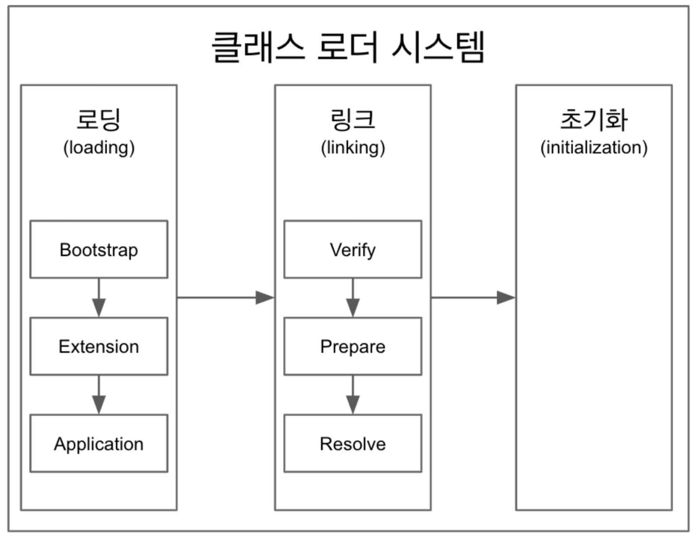

## ClassLoader | 클래스로더
> 간략하게 설명하자면.. `.java` 파일을 `.class` 파일로 바꿔주는 핵심적인 역할을 한다. (바이트코드로 변환하는 작업을 한다.)  
> 이렇게 생성된 .class 파일들을 엮어서 JVM 이 운영체제로 부터 할당받은 메모리영역인 Rumtime Data Area 로 적재하는 역할을 Class Loader 가 한다.



우선 classLoader 의 구조를 파악해보자
```java
public class ClassLoaderEx {
    public static void main(String[] args) {
        ClassLoader classLoader = ClassLoaderEx.class.getClassLoader();
        System.out.println(classLoader);
        System.out.println(classLoader.getParent());
        System.out.println(classLoader.getParent().getParent());
    }
}
```


> 이렇게 ClassLoader는 `AppClassLoader` 이고.  
> `AppClassLoader` 의 부모는 `PlatformClassLoader` 이다.  
> 그 부모도 `BootstrapClassLoader` 라고 존재하지만, null 을 반환한다.

* 이거에 대한 자료를 찾아보니..
  * 
  * 결론적으로 일부 구현에서 `BootstrapClassLoader` 는 null로 나타낼 수 있다고 한다.
  * "네이티브코드로 구현되어 볼 수 없다" - 백기선

#### 클래스를 읽어오는 순서(로딩)
<ins> 부모(BootstrapClassLoader) -> 자식(PlatformClassLoader)  -> 자식(AppClassLoader) </ins>

만약에 최하위 클래스에서 못 읽는다면.. `ClassNotFoundException` 이 발생.  
> ex) pom.xml 에 의존성 추가 안하고 App 을 실행시킬 때.


### 링크 (Link)
* Verify: `.class` 파일의 형식이 유효한지 확인한다.
* Prepare: 클래스 변수와 static 변수에 필요한 메모리
* Resolve: 이건 `Optional` 이다 "적절한 Heap 영역을 가르킬수도 있고 아닐 수도 있다."