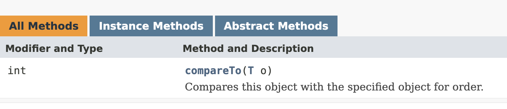

# Comparable 구현 그리고 compareTo 재정의
> 좌표정렬 알고리즘을 구현하다 Comparable 을 구현해 사용하는 것을 보고 객체를 정렬해주는 중요한 클래스인 것 같아 따로 정리한다.

#### 인덱스
1. 등장배경 이해하기
2. Comparable 
3. Comparator
4. 둘의 차이

## Comparable
> [오라클 공식문서 SE 8](https://docs.oracle.com/javase/8/docs/api/java/lang/Comparable.html#method.summary)

All Methods를 보면 하나의 추상 메소드만 있는 것을 볼 수 있다. 함수형 인터페이스인 것이다.  
뭐 그렇게 되면 해당 interface를 impl 해서 사용할 수도 있겠지만 람다식 사용도 가능하다.



> 여기서 이 클래스, 메서드의 중요한 기능은 서**로 다른 두 객체를 비교**한다는 것이다. 


보통 우리가 `primitive type` 으로 비교할 때는 아래와 같이 비교가 가능했다.
```java
public class Main {
    public boolean isCorrect(int a, int b){
        return a==b;
    }
    public static void main(String[] args) {
        Main main = new Main();

        int a = 10;
        int b = 10;

        // true 가 반환 됨.
        System.out.println(main.isCorrect(a,b));
    }
}
```

하지만 객체 A, B 일때는 어떻게 비교할 것인가? 
```java 
public class Person{
    String name;
    int age;

    public Person(String name, int age) {
        this.name = name;
        this.age = age;
    }
}
```
##  name? age? 기준으로 비교되는 건가??

사실 이 부분이 포인트이다. 본질적으로 객체는 사용자가 기준을 정해주지 않는 이상 어떤 객체가 더 높은 우선순위를 갖는지 판단 할 수 없다. 어떤 사람은 나이를 기준으로 판단할테고, 또 다른 사람은 이름을 기준으로 판단하는 등 기준이 중구난방이 되는 것이다.

그래서 이러한 문제점을 해결하기 위헤 `Comparable` 과 `Comparator`가 쓰인다는 것이다.

그럼 `Comparable`과 `Comparator`의 역할은 비슷한 것 같은데 무슨 차이인 것일까?  
왜 `Comparable`의 `comapreTo(T o)` 메소드의 파라미터는 하나이고, `Comprator`의 `compareTo(T o1, T o2)` 메소드는 파라미터가 두개인 것일까?

일단, 두 인터페이스의 구체적인 내용을 떠나서 정답부터 말하자면, `Comparable`은 **"자기자신과 매개변수 객체를 비교"** 하는 것이고, `Comparator`는 **"두 매개변수 객체를 비교"** 하는 것이다.

또 다른 차이점이라면 Comparable은 lang패키지에 있기 때문에 **import 를 해줄 필요가 없지만,**  Comparator는 util패키지에 있다.

## Comparable<T>
우선 `<T>` 제네릭에 대해서 모르는 사람은 바로 앞 TIL 문서를 보고 와줬으면 좋겠다.  
아무튼 `Comparable<T>` 에 T로 비교할 객체 타입이 오면 되는 것이다. 뭐 나는 `Person`으로 하겠다.

```java
public static class Person implements Comparable<Person>{
    String name;
    int age;

    public Person(String name, int age) {
        this.name = name;
        this.age = age;
    }

    @Override
    public int compareTo(Person o) {
        return 0;
    }
}
```
여기까지 왔으면 거의 다 된것이다.  
만약 나이 기준으로 비교 하고자 한다면 어떻게 하면 될까?  
자기 자신의 age와 매개변수로 들어온 o의 age의 값을 비교하면 된다.  

```java
@Override
public int compareTo(Student o) {

    // 자기자신의 age가 o의 age보다 크다면 양수
    if(this.age > o.age) {
        return 1;
    }
    // 자기 자신의 age와 o의 age가 같다면 0
    else if(this.age == o.age) {
        return 0;
    }
    // 자기 자신의 age가 o의 age보다 작다면 음수
    else {
        return -1;
    }
}
```

즉 쉽게 말해 우리는 '값'을 비교해서 정수를 반환해야 한다는 것이다. 그럼 무슨 기준으로 양수, 0, 음수를 반환하는 건가요?

한 번 생각해보자. 우리는 "자기자신"과 "상대방"을 비교한느 것이다. 즉 자기자신을 기준으로 삼아 대소관계를 파악해야 한다.  
만약 내가 갖고 있는 값이 7이라고 가정해보자 그리고 상대방은 3이라고 가정한다면, 나는 상대방보다 4만큼 값이 크다 

**한 마디로 자기 자신을 기준으로 상대방과의 차이가 얼마나 나느냐다.**

사실 조건문을 통해 대소비교를 하고 그에 따라 1,0,-1을 반환하는 방식이 이해하기도 쉬울테고 가장 정석적인 방법이다.  

## Comparable의 특징
1. 자기자신과 매개변수를 비교한다.
2. compareTo 메소드를 반드시 구현해야한다. (Functional Interface 특징)