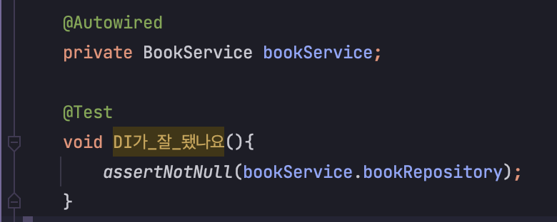

## spring의 DI 는 어떻게 작동하는걸까?
> springboot 를 사용하면서 당연시하게 지나갔던 부분인것 같은데 한번 정리해보려고 한다.

우선 임의적인 `repository, service`.class 를 만들어 보겠다.
1. bookRepository.java
```java
@Repository
public class BookRepository {
}
```
2. BookService.class
```java
@Service
public class BookService {
    @Autowired
    BookRepository bookRepository;
}
```

이렇게 하면 service 에 bookRepository가 null인지 아닌지 테스트에서 성공이 뜬다.  
너무 신기하지 않는가?? 어떻게 `@Autowired` 만 붙였다고 주입이 될 수 있는지.



