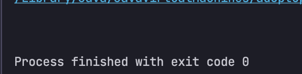

## 바이트코드를 조작해보자 - 실습

우선.. 내가 개인적으로 만든 Class 를 참고하여 구조를 파악해보자

Foo.java
```java
public class Foo {
    String name = "";

    public String answerName(){
        return name;
    }
}
```

main.java
```java
public class ByteCodeInvent {
    public static void main(String[] args) {
        Foo foo = new Foo();
        System.out.println(foo.answerName());
    }
}
```

이렇게 실행시키면 당연히 콘솔에는 아무것도 안뜨겠죠?


아... 나 maven 빌드 툴 안썻지 말입니다.. (아래 내용은 다른 강의 내용으로 대체)

#### 본격적인 바이트코드 조작 실습
* [ByteBuddy를 사용합니다](https://bytebuddy.net/#/)

maven인 경우 `pom.xml`에 의존성을 추가해줍니다.
* [여기로 들어간 후 버전은 알잘딱](https://mvnrepository.com/artifact/net.bytebuddy/byte-buddy)