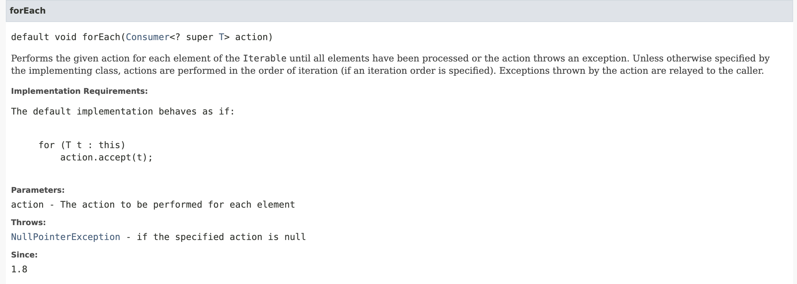

# 자바 8 API의 기본 메서드와 스태틱 메서드

## 문자열 출력을 보다 더 다양하게 하는 방법들..

### ArrayList<T> a.foreach()


자바 1.8v 부터 사용가능하게 됐고, foreach()는 특정 기능만을 수행하기 보다는 응용하여 다양하게 활용 가능하다.

#### 사용해보기..
```java
public class JavaEx {
    public static void main(String[] args) {
        ArrayList<String> names = new ArrayList<>();
        names.add("jihwan");
        names.add("sunwoo");
        names.add("changgue");

        names.forEach(s -> System.out.println(s));
    }
}
```

names변수명의 ArrayList를 만들고 이름 하나하나(index) 출력할 때 람다식을 사용할 수 있다.  
하지만.. 이 출력문을 더 간결하게 하는 방법이 있다. 바로!!! 메소드 레퍼런스를 사용하는 방법이다.  
IntelliJ에서는 메소드 레퍼런스를 사용하라고 추론해주기도 한다. 그래서.. 아래와 같이 더 간결하게 할 수 있다.

```java
names.forEach(System.out::println);
```

### Spliterator<T>


... 이외에 다양함.. [-> 참고](https://docs.oracle.com/javase/8/docs/api/java/util/Spliterator.html)