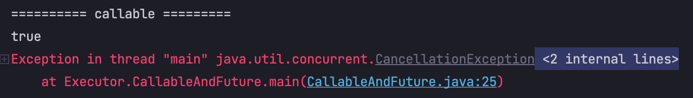

# java Callable과 Future
Thread는 Runnable과 Callable의 구현된 함수를 구현한다는 공통점이 있지만. 차이점도 존재한다.
* Runnable: 어떤 객체도 **리턴하지 않는다** Exception을 발생시키지 않는다.
* Callable: 특정 타입의 **객체를 리턴한다** Exception을 발생시킨다.

```java
public class CallableAndFuture {
    public static void main(String[] args) throws ExecutionException, InterruptedException {
        ExecutorService executorService = Executors.newSingleThreadExecutor();

        Callable<String> hello = () -> {
            Thread.sleep(1000L);
            return "Hello";
        };
        Callable<String> jihwan = () -> {
            Thread.sleep(1000L);
            return "Jihwan";
        };

        System.out.println("========== callable =========");
        Future<String> submit = executorService.submit(hello);
        System.out.println(submit.get());
    }
}
```

이렇게 Callable Type의 함수를 미리 구현하고 `executorService.submit()`을 통해 작업을 추가하고 해당 작업을 즉시 블록킹 하려면 `.get()`을 통해 결과를 볼 수 있다.

람다식으로도 당연히 가능하다 어차피 람다는 타입을 통한 추론을 해주기 때문에 !!
```Java
Future<String> submit = executorService.submit(() -> {
    Thread.sleep(2000L);
    return "이렇게도 가능하네";
});
System.out.println(submit.get());
```

### 프로세스 현황 파악하기
`submit.isDone();`을 사용하면 프로세스가 끝났는지 아닌지 boolean Type으로 확인 가능하다.  
`submit.cancel(true);`을 사용하면 프로세스를 강제 종료 할 수 있다.  

이렇게 되면 그 후에 오는 모든 작업에 관한 세부 메소드가 disabled 된다.


### 여러 작업을 동시 실행하기
`ExecutorService.invokeAll()`을 사용하여 가능하다. 

```java
public class CallableAndFuture {
    public static void main(String[] args) throws ExecutionException, InterruptedException {
        ExecutorService executorService = Executors.newSingleThreadExecutor();

        Callable<String> hello = () -> {
            Thread.sleep(1000L);
            return "Hello";
        };
        Callable<String> jihwan = () -> {
            Thread.sleep(1000L);
            return "Jihwan";
        };
        Callable<String> isGood = () -> {
            Thread.sleep(2000L);
            return "isGood";
        };

        List<Future<String>> futures = executorService.invokeAll(Arrays.asList(hello, jihwan, isGood));
        for (Future<String> f : futures){
            System.out.println(f.get());
        }

        executorService.shutdown();
    }
}
```

`invokeAll()` 은 `Collection` tasks 를 받기 때문에 `Arrays.asList()`를 통해 치환하여 파라미터로 넘겨준다.  
또, 이 `invokeAll()`메소드의 특징이 있는데 아래의 API docs 를 참고해보자.


이처럼 모든 task, 여기서 말하는 task는 `hello, jihwan, isGood` 3tasks 가 모두 완료 되어야만 `.isDone()`이 true가 된다. 결론적으로 3개의 tasks 중 가장 시간이 오래걸리는 2초 동안의 작업마저 모두 완료가 되어야 isDone을 true로 반환한다는 것이다.