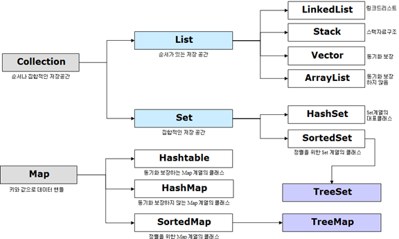

## 자바 컬렉션
> java 에서 컬렉션이란 데이터의 집합, 그룹을 의미하며,  
> JCF(Java Collections Framework)은 이러한 데이터, 자료구조인 컬렉션과 이를 구현하는 클래스를 정의하는 인터페이스를 제공한다. 

Collection 인터페이스는 List, Set, Queue 로 크게 3가지 상위 인터페이스로 분류할 수 있다.  
그리고 여기에 **Map의 경우 Collection 인터페이스를 상속받고 있지 않지만 Collection 으로 분류된다.**  

### Collection 인터페이스의 특징
1. Set - HashSet, TreeSet: **순서를 유지하지 않는 데이터의 집합**, 데이터의 중복을 허용하지 않는다.
2. List - LinkedList, Vector, ArrayList: **순서가 있는 데이터의 집합**으로 데이터의 중복을 허용한다.  
3. Queue - LinkedList, PriorityQueue: List와 유사.
4. Map - Hashtable, HashMap, TreeMap: key, value 쌍으로 이루어진 데이터의 집합으로, 순서는 유지되지 않으며, **키 중복을 허용하지는 않으나 값의 중복은 허용한다.**

* Set 인터페이스
  * 순서를 유지하지 않는 데이터의 집합으로, 데이터의 중복을 허용하지 않는다.
    * HashSet
      * 가장빠른 임의 접근 속도
      * 순서를 예측할 수 없음
    * TreeSet
      * 정렬방법을 지정할 수 있음

* List 인터페이스
  * 순서가 있는 데이터의 집합으로 데이터의 중복을 허용한다.
    * LinkedList
      * 양방향 포인터 구조로 데이터의 삽입, 삭제가 빈번할 경우 데이터의 위치정보만 수정하면 되기에 유용
      * 스택 큐 양방향 큐 등을 만들기 위한 용도로 쓰임
    * Vector
      * 과거에 대용량 처리를 위해 사용했으며, 내부에서 자동으로 동기화처리가 일어나 비교적 성능이 좋지 않고 무거워 잘 쓰이지 않음
    * ArrayList
      * 단방향 포인터 구조로 각 데이터에 대한 인덱스를 가지고 있어 조회 기능에 성능이 뛰어남

* Map 인터페이스
  * 키, 값의 쌍으로 이루어진 데이터의 집합으로,  
    순서는 유지되지 않으며 키의 중복을 허용하지 않으나 값의 중복은 허용한다. 
    * Hashtable
      * HashMap 보다는 느리지만 동기화를 지원
      * Null 불가능
    * HashMap
      * 중복과 순서가 허용되지 않으며 null 값이 올 수 있다.
    * TreeMap
      * 정렬된 순서대로 key와 value를 저장하여 검색이 빠르다.

