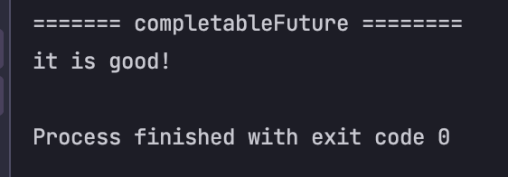
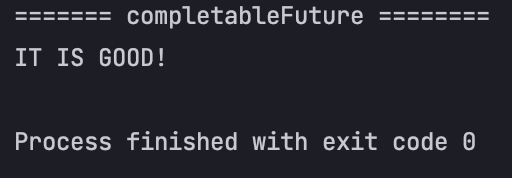

# java completableFuture 그리고 callback

## 콜백이란?
콜백 메소드란 다른 함수에 인수로 전달되는 함수이자 `myMethod(bMethod())` 이벤트 후에 실행되는 것이다.  
콜백 메서드의 용도는 다른 클래스에서 일부 작업이 완료된 경우 클래스에 완료되었다는 것을 알려줍니다.

## completableFuture 
이전에 포스팅했던 Future를 사용했을때 처리하기 힘든 일들(콜백..)을 쉽게 해준다.  
원하는 쓰레들풀을 이용해서 실행할 수도 있지만 기본은 `ForkJoinPool.commonPool()`이다. (쓰레드풀을 지정해주면 sutdown의 번거러움이 있다.)

### 비동기로 작업을 실행하는 방법
* 리턴값이 있는 경우: `CompletableFuture.supplyAsync()`
* 리턴값이 없는 경우: `CompletableFuture.runAsync()` 

기본적으로 `ExecutorService` 와 달리 굳이 `shutdown();` 하지 않아도 `CompletableFuture`의 Task가 완료되면 프로세스도 종료된다.

```java
public class CompletableFutureEx {
    public static void main(String[] args) throws ExecutionException, InterruptedException {
        CompletableFuture<String> completableFuture = CompletableFuture.supplyAsync(() -> {
            System.out.println("======= completableFuture ========");
            return "it is good!";
        });

        System.out.println(completableFuture.get());
    }
}
```



### 콜백도 제공한다. 
`CompletableFuture<T>`라는 클래스의 `supplyAsync()` 메소드의 처리 결과를 `.thenApply()` 메소드로 넘겨 실행한다.

```java
public class CompletableFutureEx {
    public static void main(String[] args) throws ExecutionException, InterruptedException {
        CompletableFuture<String> completableFuture = CompletableFuture.supplyAsync(() -> {
            System.out.println("======= completableFuture ========");
            return "it is good!";
        }).thenApply(String::toUpperCase);

        System.out.println(completableFuture.get());
    }
}
```

