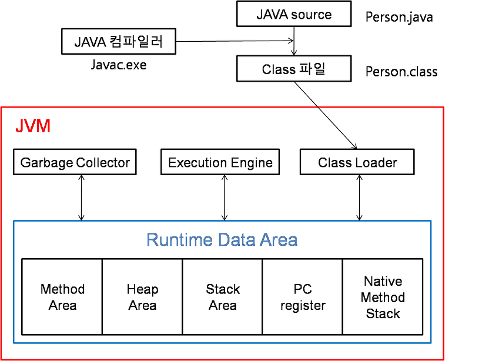
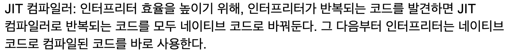
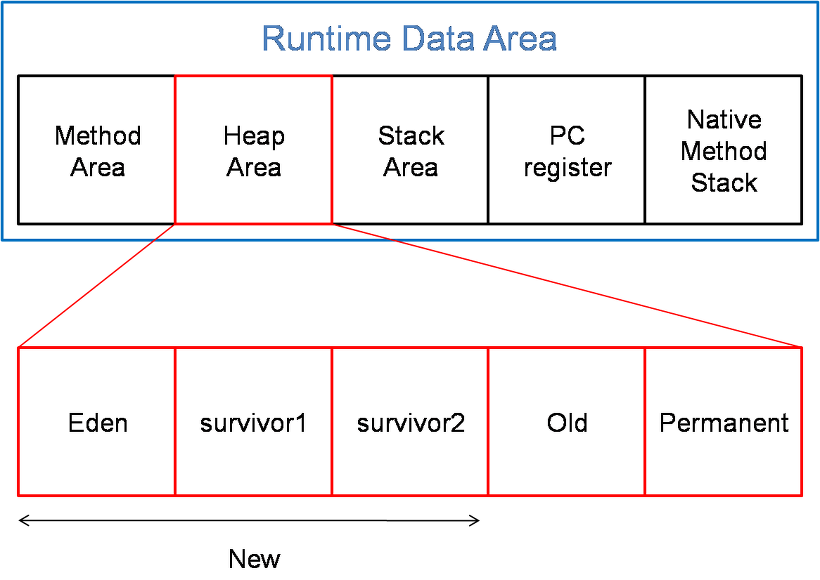
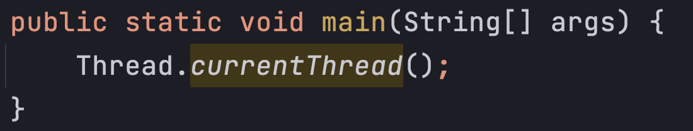
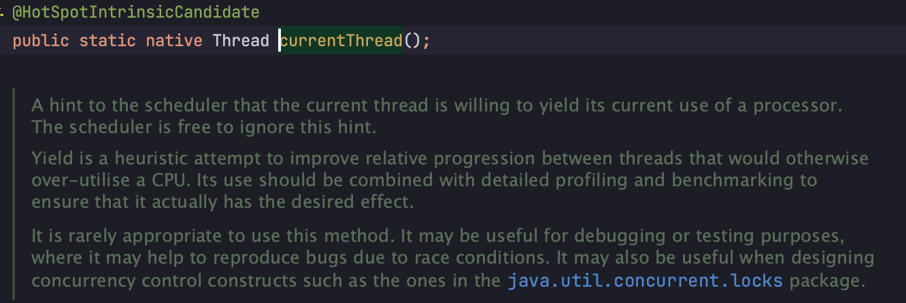

## JVM 구조와 자바 런타임 메모리 구조

> JVM의 기본적인 구조는 이전 포스트에서 설명했다.  
> 이 포스팅에서는 JVM 의 내부 Runtime Data Area 에 대해 자세히 설명해 보겠다.

#### 1. Class Loader
자바에서 소스를 작성하면 `.java` -> `.class` 로 바꿔주는 역할을 한다.  
결론적으로 소스코드를 바이트코드로 생성(변환) 해주는 역할을 하는 것이다.  
이렇게 생성된 `.class` 파일들을 엮어서 JVM 이 운영체제로 부터 할당받은 메모리영역인 **Rumtime Data Area 로 적재하는 역할을 `Class Loader` 가 한다.** (자바 어플리케이션이 실행중 일 때 이런 작업을 한다.)

#### 2. Execution Engine
Class Loader 에 의해 메모리에 적재된 **클래스코드(바이트코드)들을 기계어로 변경해 명령어 단위로 실행하는 역할을 한다.**

명령어를 하나하나 실행하는 인터프리터 방식과 JIT 컴파일러를 이용하는 방식이 있다.  
<ins>JIT 컴파일러는 적절한 시간에</ins> 바이트코드를 네이티브 코드로 변경해서 Execution Engine이 네이티브로 컴파일된 코드를 실행하는것으로 성능을 높이는 방식이다.

- JIT 컴파일러에게 적합한 시간이란 - 백기선 인용
  - native 언어를 한줄 한줄 번역하다보면 분명히 겹치는(?) 실행 line 들이 존재할 것 이다.
  - 
- JIT 컴파일러
  - `.java` 를 번역하는것에만 극한되는것이 아님 "결론적으로 java 파일만 컴파일 하는게 아니다"

여기서 네이티브 코드란 "메모리가 관리 되지 않은 코드이다."  즉 메모리가 헤제되지 않고 참조 계산, 가비지 수집이 없다. 메모리가 비어 있고 할당 된 코드.

#### 3. GC
GC 는 Heap 메모리 영역에 생성된 객체(`Aclass a = new Aclass();`)들 중에 참조되지 않은 객체들을 탐색 후 제거하는 역할을 GC가 합니다.  
또 다른 특징은 GC가 수행되는 동안 GC를 수행하는 쓰레드가 아닌 모든 쓰레드가 일시정지된다.  
특히 Full GC 가 일어나서 수 초간 모든 쓰레드가 정지한다면 장애로 이어지는 치명적인 문제가 생긴다. 

#### 4. Runtime Data Area
JVM 메모리 영역으로 자바 애플리케이션을 실행할 때 사용되는 데이터들을 적재하는 영역이다.  
이 영역은 크게 Method Area, Heap Area, Stack Area, PC Register, Native Method Stack 로 나눌 수 있다.  

1. Method area | 메서드 영역
   1. 클래스 멤버 변수의 이름, 데이터 타입, 접근 제어자 정보같은 필드 정보와 메서드 이름, 리턴 타입, 파라미터, 접근 제어자 정보같은 메서드 정보, Type 정보, static 변수, final class 변수등이 생성된다.

2. Heap area | 힙 영역
   1. new 키워드로 생성된 객체와 배열이 생성되는 영역이다.
   2. 메서드 영역에 로드된 클래스만 생성이 가능하고, GC가 참조되지 않는 메모리를 확인하고 제거하는 영역이다.

3. Stack area | 스택 영역 **- 특정 thread에 극한된다**
   1. 지역변수, 파라미터, 리턴 값 연산에 사용되는 임시 값등이 생성되는 영역이다.
   2. `int a=10;` 이라는 소스를 작성했다면, 정수값이 할당될 수 있는 메모리공간을 a라고 잡아두고 그 메모리 영역에 값이 10이 들어간다. **즉, 스택에 메모리 이름을 a라고 붙여주고 값이 10인 메모리 공간을 만든다.**
   3. 클래스 `Person p = new Person();` 이라는 소스를 작성했다면 Person p 는 스택영역에 생성되고 new 로 생성된 Person의 인스턴스는 힙 영역에 생성된다.
   4. 스택영역에 생성된 p 의 값으로 힙 영역의 주소값을 가지고 있다. **즉 스택 영역에 생성된 p가 힙 영역에 생성된 객체를 가르킨다.**
   5. 메서드를 호출할 때 마다 개별적으로 스택이 생성된다.

4. PC Register | PC 레지스터 **- 특정 thread에 극한된다**
   1. 쓰레드가 생성될 때마다 생성되는 영역으로 program counter 즉 현재 쓰레드가 실행되는 부분의 주소와 명령을 저장하고 있는 영역이다.
   2. 이것을 이용하여 쓰레드를 돌아가면서 수행할 수 있게 한다.

5. Native method stack **- 특정 thread에 극한된다**
   1. 자바 외 언어로 작성된 네이티브 코드를 위한 메모리 영역이다.
   - 보충 설명을 하자면..
   - 
   - 
   - 이처럼 `Thread.currentThread();` 메서드도 **native method** 이다.