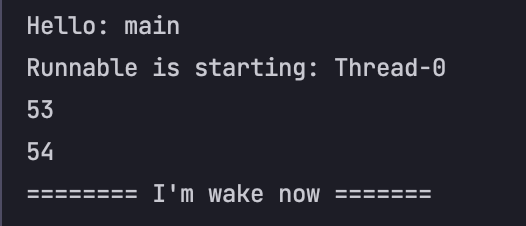

# Java Thread
### 쓰레드와 프로세스의 차이
1개의 프로세스를 처리하기 위해 n개의 쓰레드가 수행 한다고 이해하면 쉽다.
쓰레드는 한 프로세스 내에서 동작하는 여러 실행의 흐름으로 프로세스 내의 주소 공간이나 자원들을 같은 프로세스 내의 주소 공간이나 자원들을 같은 프로세스 내에 쓰레드끼리 공유하면서 실행된다.
각각의 쓰레드는 별도의 레지스터와 스택을 갖고 있지만 힙 메모리는 서로 읽고 쓸 수 있다.


## 자바에서 쓰레드를 사용해보자

### 쓰레드의 실행은 개발자가 알 수 없다.
아래의 코드에서 확인해보자..  
ProcessThread.java
```java
public class ProcessThread {
    public static void main(String[] args) {
        Thread thread = new Thread(new Runnable() {
            @Override
            public void run() {
                System.out.println("thread is running: " + Thread.currentThread().getName());
            }
        });
        thread.start();
        System.out.println("Hello: " + Thread.currentThread().getName());
    }
}
```
뭔가 `thread.start();` 가 먼저 호출되니 thread 안의 Runnable 이 먼저 실행되고 그 후가 구현될 것처럼 생각하지만.. 사실 결과는 모르는 것이다.


이처럼 Main Thread가 먼저 실행되고 직접 만든 쓰레드 Runnable이 실행되는 것을 볼 수 있다.

### 쓰레드 재우기
```java
@Override
public void run() {
    System.out.println("thread is starting: " + Thread.currentThread().getName());
    try {
        System.out.println("========= thread is sleeping ========");
        Thread.sleep(3000L);
        System.out.println("========= thread is wake =========");
    } catch (InterruptedException e) {
        e.printStackTrace();
    }
}
```
이렇게 `Thread.sleep(3000L)`를 추가해 보았다.  
이렇게 되면 Runnable이 3초간 sleep하고 나서 깨어나고 종료되는 것을 확인할 수 있다.

### 쓰레드 깨우기
```java
 public static void main(String[] args) throws InterruptedException {
    Thread thread = new Thread(() -> {
        System.out.println("Runnable is starting: " + Thread.currentThread().getName());
        while (true){
            try {
                Thread.sleep(1000L);
                System.out.println(LocalDateTime.now().getSecond());
            } catch (InterruptedException e) {
                System.out.println("======== I'm wake now =======");
                return;
            }
        }
    }); thread.start();

    System.out.println("Hello: " + Thread.currentThread().getName());
    Thread.sleep(3000L);
    thread.interrupt();
}
```

이 코드를 보면 일단 먼저 드는 생각이 굉장히 복잡하다. 뭐 그렇기 때문에 나중에 내가 다시 정리할 CompletableFuture가 등장한다. 아무튼.  

이 코드를 보면 Runnable 을 시작하자마자 무한루프에서 1초마다 현재 초를 출력한다.  
하지만, Main 쓰레드가 시작하고 3초를 sleep 하고 그 뒤에 Runnable을 깨우게 된다. 이렇게 되면 1초당 한번씩 출력하고 있던 Runnable이 `interrupt()`를 감지 하자 마자 루프를 빠져나와 종료하게 되는 것이다.



아무튼 굉장히 복잡해진다.. 나중에 n개의 쓰레드를 개발자가 직접 만들어 관리하기에는 굉장히 어렵다.

### 쓰레드 기다리기
```java
public static void main(String[] args) throws InterruptedException {
    Thread thread = new Thread(() -> {
        System.out.println("Runnable is starting: " + Thread.currentThread().getName());
        try {
            Thread.sleep(3000L);
        } catch (InterruptedException e) {
            System.out.println("======== I'm wake now =======");
        }
    }); thread.start();

    System.out.println("Hello: " + Thread.currentThread().getName());
    Thread.sleep(3000L);
    thread.join();
    System.out.println("======= thread is finished =======");
}
```
이렇게 `thread.join();` 을 사용하면 해당 쓰레드가 종료되기 전 까지 기다려주다 프로세스가 종료 되는 것을 볼 수 있다.