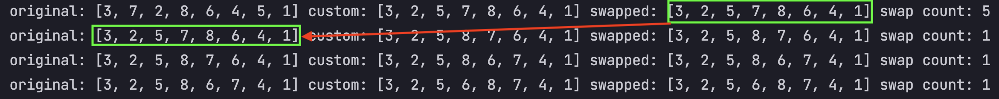
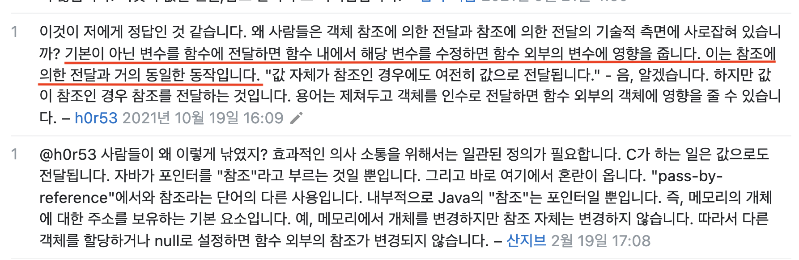
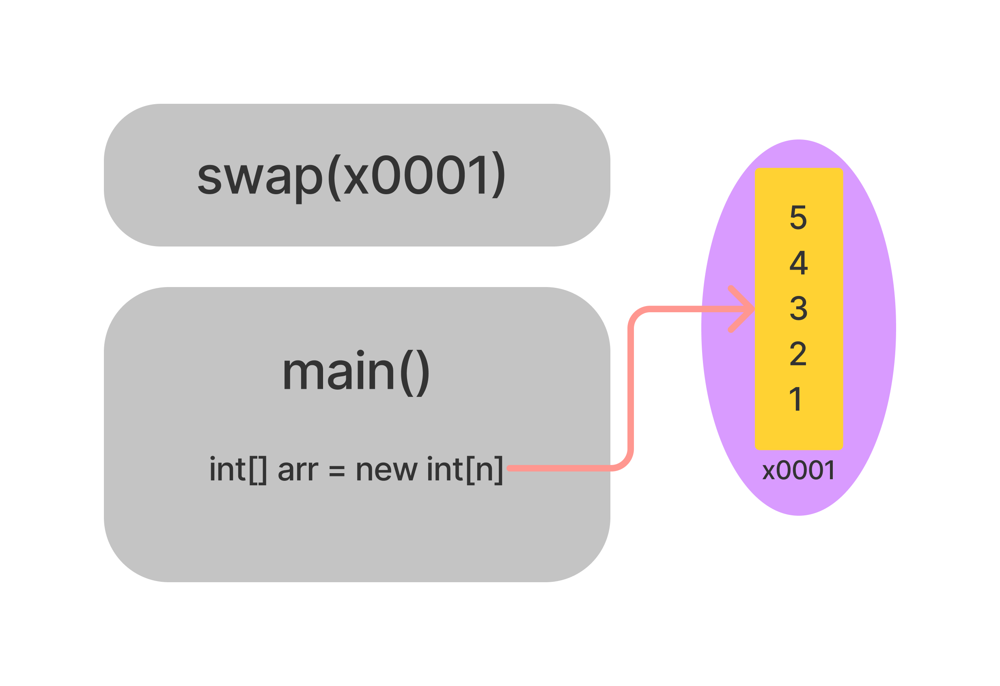
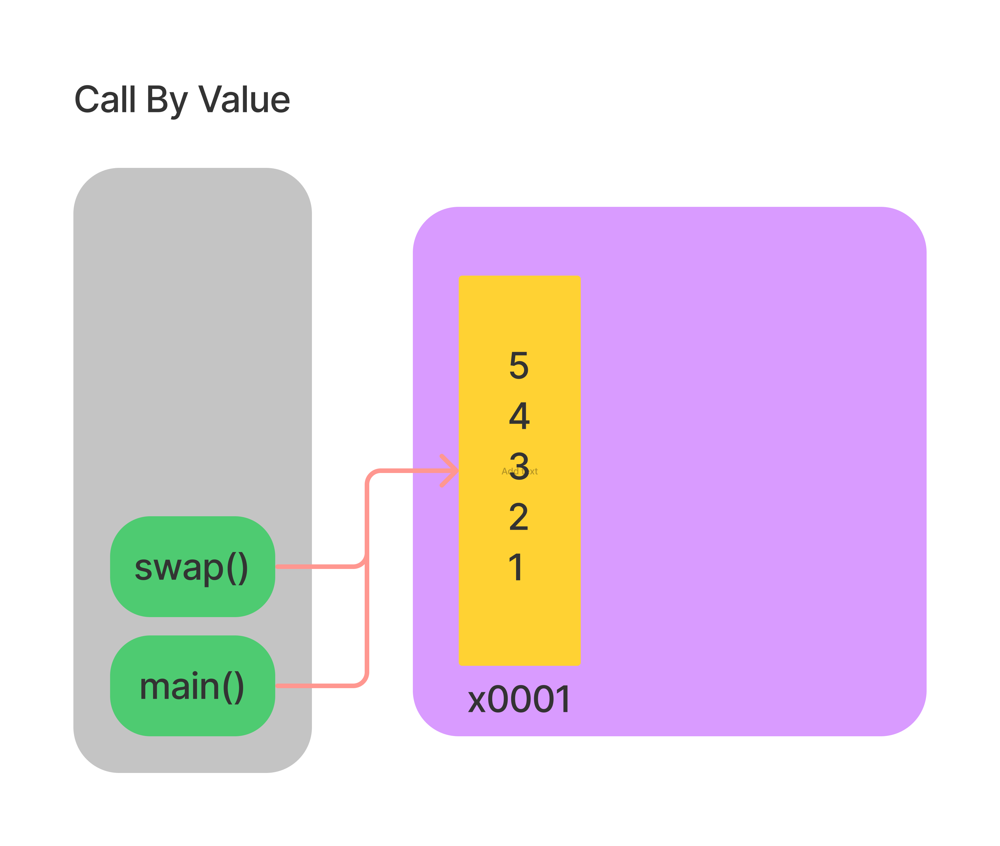

# 자바는 Call By Value 이다.

오랜만에 포스팅을 쓰는 것 같다.  
이번 포스팅은 당*마켓 기술 면접을 준비하면서 짧게 정리했던 내용을 내가 실제로 경험한 사례를 들어 자세히 설명하려고 한다.

## 아니 이게 된다고?

앞서 말했듯 자바는 `call by value` 라고 이미 알고있던 나는.. 코딩테스트 solution의 출력 결과를 보고 멘붕에 빠지게 된다.

아래 출력은 내가 실제로 나는 쏘* 코딩테스트를 보면서 있었던 일이다.  
나는 코딩테스트 시간이 촉박했기에 swap 로직의 copy address 문제를 해결하지 못하고 우선 제출했지만.. 회고하려고 한다.

<p align="center">
    
</p>

콘솔에 보이는 `original: [*, *, * ...]` 출력은 아래 예시코드로 설명하면 다음과 같다.  
`main()` 에서 `primitiveArrayCallByRef()` 에 `original`에 해당하는 array를 인자로 넘기고 호출 한 뒤 `primitiveArrayCallByRef()`에서 파라미터로 받은 배열을 출력한 것이다.

> swap을 반복할 때마다(메소드를 호출 할 때마다) `swapped: [*, *, * ...]` 의 배열이 다음 original 배열의 값에 전이(영향)가 되는 것을 확인할 수 있다.

아래의 코드를 참고하면 더 이해가 잘 될 것이다.

```java
public static void main(String[] args) {
    int[] array = new int[]{1, 2, 3, 4, 5};

    for (int i=0; i<3; i++){
        primitiveArrayCallByRef(array);
    }

}

private static void primitiveArrayCallByRef(int[] array) {

    System.out.println("=============");
    System.out.println(Arrays.toString(array)); 

    for (int i=0; i<array.length; i++){
        if (i == 1){
            // swap
            int temp = array[i];
            array[i] = array[i+1];
            array[i+1] = temp;
        }
    }
}
```

어떻게 보면 자바는 `Call By Reference`와 `Call By Value`가 공존하는 언어가 아닐까? 하는 생각이 들 것이다.  

여러 커뮤니티에 "java는 `Call By Value`다. `Call By Ref`도 존재한다." 를 두고 열렬한 토론을 하고 있었다. 나는 이럴 때 일수록, 이런 결과에도 불구하고 java가 `Call By Value` 라는 점을 증명하려 한다.

참고하면 좋은 자료들
> [DevEric Blog](https://deveric.tistory.com/92)  
> [stackoverflow - Call By Value, Call By Reference 두 가지 이면의 의미와 역사](https://stackoverflow.com/a/430958/18518672)  
> [Scott Stanchfield - Java is Pass-by-Value, Dammit!](https://www.javadude.com/articles/passbyvalue.htm)

## 기본적으로 Call By Value는 함수 외부의 변수에 영향을 주지 않아야 해!

내가 처음에 생각했던 java가 진정 `Call By Value` 라면 "**함수 외부의 변수에 영향을 주면 안돼 !"** 를 이미 어떤 분이 StackOverFlow에 기재하셨다.

<p align="center">
    
</p>

"함수 외부에 변수에 영향을 주면 안되잖아."에 대한 답변도 내 포스팅 내용을 더 읽지 않는 이상 바로 이해 하기에는 어려울 것이다.  

<p align="center">
    
</p>

> 솔직히 이걸 작성하면서 자료를 많이 조사했는데 이러한 논쟁들이 기술적 용어에 대한 말장난을 하는 것만 같아 짜증이 났다.  
> 나처럼 말장난 (용어가 복잡하게 얽혀 있음)으로 여기고 그로 인해 명쾌하지만은 않은 답변들이 불편하다는 것에 의견을 남기신 분도 존재했다.

## On Pointers vs References

프로그래밍 언어 디자인에서 "포인터"는 일부 데이터의 위치를 ​​간접적으로 추적하는 변수입니다. 포인터의 값은 관심 있는 데이터의 메모리 주소인 경우가 많습니다. 일부 언어에서는 해당 주소를 조작할 수 있습니다.

참고자료 3번째 블로그에서는..  
이 [Oracle 자료](https://docs.oracle.com/javase/specs/jls/se11/html/jls-4.html#jls-4.3.1) 두 번째 줄은 많은 사람들에게 더 큰 혼란을 야기 시켰다고 이야기 합니다.

> The reference values (often just references) are pointers to these objects, and a special null reference, which refers to no object.  
>
> 참조 값(종종 단순히 참조)은 이러한 개체에 대한 포인터이며 개체를 참조하지 않는 특수한 null 참조입니다.

그들은 원래 Java를 만들 때 "포인터"를 염두에 두고 있었습니다. (예: 클래스에서 이것의 일부를 볼 수 있습니다 NullPointerException)  

Sun은 Java를 보안 언어로 사용하기를 원했으며 **Java의 장점 중 하나는 C++에서처럼 포인터 연산 을 허용하지 않는다는 것입니다.**  
그들은 공식적으로 "참조"라고 부르는 개념에 대해 다른 이름을 시도하기까지 했습니다. 엄청난 실수로 그 과정에서 더 큰 혼란을 일으켰습니다.

## 객체를 전달하지 않습니다. 메모리 값을 전달합니다.

`primitiveArrayCallByRef(arr)`에 arr 의 개체를 전달하지 않습니다. 포인터 값을 전달합니다.  
전달되는 포인터는 메모리 주소와 굉장히 유사합니다. 자바 측에서는 아니라고 하지만 같다고 생각하는게 이해하기 쉽습니다. 이 메모리 값은 일부 개체를 고유하게 식별합니다.

자바에서는..

```java
Person p;
```

C++ 에서는.. 다음과 일치합니다.
```cpp
Person *p;
```

자바에서는..
```java
p.setName("jyeonjyan");
```

c++ 에서는.. 다음과 일치합니다.
```cpp
p->setName("jyeonjyan");
```

요약하자면 자바 에는 포인터가 있고 포인터의 값이 전달 됩니다. 실제로 객체 자체를 매개변수로 전달할 수 있는 방법은 없습니다. 객체에 대한 포인터만 전달할 수 있습니다.

```java
primitiveArrayCallByRef(arr)
```

당신은 arr 자체를 전달하고 있지 않습니다. arr에 대한 포인터(메모리 주소)를 전달하고 있습니다.

## 그렇다면 제 코드에서는 어떤일이 일어나고 있었던걸까요?

참고하면 좋은 자료
- [stackoverflow - primitve types array in meomory](https://stackoverflow.com/a/29582896/18518672)

```java
public static void main(String[] args) {
    int[] arr = new int[]{1, 2, 3, 4, 5};

    for (int i=0; i<3; i++){
        primitiveArrayCallByRef(arr); // 1
    }

}

private static void primitiveArrayCallByRef(int[] array) {

    System.out.println("=============");
    System.out.println(Arrays.toString(array)); 

    for (int i=0; i<array.length; i++){
        if (i == 1){
            // swap
            int temp = array[i];
            array[i] = array[i+1];
            array[i+1] = temp;
        }
    }
}
```

* `주석 1` 과 같이 array를 매개변수로 넣어 `primitiveArrayCallByRef(arr)`메소드를 호출 했을 때 `new int[]`로 선언한 `main()`의 배열의 포인터(메모리 주소) 값을 복사하여 전달됩니다. (`Call By Value`)
  * 그림으로 표현하면 다음과 같습니다.
  * 
* `primitiveArrayCallByRef(int[] array)` 파라미터로 받은 `array` 이름을 가진 배열은 `main()` 의 배열 `arr` 이름을 가진 포인터를 가르키게 됩니다.
  * 그림으로 표현하면 다음과 같습니다.
  * 

