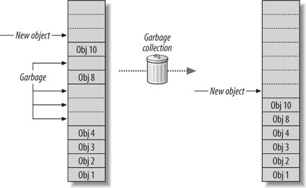

## 멀티 스레드(multi-thread)
일반적으로 하나의 프로세스는 하나의 스레드를 가지고 작업을 수행하게 됩니다.  
하지만 멀티 스레드 (multi-thread)란 하나의 프로세스 내에서 둘 이상의 스레드가 동시에 작업을 수행하는 것을 의미합니다.  
또한, 멀티 프로세스(multi-process)는 여러 개의 메모리를 가지고 실행되지만, 멀티 스레드는 각 스레드가 자신이 속한 프로세스의 메로리를 공유한다는 점이 다릅니다.


<br>

<u>멀티 스레드와 멀티 프로세스 모두 여러 흐름을 동시에 수행한다는 공통점을 가지고 있습니다.</u>  
멀티 프로세스는 각 프로세스가 독립적인 메모리를 갖고 별도로 실행되지만, 멀티 스레드는 각 스레드가 자신이 속한 프로세스의 메모리를 공유한다는 점이 다릅니다.  

<br>

멀티 스레드는 각 스레드가 자신이 속한 프로세스의 메모리를 공유하므로, 시스템 자원의 낭비가 적습니다. 또한, 하나의 스레드가 작업을 할 때 스레드가 별도의 작업을 할 수 있어 사용자와의 응답성도 좋아집니다.

## 문맥 교환 (context switching)
컴퓨터에서 동시에 처리할 수 있는 최대 작업 수는 CPU의 코어(core)수와 같습니다.  
만약 CPU의 코어 수보다 더 많은 스레드가 실행되면, 정해진 시간 동안 여러 작업을 번갈아가며 수행하게 됩니다.


이때 각 스레드가 서로 교체될 때 스레드 간의 **문맥 교환(context switching)** 이라는 것이 발생합니다.  
문맥 교환이란 현재까지의 작업 상태나 다음 작업에 필요한 각종 데이터를 저장하고 읽어오는 작업을 가르킵니다.  

이러한 문맥 교환이 걸리는 시간이 커지면 커질수록, 멀티 스레딩의 효율은 저하됩니다.  
오히려 많은 양의 단순한 계산은 싱글 스레드로 동작하는 것이 더 효율적일 수 있습니다.  
따라서 많은 수의 스레드를 실행하는 것이 언제나 좋은 성능을 보이는 것은 아니라는 점.

## 스레드 그룹(thread group)
스레드 그룹(thread group)이란 서로 관련이 있는 스레드를 하나의 그룹으로 묶어 다루기 위한 장치 입니다. 자바에서는 스레드 그룹을 다루기 위해 ``ThreadGroup`` 이라는 클래스를 제공합니다.


이러한 스레드 그룹은 다른 스레드 그룹을 포함할 수도 있으며, 이렇게 포함된 스레드 그룹은 트리 형태로 연결됩니다.  
이때 스레드는 자신이 포함된 스레드 그룹이나 그 하위 그룹에는 접근할 수 있지만, 다른 그룹에는 접근 할 수 없습니다.  
이렇게 스레드 그룹은 스레드가 접근할 수 있는 범위를 제한하는 보안상으로도 중요한 역할을 하고 있습니다.

```java
class ThreadWithRunnable implements Runnable {
    public void run() {
        try {
            Thread.sleep(10); // 0.01초간 스레드를 멈춤.
        } catch (InterruptedException e) {
            e.printStackTrace();
        }
    }
}
public class Thread03 {
    public static void main(String[] args){
        Thread thread0 = new Thread(new ThreadWithRunnable());
        thread0.start(); // Thread-0 실행
        System.out.println(thread0.getThreadGroup());

        ThreadGroup group = new ThreadGroup("myThread"); // myThread라는 스레드 그룹 생성함.
        group.setMaxPriority(7); // 해당 스레드 그룹의 최대 우선순위를 7로 설정함.

        // 스레드를 생성할 때 포함될 스레드 그룹을 전달할 수 있음.
        Thread thread1 = new Thread(group, new ThreadWithRunnable());
        thread1.start(); // Thread-1 실행
        System.out.println(thread1.getThreadGroup());
    }
}
```
> 위의 예제처럼 main() 메소드에서 생성된 스레드의 기본 스레드 그룹의 이름은 "main"이 되며, 최대 우선순위는 10으로 자동 설정됩니다.


## 데몬 스레드(deamom thread)
데몬 스레드(deamon thread)란 다른 일반 스레드의 작업을 돕는 보조적인 역할을 하는 스레드를 가르킵니다.  
따라서 데몬 스레드는 일반 스레드가 모두 종료되면 더는 할 일이 없으므로, 데몬 스레드 역시 자동으로 종료됩니다.  

<br>

데몬 스레드의 생성 방법과 실행 방법은 모두 일반 스레드와 같습니다.  
단, 실행하기 전에 setDeamom() 메서드를 호출하여 데몬 스레드로 설정하기만 하면 됩니다.

<br>

이러한 데몬 스레드는 일정 시간마다 자동으로 수행되는 저장 및 화면 갱신 등에 이용되고 있습니다.

## 가비지 컬렉터(gabege collector)
데몬 스레드를 이용하는 가장 대표적인 예로 가비지 컬렉터를 들 수 있습니다.  
가비지 컬렉터란 프로그래머가 동적으로 할당한 메모리중 사용하지 않는 영역을 자동으로 찾아내어 해제해 주는 데몬 스레드 입니다.  

자바에서는 프로그래머가 메모리에 직접 접근하지 못하게 하는 대신에 가비지 컬렉터가 자동으로 메모리를 관리해 줍니다.  
이러한 가비지 컬렉터를 이용하면 프로그래밍을 하기가 훨씬 시워지며, 메모리에 관련된 버그가 발생할 확률도 낮아집니다.  



보통 가비지 컬렉터가 동작하는 동안에는 프로세서가 일시적으로 중지되므로, 필연적으로 성능의 저하가 발생합니다.  
하지만 요즘에는 가비지 컬렉터의 성능이 많이 향상되어, 새롭게 만들어지는 대부분의 프로그래밍 언어에서 가비지 컬렉터를 제공하고 있습니다.