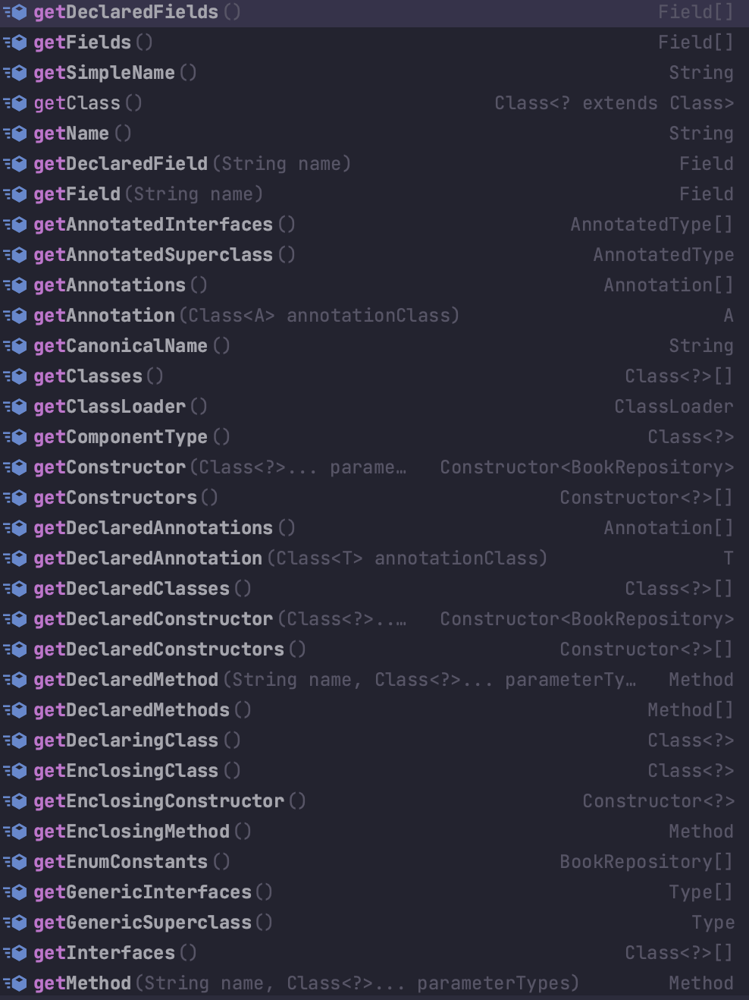

## java reflection
> Reflection을 사용하는 기술을 나열하자면, 우리가 잘 아는 스프링 프레임워크, 대표적 ORM 기술인 하이버네이트, jackson라이브러리 등에 사용됩니다.

#### 클래스 정보를 조회하는 다양한 방법
```java
// 이렇게 바로 접근도 가능합니다.
Class<BookRepository> bookRepositoryClass = BookRepository.class;

// app 에 이미 인스턴스가 잡혀 있을 때.
BookRepository bookRepository = new BookRepository();
Class<? extends BookRepository> aClass = bookRepository.getClass();

// 이렇게 forName 을 통해서 경로로 class 를 접근할 수도 있다.
Class<?> aClass1 = Class.forName("com.example.thejava.repository.BookRepository");
```

#### 클래스의 필드를 가져오는 방법
1. public 에 한에서 가져오기
```java
/**
* 해당 클래스의 필드를 전부 가져오는 방법
*/
Class<BookRepository> bookRepositoryClass1 = BookRepository.class;

// 해당 클래스의 필드를 가져오기(Public)
Arrays.stream(bookRepositoryClass1.getFields()).forEach(System.out::println);
```

2. private 까지 전부 가져오기
```java
Arrays.stream(bookRepositoryClass1.getDeclaredFields()).forEach(System.out::println);
```


**아래는 앞으로 잘 사용하게 될 여러가지의 option들이다 잘 참고하시길 (귀찮아서 절대 아님)**
