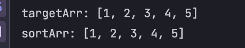
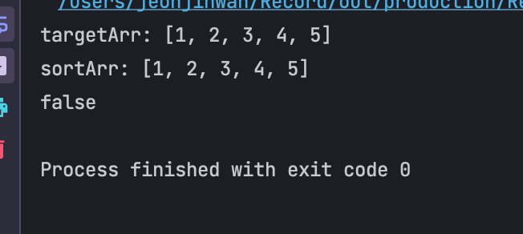

# 자바 배열의 깊은 복사와 얕은 복사
> 배열에서 어떠한 값이 복사되는데 크게 2가지 복사 방법이 있습니다.

## 얕은복사 (shallow copy)
간단히 정리하면 한쪽에서 수정이 발생하면 다른쪽에도 영향을 끼쳐 같아지게 됩니다.  
복사한 배열에서 어떠한 값을 수정하면 원래 배열에도 변경된 값이 들어갑니다.

```java
public class Main {
    public static void main(String[] args) {
        // Given
        int[] targetArr = {1,2,3,4,5};
        int[] sortArr = targetArr;
        // When
        Arrays.sort(sortArr);
        // Then
        System.out.println("targetArr: "+Arrays.toString(targetArr));
        System.out.println("sortArr: "+Arrays.toString(sortArr));
    }
}
```



위와 같이 b 배열에 a를 복사하고 b에 변경(sort)를 주었지만 a까지 값이 변경되는것을 볼 수 있다.

## 1차원 배열에서의 깊은 복사
깊은 복사는 배열을 복사 한 후에 한쪽 값을 수정해도 다른 배열에 영향을 끼치지 않습니다.  
만약 원래 배열의 값을 수정했다해도 복사한 배열의 값은 복사했을때 그대로의 값이 저장되어 있습니다.

```java
public class Main {
    public static void main(String[] args) {
        // Given
        int[] targetArr = {1,2,3,4,5};
        int[] sortArr = targetArr.clone();
        // When
        Arrays.sort(sortArr);
        // Then
        System.out.println("targetArr: "+Arrays.toString(targetArr));
        System.out.println("sortArr: "+Arrays.toString(sortArr));
        System.out.println(targetArr == sortArr);
    }
}
```



위와 같이 b배열에 sort라는 함수를 통해 값을 변경해도 타겟 a에게는 영향이 없는 것을 볼 수 있다.

## 정리
1차원 배열의 깊은 복사는 `배열.clone()`을 사용해서 정말 간단하게 할 수 있다.  
(array of int .. etc ) 일반 배열의 구조에 한 함.

하지만, 객체 배열의 경우 `.clone()`을 사용하면 깊은 복사가 되지 않는다.  
이유는 객체(Object)는 주소값을 가지고 있기 때문인데.. 마찬가지로 2차원 배열의 경우도 각각 row에 대한 주소값을 가지고 있기 때문에 deepCopy(깊은 복사)가 되지 않는다.