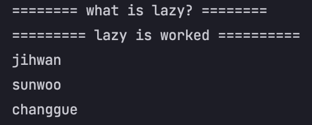
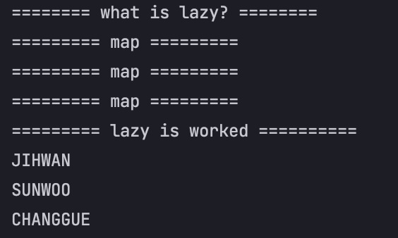
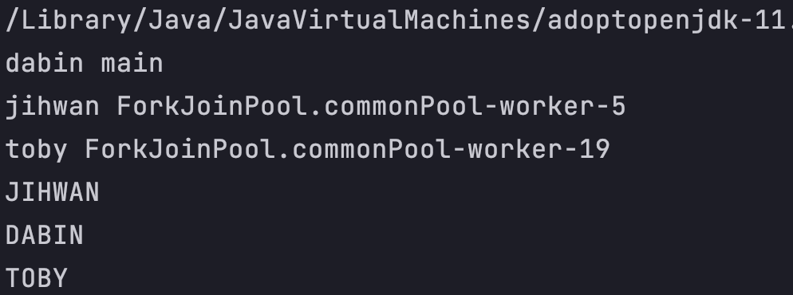

## 스트림 API

### 스트림 API
Java SE 8 + 부터 추가된 스트림 API는 앞서 입력과 출력 수업에서 살펴본 스트림과 전혀 다른 개념입니다.  
자바에서는 많은 양의 데이터를 저장하기 위해서 배열이나 컬렉션을 사용합니다.  
이렇게 저장된 데이터에 접근하기 위해서는 반복문이나 반복자를 사용하여 매번 새로운 코드를 작성해야 합니다.  

하지만, 이렇게 작성된 코드는 길이가 너무 길고 가독석이 떨어지며 코드의 재사용이 거의 불가능합니다.  
즉, 데이터베이스의 쿼리와 같이 정형화된 처리 패턴을 가지지 못했기에 데이터마다 다른 방법으로 접근해야만 했습니다.  

이러한 문제점을 극복하기 위해 `java SE 8+` 부터 `Stream API` 를 도입합니다.  
스트림 API는 데이터를 추상화하여 다루므로, 다양한 방식으로 저장된 데이터를 읽고 쓰기 위한 공통된 방법을 제공합니다.  
따라서 스트림 API를 이용하면 배열이나 컬렉션뿐만 아니라 파일에 저장된 데이터도 모두 같은 방법으로 다룰 수 있게 됩니다.  

### 스트림 API의 특징
스트림 API 는 다음과 같은 특징을 가집니다.
1. 스트림은 외부 반복을 통해 작업하는 컬렉션과는 달리 내부 반복(internal interation)을 통해 작업을 수행합니다.
2. 스트림은 재사용이 가능한 컬렉션과는 달리 한 번만 사용 가능 합니다.
3. 스트림은 원본 데이터를 변경하지 않습니다.
4. 스트림의 연산은 `filter-map` 기반의 API 를 사용하여 `lazy`연산을 통해 성능을 최적화 합니다.
5. 스트림은 `parallelStream()` 메서드를 통한 손쉬운 병렬 처리를 지원합니다.


### 스트림 API의 동작 흐름
스트림 API는 다음과 같이 세 가지 단계를 거쳐 동작합니다.
1. 스트림 생성
2. 스트림의 중개 연산 (스트림의 변환)
3. 스트림의 최종 연산 (스트림의 사용)


### Stream API 사용하기
```java
    @Test
    void 스트림(){
        // 배열선언, 초기화
        int [] arr = {1,2,3,4,5};
        // arr에 저장된 값 모두 더하기
        int sumValue = Arrays.stream(arr).sum();
        System.out.println(sumValue);
        // 배열의 요소 개수를 변환
        int count = (int)Arrays.stream(arr).count();
        System.out.println(count);
    }
```
```java
    @Test
    void 스트림_정렬(){
        // strList 객체 생성
        List<String> strList = new ArrayList<String>();
        strList.add("jihwan");
        strList.add("john");
        // stream 생성
        Stream<String> stream = strList.stream();
        // 베열의 요소를 하나씩 출력
        stream.forEach(s -> System.out.println(s));
        System.out.println();
        //정렬
        strList.stream().sorted().forEach(s -> System.out.println(s));
    }
```

### 대표적인 중개 연산 메소드
| 메서드 | 설명 | 
|------|------|
| Stream<T> filter(Predicate<? super T> predicate) | 해당 스트림에서 주어진 조건(predicate)에 맞는 요소만으로 구성된 새로운 스트림을 반환함.  |
| <R> Stream<R> map(Functoin<? super T, ? extends R> mapper) | 	해당 스트림의 요소들을 주어진 함수에 인수로 전달하여, 그 반환값으로 이루어진 새로운 스트림을 반환함.  |
|  <R> Stream<R> flatMap(Functoin<? super T, ? extends Stream<? extends R>> mapper) | 해당 스트림의 요소가 배열일 경우, 배열의 각 요소를 주어진 함수에 인수로 전달하여, 그 반환값으로 이루어진 새로운 스트림을 반환함.  |
| Stream<T> distinct() | 해당 스트림에서 중복된 요소가 제거된 새로운 스트림을 반환함. 내부적으로 Object 클래스의 equals() 메소드를 사용함. |
| Stream<T> limit(long maxSize)	| 해당 스트림에서 전달된 개수만큼의 요소만으로 이루어진 새로운 스트림을 반환함. |
|Stream<T> peek(Consumer<? super T> action)| 해결과 스트림으로부터 각 요소를 소모하여 추가로 명시된 동작(action)을 수행하여 새로운 스트림을 생성하여 반환함. |
|Stream<T> skip(long n)| 해당 스트림의 첫 번째 요소부터 전달된 개수만큼의 요소를 제외한 나머지 요소만으로 이루어진 새로운 스트림을 반환함. |
|Stream<T> sorted(), Stream<T> sorted(Comparator<? super T> comparator)| 해당 스트림을 주어진 비교자(comparator)를 이용하여 정렬함. 비교자를 전달하지 않으면 영문사전 순(natural order)으로 정렬함. |


## 추가적인 설명

### 스트림의 연산은 `filter-map` 기반의 API 를 사용하여 `lazy`연산을 통해 성능을 최적화 한다.

lazy 연산을 한다. 라는 의미에는 다양한게 있겠지만 대표적으로 아래와 같은 예시를 살펴볼 수 있겠다.

```java
public class JavaEx {
    public static void main(String[] args) {
        System.out.println("======== what is lazy? ========");
        names.stream().map(s -> {
            System.out.println("========= map =========");
            return s.toUpperCase();
        });
        System.out.println("========= lazy is worked ==========");
        names.forEach(System.out::println);
    }
}

```

이렇게 보면 ArrayList에 `stream.map()`을 사용해서 중개 연산만 해준 상태이다. `.collect()`같은 최종 연산이 없다는 것이다. 이렇게 되면..  



딱 봤을 때 map 안의 print문과 `.toUpperCase()` 변환하는 로직이 실행될 것 같지만 실행되지 않는 것을 확인할 수 있다.  
이유는 stream API는 중애 연산을 `0~n`개가 올 수 있다. 하지만 종료 연산은 무조건 하나 이상 와야 실행이 가능하다.  

이제 그러면 해당 stream 연산을 수행하려면 종료 연산을 추가하면된다.
```java
public class JavaEx {
    public static void main(String[] args) {
        System.out.println("======== what is lazy? ========");
        List<String> collect1 = names.stream().map(s -> {
            System.out.println("========= map =========");
            return s.toUpperCase();
        }).collect(Collectors.toList());
        System.out.println("========= lazy is worked ==========");
        collect1.forEach(System.out::println);
    }
}
```



### 스트림은 `parallelStream()` 메서드를 통한 손쉬운 병렬 처리를 지원한다.
> 여러개의 쓰레드로 병렬처리하는 것이 항상 빠른 것은 절대 아니다.(데이터가 완전 방대한 경우에는 비교적 빠름)  
> 상황에 따라 싱글 스레드로 프로세스를 처리 하는 것이 빠를 때도 있다.

```java
public class MyStream {
    public static void main(String[] args) {
        ArrayList<String> names = new ArrayList<>();
        names.add("jihwan");
        names.add("dabin");
        names.add("toby");

        List<String> collect = names.parallelStream().map(s -> {
            System.out.println(s + " " + Thread.currentThread().getName());
            return s.toUpperCase();
        }).collect(Collectors.toList());

        collect.forEach(System.out::println);
    }
}
```

이렇게 한번 `parallelStream()`를 사용해서 병렬처리를 해볼것이다.  
`.map()`이 돌아갈 때 마다 `currentThread().getName()` 하도록 해 보았다.



이처럼 각자 ArrayList index 하나하나 다른 Thread가 할당되어 처리 되는 것을 볼 수 있다.