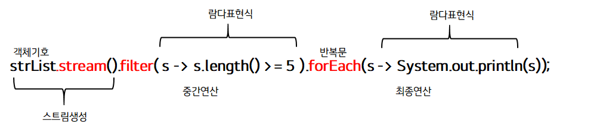

## 스트림 API

### 스트림 API
Java SE 8 + 부터 추가된 스트림 API는 앞서 입력과 출력 수업에서 살펴본 스트림과 전혀 다른 개념입니다.  
자바에서는 많은 양의 데이터를 저장하기 위해서 배열이나 컬렉션을 사용합니다.  
이렇게 저장된 데이터에 접근하기 위해서는 반복문이나 반복자를 사용하여 매번 새로운 코드를 작성해야 합니다.  

하지만, 이렇게 작성된 코드는 길이가 너무 길고 가독석이 떨어지며 코드의 재사용이 거의 불가능합니다.  
즉, 데이터베이스의 쿼리와 같이 정형화된 처리 패턴을 가지지 못했기에 데이터마다 다른 방법으로 접근해야만 했습니다.  

이러한 문제점을 극복하기 위해 `java SE 8+` 부터 `Stream API` 를 도입합니다.  
스트림 API는 데이터를 추상화하여 다루므로, 다양한 방식으로 저장된 데이터를 읽고 쓰기 위한 공통된 방법을 제공합니다.  
따라서 스트림 API를 이용하면 배열이나 컬렉션뿐만 아니라 파일에 저장된 데이터도 모두 같은 방법으로 다룰 수 있게 됩니다.  

### 스트림 API의 특징
스트림 API 는 다음과 같은 특징을 가집니다.
1. 스트림은 외부 반복을 통해 작업하는 컬렉션과는 달리 내부 반복(internal interation)을 통해 작업을 수행합니다.
2. 스트림은 재사용이 가능한 컬렉션과는 달리 한 번만 사용 가능 합니다.
3. 스트림은 원본 데이터를 변경하지 않습니다.
4. 스트림의 연산은 `filter-map` 기반의 API 를 사용하여 `lazy`연산을 통해 성능을 최적화 합니다.
5. 스트림은 `parallelStream()` 메서드를 통한 손쉬운 병렬 처리를 지원합니다.

### 스트림 API의 동작 흐름
스트림 API는 다음과 같이 세 가지 단계를 거쳐 동작합니다.
1. 스트림 생성
2. 스트림의 중개 연산 (스트림의 변환)
3. 스트림의 최종 연산 (스트림의 사용)

