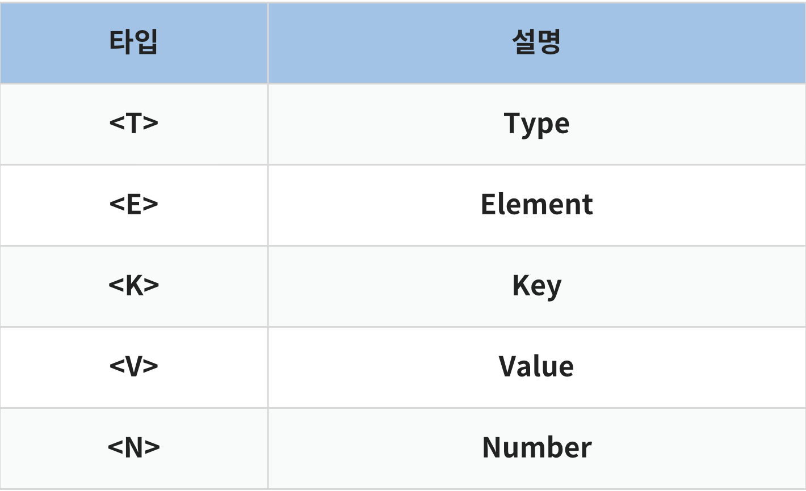
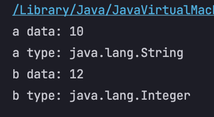

## 제네릭의 이해
> 제네릭은 직역하자면 '일반적인' 이라는 뜻을 갖고 있다.  
> 부연설명을 하자면.. '데이터 형식에 의존하지 않고, 하나의 값이 여러 다른 데이터 타입들을 가질 수 있도록 하는 방법'이다.  


* 우리가 흔히 쓰는 ArrayList, LinkedList 등을 생성할 때 어떻게 쓰는가?
  * `객체<타입> 객체명 = new 객체<타입>();` 이렇게 쓰지 않는가? 즉, 아래와 같이 여러 생성방식이 있다.
    ```java
    ArrayList<Integer> list1 = new ArrayList<Integer>();
    ArrayList<String> list2 = new ArrayList<Integer>();
    LinkedList<Double> list3 = new LinkedList<Double>():
    LinkedList<Character> list4 = new LinkedList<Character>();
    ```

    이렇게 괄호<> 안에 타입을 지정해준다.

    생각해보자. 만약에 우리가 어떤 자료구조를 만들어 배포하려고 한다.  
    그런데 String 타입도 지원하고 싶고, Integer 타입도 지원하고 싶다.  
    그럼 String에 대한 클래스, Integer 에 대한 클래스 하나하나 타입에 따라 만들 것인가?  
    그건 너무 비효율적이다. 이러한 문제를 해결하기 위해 우리는 제네릭이라는 것을 사용한다.

    이렇듯 제네릭은 클래스 내부에서 지정하는 것이 아닌 외부에서 사용자에 의해 지정되는 것을 의미한다.  
    한마디로 특정 타입을 미리 지정해주는 것이 아닌 필요에 의해 지정할 수 있도록 하는 일반 타입이라는 것이다.  


* 제너릭의 장점
    1. 제네릭을 사용하면 잘못된 타입이 들어올 수 있는 것을 컴파일 단계에서 방지할 수 있다.
    2. 클래스 외부에서 타입을 지정해주기 때문에 따로 타입을 체크하고 반환해줄 필요가 없다. - 즉 관리가 편하다.
    3. 비슷한 기능을 지원하는 경우 코드의 재사용성이 높아진다.



1. 클래스 및 인터페이스 선언
```java
public class ClassName<T> {}
public Interface InterfaceName<T> {}
```

기본적으로 제네릭 타입의 클래스나 인터페이스의 경우 위와 같이 선언한다.  
T 타입은 해당 블럭 안에서까지 유효하다.  

또한 여기서 더 나아가 제네릭 타입을 두 개로 둘 수도 있다. (대표적으로 HashMap)

```java
public class HashMap<K, V>{}
```

이렇듯 데이터 타입을 외부로부터 지정할 수 있도록 할 수 있다.

그럼 이렇게 생성된 제네릭 클래스를 사용하고 싶을 것이다.  
즉, 객체를 생성해야 하는데 이 때 구체적인 타입을 명시를 해주어야 하는 것이다.  

```java
public class ClassName<T, K>{}

public class Main {
	public static void main(String[] args) {
		ClassName<String, Integer> a = new ClassName<String, Integer>();
	}
}
```

이 때 한가지 주의 할 점은 타입 파라미터로 명시할 수 있는 것은 참조 타입 밖에 올 수 없다.  
일반 타입은 올 수 없고 Integer, Double 같은 `Wrapper Type` 으로 쓰는 이유가 바로 위와 같은 이유이다.  

또한 바꿔 말하면 참조 타입이 올 수 있다는 것은 **사용자가 정의한 클래스도 타입으로 올 수 있다는 것이다.**  

```java
public class ClassName <T> { ... }
 
public class Student { ... }
 
public class Main {
	public static void main(String[] args) {
		ClassName<Student> a = new ClassName<Student>();
	}
}
```

### 제네릭 공부하기
```java
public class Generic_Ex {
    static class ClassName<E>{
        // 제네릭 타입 변수
        private E element;
        // setter
        void setElement(E element){
            this.element = element;
        }
        // getter
        E get(){
            return element;
        }
    }
    public static void main(String[] args) {
        ClassName<String> a = new ClassName<>();
        ClassName<Integer> b = new ClassName<>();

        a.setElement("10");
        b.setElement(12);

        System.out.println("a data: " + a.get());
        System.out.println("a type: " + a.get().getClass().getName());
        System.out.println("b data: " + b.get());
        System.out.println("b type: " + b.get().getClass().getName());
    }
}
```

