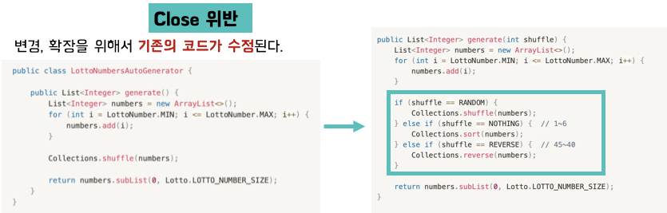
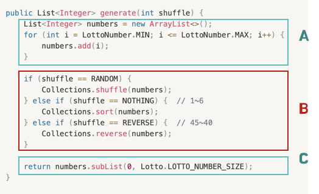
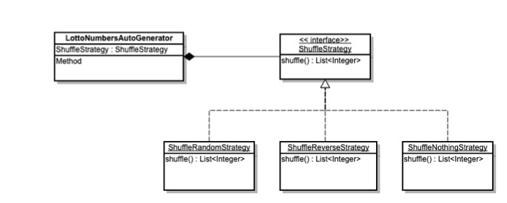
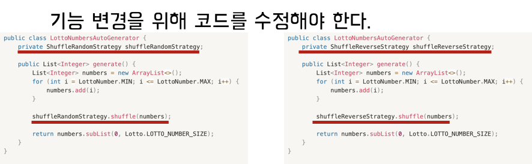
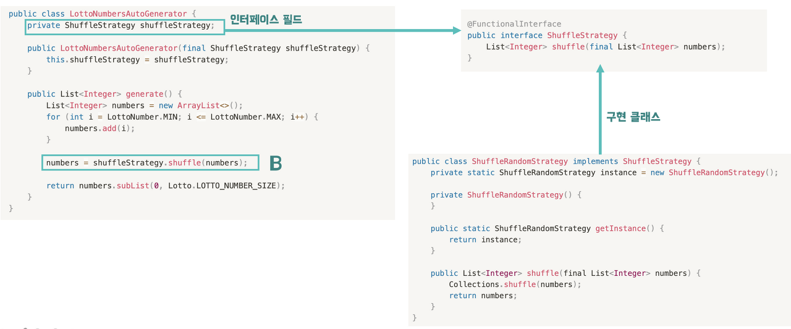
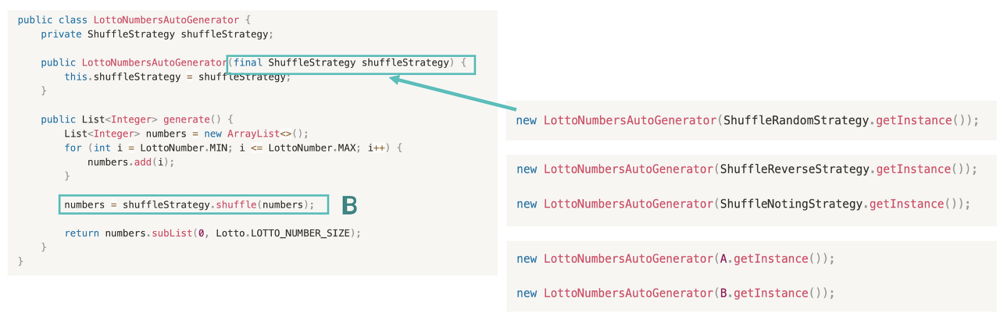

# OCP 개방 폐쇄의 원칙

### Index
1. OCP 적용이 필요한 사례 보기
2. OCP 란?
3. 전략패턴 (Strategy Pattern) 

## OCP란?
> 시간이 지나도 유지 보수와 확장이 쉬운 시스템을 만들고자 로버트 마틴이 명명한 객체지향설계 5대원칙 SOLID 중 하나.

OCP는 소프트웨어 구성 요소(컴퍼넌트, 클래스, 모듈, 함수)는 **확장에 대해서는 개방**, **변경에 있어서는 폐쇄 되어야 한다** 라는 의미.

즉, 기존의 코드를 변경하지 않으면서 기능을 추가할 수 있도록 설계가 되어야 한다는 의미.

기존 코드에서 확장을 위해 코드가 수정되었다.  
이런경우에 Close 를 위반하게 된다. OCP의 핵심은 `Close` 입니다.  
변경, 확장을 위해서 기존 코드가 수정되면 변경, 확장 Open 도 힘들어집니다.

## OCP 적용방법
1. 상속 (is-a)
2. 컴포지션 (has-a)

주로 컴포지션을 사용함.  
상속은 상위클래스가 바뀌면 하위클래스에 끼치는 영향이 매우 크다는 단점이 존재하기 때문에.

1. 변경(확장)될 것과 변하지 않을 것을 엄격히 구분
2. 이 두 모듈이 만나는 지점에서 인터페이스를 정의
3. 구현에 의존하기보다 **정의한 인터페이스에** 의존하도록 코드를 작성

### 1. 변경될 부분과 변하지 않을 부분을 엄격히 구분하라

`B` 부분에서 변경이 생기니 이 부분을 `interface`로 추출 해야한다.

### 2. 모듈이 만나는 지점에 인터페이스 정의

`B` 를 `shuffle()` 메서드를 가진 `ShuffleStrategy` 라는 인터페이스로 분리했다.  
여기서 주의할 점은 인터페이스로 만들어야 한다는 것. 변하는 것과 변하지 않는 모듈의 교차점으로 서로를 보호하는 역할을 한다.

인터페이스가 아닌 구현 클래스에 의존하면 기능 변경을 위해 코드를 수정해야 한다.

### 3. 인터페이스에 의존하도록 코드를 작성

`..Generator.class`가 `ShuffleStrategy` 인터페이스에 의존하도록 해주고 생성자를 통해 구현 클래스의 인스턴스를 외부에서 주입해주는 방식으로 이용한다.

## 기능을 바꿔도 내부 코드의 변경이 일어나지 않는다.

다른 기능을 사용하고 싶을 때, `..Generator.class` 생성자에 원하는 기능을 넣어주면 된다.
이렇게 해줌으로써 기능이 추가, 수정되어도 기존의 코드에는 영향이 가지 않는다.

### 정리
1. OPEN: 확장에 열려있다.
2. CLOSE: 변경에 닫혀있다.

기존의 코드를 변경하지 않으면서 기능을 추가할 수 있다.