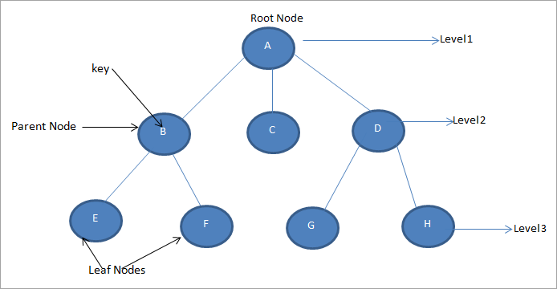

# DFS, 깊이 우선 탐색
> 하나의 정접으로부터 시작하여 차례대로 모든 정점들을 한 번씩 방문하는 것

## Tree


- rootNode 는 level 이 1 이다.

### 깊이 우선 탐색이란
> 루트 노드에서 시작하여 다음 분기로 넘어가기 전에 해당 분기를 완벽하게 탐색하는 방법

- 미로를 탐색할 때 한 방향으로 갈 수 있을 때까지 계속 가다가 더 이상 갈 수 없게 되면 가장 가까운 갈림길로 돌아와서 이곳으로부터 다른 방향으로 다시 탐색을 진행하는 방법과 유사하다.
- 즉 넓게(Wide) 탐색하기 전에 깊게(Deep) 탐색하는 것이다.
- 속도: DFS > BFS (단, 단순 검색에서는 BFS가 빠르다.)

### 깊이 우선 탐색(DFS) 특징
* 자기 자신을 호출하는 순환 알고리즘의 형태를 가지고 있다. (재귀함수)
* 전위 순회를 포함한 다른 형태의 트리 순회는 모두 DFS의 한 종류이다.
* 이 알고리즘을 구현할 때 가장 큰 차이점은, 그래프 탐색의 경우 어떤 노드를 방문했었는지 여부를 반드시 검사해야한다. (노드의 주소를 저장하면 될 듯)
  * 검사하지 않으면 무한루프에 빠질 수 있다. 

## DFS 구현하기

우선 Node라는 객체를 만든다.
```java
class Node{
    int data;
    // lt, rt 노드의 주소를 담아야 하기 때문에 참조형 변수를 선언한다.
    Node lt, rt;
    /** 
    새로운 노드를 생성할 때 마다 그 노드의 값과 
    lt, rt를 null로 초기화 한다.
    */
    public Node(int data){
        this.data = data;
        lt = rt = null;
    }
}
```
> 참조형 변수에 대해서 모른는 사람은 [여기](../JAVA/Reference-veriable.md)를 참고하기 바란다.