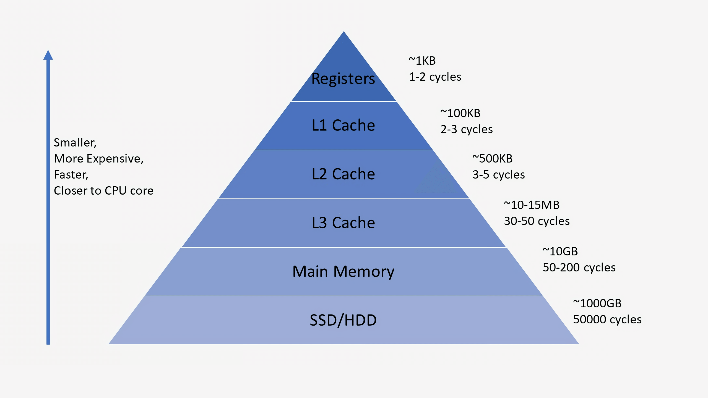

## Cache 란?
> 자주 사용하는 데이터나 값을 미리 복사해 놓은 임시 장소를 가르킨다.  
> 아래와 같은 저장공간 계층 구조에서 확인할 수 있듯이, 캐시는 저장 공간이 작고 비용이 비싼 대신 빠른 성능을 제공한다.

#### ((Cache는 아래와 같은 경우에 사용을 고려하면 좋다))
* 접근시간에 비해 원래 데이터를 접근하는 시간이 오래 걸리는 경우(서버의 균일한 API 데이터)
* 반복적으로 동일한 결과를 돌려주는 경우(이미지나 썸네일)

### ((Cache에 데이터를 미리 복사해 놓으면 계산이나 접근시간 없이 더 빠른 속도로 데이터에 접근할 수 있다.))

결국 Cache란 반복적으로 데이터를 불러오는 경우에, 지속적으로 DBMS 혹은 서버에서 요청하는 것이 아니라, Memory에 데이터를 저장시켰다가 불러다 쓰는 것을 의미한다. 

Enterprise 급 App 에서는 DBMS의 부하를 줄이고, 성능을 높이기 위해 캐시를 사용한다. 

원하는 데이터가 테시에 존재할 경우 해당 데이터를 반환하며, 이러한 상황을 **Cache Hit** 라고 한다.   
캐시는 저장공간이 작기 때문에, 지속적으로 **Cache Miss**가 발생하는 데이터의 경우 캐시 전략에 따라서 저장중인 데이터를 변경해야한다.

### Cache의 필요성

> 위의 그래프는 Long Tail 법칙의 그래프인데. Long Tail 법칙은 20% 의 요구가 스스템 리소스의 대부분을 사용한다는 법칙이다. **그렇기 때문에 20%의 기능에 Cache를 이용함으로써 리소스 사용량은 대폭 줄이고, 성능은 대폭 향상 시킬 수 있다.**