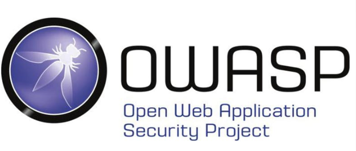
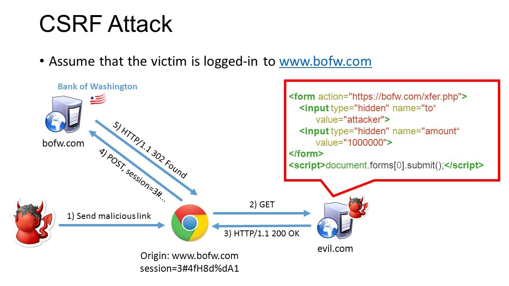

# spring application으로 백엔드를 운영할 때 고려해야 할 보안사항

## index
1. CSRF

## CSRF (Cross Site Request Forgery)

우선 CSRF 를 직역하면 "사이트 간 요청 위조" 라는 뜻을 갖는다.  
OWASP top10 에도 오른적이 있을 만큼 대단히 위험도가 높은 것으로 평가되었던 공격이다.

1. 공격자는 희생자의 개인정보나 권한을 얻기 위해 보안이 취약한 웹사이트에 HTTP로 작성된 요청문을 게시판에 등록한다.  
2. 공격자의 게시물이 DB에 저장되고, 게시글로 등록된다.
3. 희생자는 공격자가 올려놓은 게시글을 읽게 되고 링크 또는 이미지에 삽입한 링크를 클릭하면서 **공격자가 작성한 HTTP를 자신의 권한으로 실행, 요청한다.**
4. 희생자 권한으로 HTTP 요청을 받은 웹서버는 요청을 처리하고 응답을 보낸다. **공격자의 의도대로 실행이 되었고** 희생자는 의도하지 않은 피해를 입게 된다.

### CSRF에 취약하다고 판단을 할 수 있는 기준

웹 애플리케이션 사용자가 입력할 수 있는 형식(게시판, Q&A 등등)에서 img src 이용하여 공격할 수 있는 조작문을 작성하고 모의 공격을 해본다.

### CSRF 보안 대책
1. 중요한 요청에 대한 재인증 요청
2. 사용자의 접근 권한 정보가 포함된 토큰을 생성하고 사용자가 웹 서버에 요청을 보낼 때 토큰 값으로 검증.