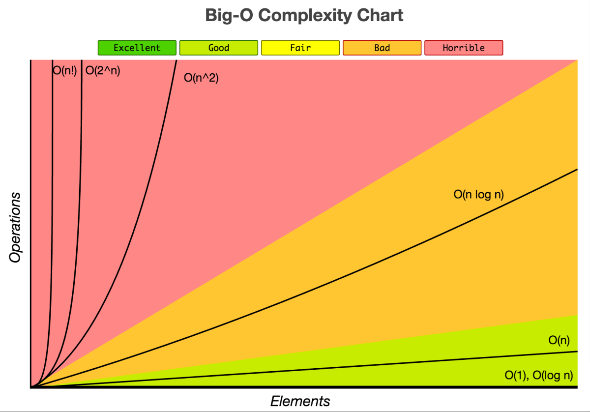
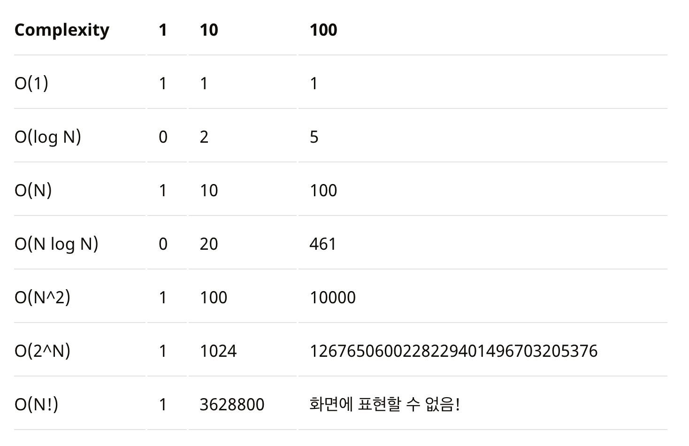
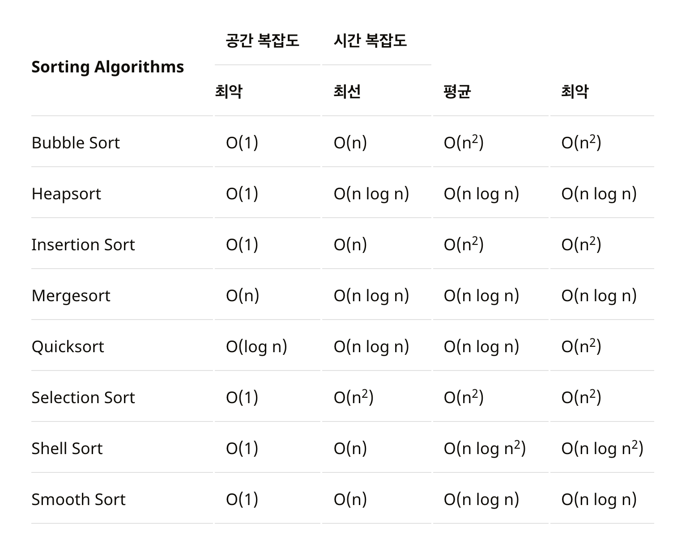
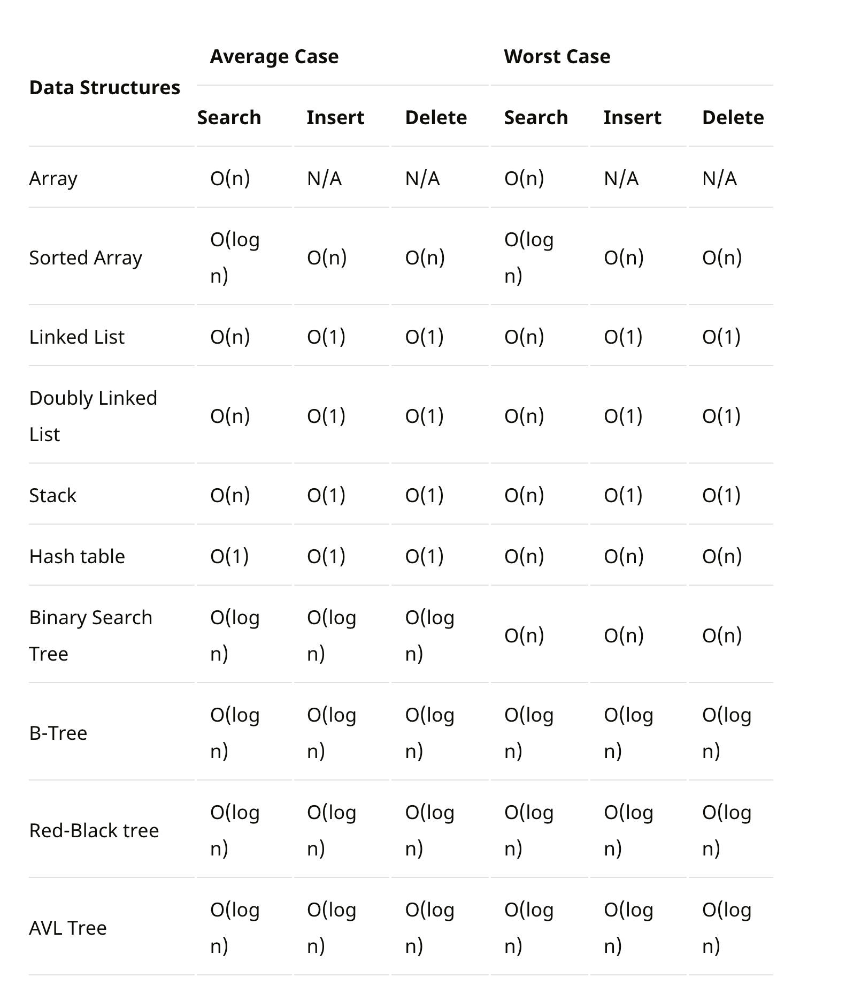

# 알고리즘의 시간 복잡도와 Big-O 
> 여러분들이 코딩테스트를 풀 때 테스트 수행 시간제한이라는 문구를 보았을 것이다.  
> 이 말은 소스코드 전체의 시간복잡도를 계산해도 해당 수행시간보다 많이 걸리면 안된다는 것인데..  
> 도대체 뭘 쓰면 복잡도가 증가하고 어떻게 풀어나가면 되는지 감을 잡아주기 위한 포스팅이다.

## 알고리즘의 수행시간
1. 입력값에 크기에 따른 알고리즘 실행시간을 검증
2. 입력값의 크기에 따른 함수의 증가량, 성장률 
   1. 이때 중요하지 않은 상수와 계수들을 제거하면 알고리즘의 실행시간에서 중요한 성장률에 집중할 수 있는데 이것을 점금적 표기법이라고 부른다.
   2. 점근적이라는 의미는 가장 큰 영향을 주는 항만을 계산한다는 의미이다.

### 점금적 표기법
* 최상의 경우: 오메가 표기법(Big-Ω Notation)
* 평균의 경우: 세타 표기법(Big-θ Notation)
* 빅오 표기법: 빅오 표기법(Big-O Notation)

평균인 세타 표기를 하면 가장 정확하고 좋겠지만 평가하기가 굉장히 까다롭다고 한다.  
그래서 **최악인 경우인 빅오를 사용**하는데 알고리즘이 최악일때의 경우를 판단하면 평균과 가까운 성능으로 예측하기 쉽기 때문이다.

## 빅오 표기법
> 빅오 표기법은 불필요한 연산을 제거하여 알고리즘분석을 쉽게 할 목적으로 사용된다.  

Big-O로 측정되는 복잡성에는 시간과 공간복잡도가 있는데
* 시간복잡도는 입력된 N의 크기에 따라 실행되는 조작의 수를 나타낸다.
* 공간복잡도는 알고리즘이 실행될때 사용하는 메모리 양을 나타낸다.
  * 요즘에는 데이터를 저장할 수 있는 메모리의 발전으로 중요도가 낮아졌다.



## 시간복잡도
시간복잡도의 가장 간단한 정의는 알고리즘 성능을 설명하는 것이다.  
다른 의미로는 알고리즘을 수행하기 위해 프로세스가 수행하는 연산을 수치화 한것이다.

시간복잡도에서 가장 중요하게 보는 것은 가장 큰 영향을 미치는 n의 단위이다.
```
1             O(1)   --> 상수
2n + 20       O(n)   --> n이 가장 큰영향을 미친다.
3n^2          O(n^2) --> n^2이 가장 큰영향을 미친다.
```

시간복잡도의 문제해결 단계를 나열하면 아래와 같다
```
O(1) – 상수 시간 : 문제를 해결하는데 오직 한 단계만 처리함.
O(log n) – 로그 시간 : 문제를 해결하는데 필요한 단계들이 연산마다 특정 요인에 의해 줄어듬.
O(n) – 직선적 시간 : 문제를 해결하기 위한 단계의 수와 입력값 n이 1:1 관계를 가짐.
O(n log n) : 문제를 해결하기 위한 단계의 수가 N*(log2N) 번만큼의 수행시간을 가진다. (선형로그형)
O(n^2) – 2차 시간 : 문제를 해결하기 위한 단계의 수는 입력값 n의 제곱.
O(C^n) – 지수 시간 : 문제를 해결하기 위한 단계의 수는 주어진 상수값 C 의 n 제곱.
```
아래는 실행시간이 빠른 순으로 N값에 따른 서로 다른 알고리즘의 시간 복잡도이다.


### O(1): 상수 
> 입력에 관계없이 복잡도는 동일하게 유지된다.
```java
public class TimeComplexity {
    public static void main(String[] args) {
        System.out.println("Hello O(1)");
    }
}
```

### O(N): 선형
> 입력이 증가하면서 처리 시간 또는 메모리 사용이 선형적으로 증가한다.
```java
public class TimeComplexity {
    public static void main(String[] args) {
        for (int i=0; i<3; i++){
            System.out.println("Hello O(N)"+i);
        }
    }
}
```

### O(N^2): Square
> 반복문이 두 번 있는 케이
```java
public class TimeComplexity {
    public static void main(String[] args) {
        for (int i=0; i<3; i++){
            for (int j=0; j<3; j++){
                System.out.println("Hello O(n^2)"+i+j);
            }
        }
    }
}
```

### O(log n) O(n log n)
> 주로 입력 크기에 따라 처리 시간이 증가하는 정렬알고리즘에서 많이 사용된다.
```java
public class TimeComplexity {
    public int returnEvenInTen(int num){
        if (num%2 != 0){
            if (num > 10){
                return num-1;
            } else {
                return num+1;
            }
        } else {
            return num;
        }
    }
    public static void main(String[] args) {
        TimeComplexity timeComplexity = new TimeComplexity();
        Scanner scanner = new Scanner(System.in);
        System.out.println(timeComplexity.returnEvenInTen(scanner.nextInt()));
    }
}
```

### 시간복잡도를 구하는 요령
* 하나의 루프를 사용하여 단일 요소 집합을 반복 하는 경우: O(n)
* 컬렉션 절반 이상을 반복 하는 경우: O(n/2) -> O(n)
* 두 개의 다른 루프를 사용하여 두 개의 개별 콜렉션을 반복 할 경우: O(n+m) -> O(n)
* 두 개의 중첩 루프를 사용하여 단일 컬렉션을 반복하는 경우: O(n²)
* 두 개의 중첩 루프를 사용하여 두 개의 다른 콜렉션을 반복 할 경우: O (n * m) -> O (n²)
* 켈렉션 정렬을 사용하는 경우: O(n*log(n))

ㄴ> 여기서 콜렉션은 자료구조의 유형인데 데이터의 집합이나 그룹을 의미한다.


