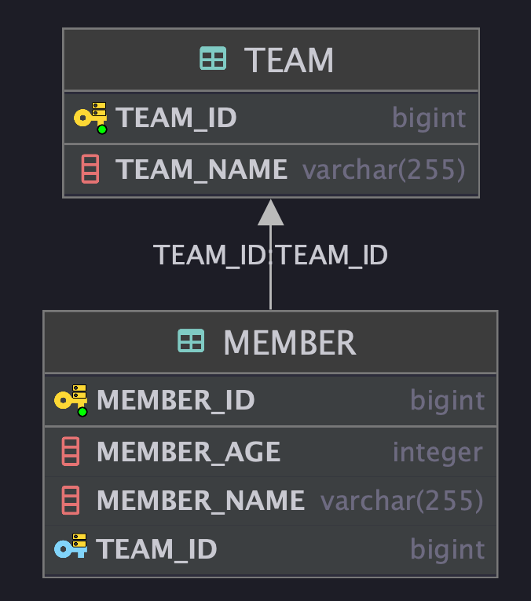

# JPA N+1
> 기본기가 중요하기 때문에 DataJPA가 아닌 JPA (EntityManager)을 써서 여러가지를 시험 해보고 있다.  
> 그리고 나는 N+1을 경험해본적이 없다 ㅋㅋㅋㅋ

우선 JPA N+1 을 이해하기 전에 즉시로딩과 지연로딩에 대해 알아야 한다.  
솔직히 그냥 이름만 들어도 감이 오죠?  

## 즉시로딩(FetchType.EAGER), 지연로딩(FetchType.LAZY)



위에 있는 엔티티 다이어그램을 보면 Member와 Team이 양방향으로 N:1 로 돼 있는 것을 볼 수 있다.  

### 나는 즉시로딩 하고 싶다.

즉시로딩은 언제 사용하면 좋은 전략일까?  
간단하다. 나는 비교적 member를 조회할 때, team도 가져와야 가능한 비즈니스로직을 많이 짠다. 하면 즉시로딩을 사용하는 것이다.

```java
@Transactional
@Test @DisplayName("즉시로딩, 지연로딩")
void 즉시로딩_지연로딩(){
    Team team = Team.builder()
            .teamName("지화니팀")
            .build();

    entityManager.persist(team);

    Member member = Member.builder()
            .name("jihwan")
            .team(team)
            .build();

    entityManager.persist(member);

    // 영속성 컨텍스트에 이전 내용 동기화
    entityManager.flush();
    // 영속성 컨텍스트 내용 비우기
    entityManager.clear();

    Member member1 = entityManager.find(Member.class, member.getId());
}
```

아래는 위에 코드를 실행시킨 후 발생한 쿼리문이다.  
**`Member` 엔티티 `Team`과의 FetchType을 EAGER 했을 때의 결과이다.**

```sql
Hibernate: 
    select
        member0_.member_id as member_i1_0_0_,
        member0_.member_age as member_a2_0_0_,
        member0_.member_name as member_n3_0_0_,
        member0_.team_id as team_id4_0_0_,
        team1_.team_id as team_id1_1_1_,
        team1_.team_name as team_nam2_1_1_ 
    from
        member member0_ 
    left outer join
        team team1_ 
            on member0_.team_id=team1_.team_id 
    where
        member0_.member_id=?
```

`left outer join`으로 member의 엔티티에 해당한 팀을 **즉시로딩** 한다.  

- 장점
네트워크 1번에 `member`와 `team`을 조회하는 한방쿼리를 한다는 것이 장점이다. (매번 member와 team을 같이 조회한다고 하면)

- 단점
이렇게 조인을 2, 3 테이블만 한다면 그 자체가 성능상에 치명적인 문제는 야기시키지 않지만, 요청 횟수에 따른 반환시간은 거의 배가 된다고 보면 된다.  
또한 연관(조인) 테이블이 증가하면 증가할 수로 반환시간은 길어질 것이다.

### 나는 지연로딩 하고 싶다!

나는 member를 조회할 때 딱히 team이 필요할 때가 별로 없다.  
그럼 매번 team 이 member와 연관이 있다고 select query를 날리면 좋은걸까? (답은 아니다. 그냥 member만 조회하면 된다.)  

???? 😧 그걸 어떻게 가능하게 합니까?? JPA는 proxy 엔티티라는 기술로 이 문제를 한방에 해결한다.  

음 프록시 자체의 뜻은 '대리' 라는 의미를 가진다. JPA에서는 가짜 엔티티(?)를 반환하는 기술 정도로 이해하면 될 것 같다.  
방법은 간단하다 연관관계가 있는 조인 칼럼에 `fetch = FetchType.LAZY` 해주면 된다.

```sql
Hibernate: 
    select
        member0_.member_id as member_i1_0_0_,
        member0_.member_age as member_a2_0_0_,
        member0_.member_name as member_n3_0_0_,
        member0_.team_id as team_id4_0_0_ 
    from
        member member0_ 
    where
        member0_.member_id=?
```

`fetch = FetchType.LAZY` 을 적용시키고 아까 테스트를 그대로 돌린 것이다.  
`member` 만 조회 되는 것을 확인 할 수 있다. 그럼 아까 말한 proxy 엔티티는 어떻게 알 수 있나..?

조회된 member의 team에 접근해서 클래스 정보를 보면 `log.info(String.valueOf(member1.getTeam().getClass()));`  
`class com.jpa.just.model.Team$HibernateProxy$0alAnsnB` 이렇게 하이버네이트 어쩌고 proxy 엔티티가 반환되는걸 볼 수 있다.

아래 처럼 실제로 팀 내부의 필드에 접근할 때 team을 select 한다.  
`team`을 어떻게 select 할 수 있냐면, proxy 엔티티가 DB에게 초기화 요청을 해서 select 가 가능해진다.

```java
log.info("===========실제로 팀 조회를 시도할 때=============");
String teamName = findMember.getTeam().getTeamName();
log.info("============teamName: {}=========", teamName);
```

```sql
2021-12-16 20:31:52.418  INFO 13845 --- [main] com.jpa.just.model.MemberTest: ===========실제로 팀 조회를 시도할 때=============
Hibernate: 
    select
        team0_.team_id as team_id1_1_0_,
        team0_.team_name as team_nam2_1_0_ 
    from
        team team0_ 
    where
        team0_.team_id=?
```

## 😨 그럼 N+1 은 언제 발생하는데?
> 보통 그저 FetchType.EAGER 라서 발생한다고 생각하지만, 여러가지 예외사항들이 있다.

